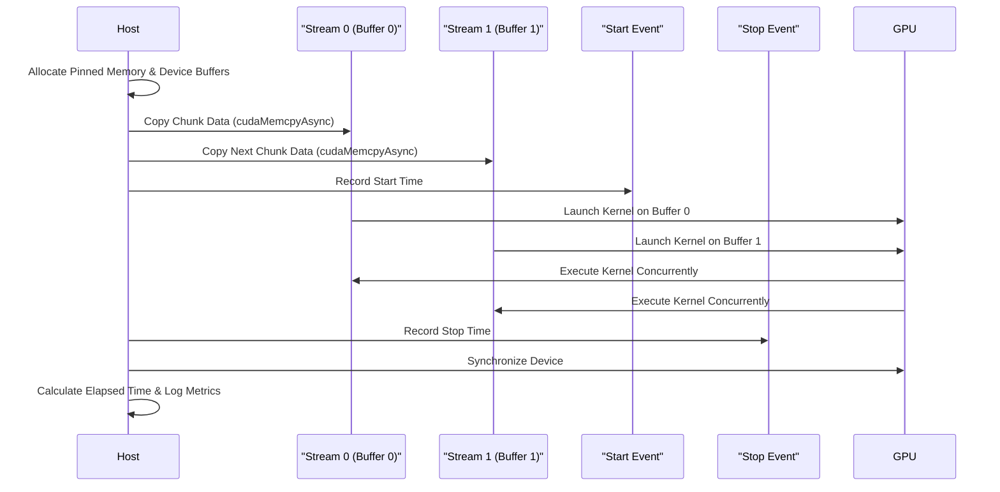

# Day 25: Double Buffering Technique

In this lesson, we explore the **double buffering technique** in CUDA to overlap data transfers (communication) with computation. Double buffering is a common technique in high-performance computing to hide the latency of data transfers by using two sets of buffers: while one buffer is used for computation, the other is used for data transfer. This creates a pipeline where compute and copy operations run concurrently, thereby increasing throughput.

**Key Learning Objectives:**
- Understand the concept of double buffering.
- Learn how to implement a two-buffer pipeline using CUDA streams and asynchronous memory transfers.
- Recognize common pitfalls such as improper synchronization that can result in reading incomplete data.
- Use practical code examples with extensive inline comments.
- Visualize the process with detailed conceptual diagrams.
- Refer to precise documentation and best practices.

*Reference:*  
- [CUDA Concurrent Kernels Sample](https://docs.nvidia.com/cuda/cuda-samples/index.html)  
- [CUDA C Programming Guide – Asynchronous Transfers](https://docs.nvidia.com/cuda/cuda-c-programming-guide/index.html#asynchronous-transfers)

---

## Table of Contents

1. [Overview](#1-overview)  
2. [What is Double Buffering?](#2-what-is-double-buffering)  
3. [How Double Buffering Works in CUDA](#3-how-double-buffering-works-in-cuda)  
4. [Practical Exercise: Implementing a Two-Buffer Pipeline](#4-practical-exercise-implementing-a-two-buffer-pipeline)  
    - [a) Sample Kernel Code](#a-sample-kernel-code)  
    - [b) Host Code with Detailed Error Checking and Double Buffering](#b-host-code-with-detailed-error-checking-and-double-buffering)  
5. [Common Debugging Pitfalls](#5-common-debugging-pitfalls)  
6. [Conceptual Diagrams](#6-conceptual-diagrams)  
7. [References & Further Reading](#7-references--further-reading)  
8. [Conclusion](#8-conclusion)  
9. [Next Steps](#9-next-steps)  

---

## 1. Overview

In many CUDA applications, the performance bottleneck is often not the computation itself, but rather the **data transfer** between host and device. Double buffering addresses this problem by using two sets of buffers to overlap computation with data transfers. This technique ensures that while the GPU is processing data from one buffer, the next chunk of data is transferred into the alternate buffer.

---

## 2. What is Double Buffering?

**Double Buffering** is a technique where two buffers are used to alternate between transferring data and performing computations. The basic idea is:
- **Buffer 0** is used for computation while **Buffer 1** is being loaded with new data.
- Once the computation on Buffer 0 is finished, the roles are swapped.
- This overlap helps hide the latency of data transfers, leading to improved throughput.

---

## 3. How Double Buffering Works in CUDA

In CUDA, double buffering is typically implemented using:
- **Pinned (page-locked) host memory** for fast asynchronous transfers.
- **Two device buffers** that are used alternately.
- **CUDA Streams** to schedule asynchronous memory copies (`cudaMemcpyAsync()`) and kernel launches concurrently.
- **Synchronization** to ensure that the computation and memory transfers do not overlap incorrectly, which could result in reading incomplete data.

---

## 4. Practical Exercise: Implementing a Two-Buffer Pipeline

We will implement a simple vector addition using a double-buffering technique. The process involves:
1. Splitting the data into chunks.
2. Using two device buffers (Buffer 0 and Buffer 1) to overlap data transfers with computation.
3. Using CUDA streams and events for asynchronous operations and proper synchronization.

### a) Sample Kernel Code

```cpp
// vectorAddKernel.cu
#include <cuda_runtime.h>
#include <stdio.h>

// Simple vector addition kernel that processes one data chunk.
// Each thread computes one element of the output vector.
__global__ void vectorAddKernel(const float *A, const float *B, float *C, int chunkSize) {
    int idx = threadIdx.x + blockIdx.x * blockDim.x;
    if (idx < chunkSize) {
        C[idx] = A[idx] + B[idx];
    }
}
Comments:

This kernel is identical to a basic vector addition kernel.
It processes a "chunk" of data, where the size of the chunk is passed as a parameter.
b) Host Code with Detailed Error Checking and Double Buffering
Below is the host code that implements double buffering. It uses pinned memory for fast transfers and two device buffers to overlap memory transfers with kernel computation.

cpp
Copy
// doubleBufferingPipeline.cu
#include <cuda_runtime.h>
#include <stdio.h>
#include <stdlib.h>
#include <time.h>

// Declaration of the vector addition kernel.
__global__ void vectorAddKernel(const float *A, const float *B, float *C, int chunkSize);

// Macro for error checking.
#define CUDA_CHECK(call) {                                    \
    cudaError_t err = call;                                   \
    if(err != cudaSuccess) {                                 \
        printf("CUDA Error at %s:%d - %s\n", __FILE__, __LINE__, cudaGetErrorString(err)); \
        exit(EXIT_FAILURE);                                   \
    }                                                         \
}

int main() {
    // Total vector size and chunk size.
    int totalElements = 1 << 22;  // e.g., 4M elements
    int chunkSize = 1 << 20;      // Process in chunks of 1M elements
    size_t chunkBytes = chunkSize * sizeof(float);
    size_t totalBytes = totalElements * sizeof(float);

    // Allocate pinned host memory for the entire input and output vectors.
    float *h_A, *h_B, *h_C;
    CUDA_CHECK(cudaMallocHost((void**)&h_A, totalBytes));
    CUDA_CHECK(cudaMallocHost((void**)&h_B, totalBytes));
    CUDA_CHECK(cudaMallocHost((void**)&h_C, totalBytes));

    // Initialize the host arrays with random values.
    srand(time(NULL));
    for (int i = 0; i < totalElements; i++) {
        h_A[i] = (float)(rand() % 100) / 10.0f;
        h_B[i] = (float)(rand() % 100) / 10.0f;
    }

    // Allocate two device buffers for double buffering.
    float *d_A0, *d_B0, *d_C0;
    float *d_A1, *d_B1, *d_C1;
    CUDA_CHECK(cudaMalloc((void**)&d_A0, chunkBytes));
    CUDA_CHECK(cudaMalloc((void**)&d_B0, chunkBytes));
    CUDA_CHECK(cudaMalloc((void**)&d_C0, chunkBytes));
    CUDA_CHECK(cudaMalloc((void**)&d_A1, chunkBytes));
    CUDA_CHECK(cudaMalloc((void**)&d_B1, chunkBytes));
    CUDA_CHECK(cudaMalloc((void**)&d_C1, chunkBytes));

    // Create two CUDA streams for asynchronous operations.
    cudaStream_t stream0, stream1;
    CUDA_CHECK(cudaStreamCreate(&stream0));
    CUDA_CHECK(cudaStreamCreate(&stream1));

    // Create CUDA events for timing.
    cudaEvent_t start, stop;
    CUDA_CHECK(cudaEventCreate(&start));
    CUDA_CHECK(cudaEventCreate(&stop));

    // Determine the number of chunks.
    int numChunks = totalElements / chunkSize;
    if (totalElements % chunkSize != 0) numChunks++;

    // Kernel configuration.
    int threadsPerBlock = 256;
    int blocksPerGrid = (chunkSize + threadsPerBlock - 1) / threadsPerBlock;

    // Start overall timing.
    CUDA_CHECK(cudaEventRecord(start, 0));

    // Loop through all chunks using double buffering.
    for (int chunk = 0; chunk < numChunks; chunk++) {
        // Calculate the offset for this chunk.
        int offset = chunk * chunkSize;
        // Determine current chunk size (last chunk may be smaller).
        int currentChunkSize = ((offset + chunkSize) <= totalElements) ? chunkSize : (totalElements - offset);
        size_t currentChunkBytes = currentChunkSize * sizeof(float);

        // Determine which device buffers to use (ping-pong switching).
        // If chunk is even, use buffers 0; if odd, use buffers 1.
        float *d_A = (chunk % 2 == 0) ? d_A0 : d_A1;
        float *d_B = (chunk % 2 == 0) ? d_B0 : d_B1;
        float *d_C = (chunk % 2 == 0) ? d_C0 : d_C1;
        cudaStream_t stream = (chunk % 2 == 0) ? stream0 : stream1;

        // Asynchronously copy the current chunk of data from host to device.
        CUDA_CHECK(cudaMemcpyAsync(d_A, h_A + offset, currentChunkBytes, cudaMemcpyHostToDevice, stream));
        CUDA_CHECK(cudaMemcpyAsync(d_B, h_B + offset, currentChunkBytes, cudaMemcpyHostToDevice, stream));

        // Launch the vector addition kernel on this chunk.
        vectorAddKernel<<<blocksPerGrid, threadsPerBlock, 0, stream>>>(d_A, d_B, d_C, currentChunkSize);

        // Asynchronously copy the result from device to host.
        CUDA_CHECK(cudaMemcpyAsync(h_C + offset, d_C, currentChunkBytes, cudaMemcpyDeviceToHost, stream));

        // Optional: Overlap additional computation or data transfer for subsequent chunks here.
    }

    // Wait for all streams to finish processing.
    CUDA_CHECK(cudaDeviceSynchronize());

    // Record the stop event.
    CUDA_CHECK(cudaEventRecord(stop, 0));
    CUDA_CHECK(cudaEventSynchronize(stop));

    // Calculate total elapsed time.
    float elapsedTime = 0;
    CUDA_CHECK(cudaEventElapsedTime(&elapsedTime, start, stop));
    printf("Total Pipeline Execution Time: %f ms\n", elapsedTime);

    // (Optional) Verify results: Print first 10 elements.
    printf("First 10 elements of result vector:\n");
    for (int i = 0; i < 10; i++) {
        printf("%f ", h_C[i]);
    }
    printf("\n");

    // Cleanup: Free device memory.
    CUDA_CHECK(cudaFree(d_A0));
    CUDA_CHECK(cudaFree(d_B0));
    CUDA_CHECK(cudaFree(d_C0));
    CUDA_CHECK(cudaFree(d_A1));
    CUDA_CHECK(cudaFree(d_B1));
    CUDA_CHECK(cudaFree(d_C1));

    // Destroy streams and events.
    CUDA_CHECK(cudaStreamDestroy(stream0));
    CUDA_CHECK(cudaStreamDestroy(stream1));
    CUDA_CHECK(cudaEventDestroy(start));
    CUDA_CHECK(cudaEventDestroy(stop));

    // Free pinned host memory.
    CUDA_CHECK(cudaFreeHost(h_A));
    CUDA_CHECK(cudaFreeHost(h_B));
    CUDA_CHECK(cudaFreeHost(h_C));

    return 0;
}
Detailed Comments Explanation:

Memory Allocation:
Pinned Memory Allocation:
cudaMallocHost() is used to allocate host memory for arrays h_A, h_B, and h_C to enable high-throughput asynchronous transfers.
Device Memory Allocation:
Two sets of device buffers (d_A0/d_B0/d_C0 and d_A1/d_B1/d_C1) are allocated, one for each of the two buffers used in double buffering.
Stream Creation:
Two CUDA streams (stream0 and stream1) are created to perform asynchronous transfers and kernel launches concurrently.
Event Creation and Timing:
CUDA events (start and stop) are created to measure the total execution time of the entire pipeline.
The start event is recorded before beginning the loop, and the stop event is recorded after all processing is complete.
Processing Loop (Double Buffering Pipeline):
The data is divided into chunks; each chunk is processed separately.
A ping-pong mechanism is used to alternate between two sets of device buffers, allowing one buffer to be used for computation while the other is being loaded/unloaded.
For each chunk:
Asynchronous Memory Transfer:
The current chunk of data is copied asynchronously from the pinned host memory to the appropriate device buffer using cudaMemcpyAsync().
Kernel Launch:
The vectorAddKernel is launched in the corresponding stream, processing the current chunk.
Result Copy:
The result is copied back asynchronously to the host.
The host then synchronizes with cudaDeviceSynchronize() to ensure all streams have finished.
Cleanup:
All device memory, streams, events, and pinned host memory are freed or destroyed properly.
Performance Measurement:
The elapsed time is computed using cudaEventElapsedTime() and printed.
7. Conceptual Diagrams
Diagram 1: Double Buffering Pipeline Workflow
mermaid
Copy
flowchart TD
    A[Host: Allocate Pinned Memory for h_A, h_B, h_C]
    B[Host: Allocate Two Sets of Device Buffers (Buffer 0 & Buffer 1)]
    C[Host: Create Two CUDA Streams (stream0 & stream1)]
    D[Loop Over Data Chunks]
    E[Determine Current Chunk and Offset]
    F{Is Chunk Even?}
    G[Use Buffer 0 in stream0]
    H[Use Buffer 1 in stream1]
    I[Asynchronously copy data from host to device (cudaMemcpyAsync)]
    J[Launch Kernel on the current device buffer]
    K[Asynchronously copy results from device to host]
    L[Synchronize Stream]
    M[After Loop, Synchronize Device]
    N[Record Total Execution Time with CUDA Events]
    O[Host: Verify Results]
    
    A --> B
    B --> C
    C --> D
    D --> E
    E --> F
    F -- Yes --> G
    F -- No --> H
    G --> I
    H --> I
    I --> J
    J --> K
    K --> L
    L --> D
    D --> M
    M --> N
    N --> O
Explanation:

A–C: Setup of pinned host memory, two device buffers, and two streams.
D–E: The data is divided into chunks; for each chunk, determine the starting offset.
F–H: Use a ping-pong mechanism to choose between Buffer 0 and Buffer 1 based on whether the chunk index is even or odd.
I–K: Asynchronous data transfers and kernel launches are performed in the selected stream.
L–N: After processing all chunks, the device is synchronized and the elapsed time is measured using CUDA events.
O: Results are copied back and verified.
Diagram 2: Timing Workflow with CUDA Events
mermaid
Copy
sequenceDiagram
    participant Host
    participant GPU
    participant StartEvent as "Start Event"
    participant StopEvent as "Stop Event"

    Host->>StartEvent: Record Start Timestamp
    Host->>GPU: Launch Pipeline Loop (Double Buffering)
    GPU->>Host: Process Data Chunks Concurrently
    Host->>StopEvent: Record Stop Timestamp after Synchronization
    Host->>Host: Compute Elapsed Time using cudaEventElapsedTime()
Explanation:

This sequence diagram outlines how the host records start and stop events around the entire double buffering pipeline.
The elapsed time reflects the total time taken for all data transfers and kernel executions.
8. References & Further Reading
CUDA C Programming Guide – Asynchronous Transfers
CUDA Asynchronous Transfers
CUDA C Programming Guide – Concurrent Kernels
CUDA Concurrent Kernels
CUDA Concurrent Kernels Sample
NVIDIA CUDA Samples
CUDA C Best Practices Guide
CUDA C Best Practices Guide
"Programming Massively Parallel Processors: A Hands-on Approach" by David B. Kirk and Wen-mei W. Hwu
NVIDIA Developer Blog
NVIDIA Developer Blog
9. Conclusion
In Day 25, you learned to implement a double buffering technique in CUDA to overlap computation with data transfers. Key takeaways include:

Double Buffering Technique:
Using two device buffers to process data chunks concurrently—one buffer is used for computation while the other is used for memory transfers.
Asynchronous Operations:
Utilizing cudaMemcpyAsync() with pinned memory and CUDA streams to overlap data transfer with kernel execution.
Synchronization:
Ensuring proper synchronization to avoid reading incomplete data.
Timing:
Using CUDA events to measure the total execution time of the pipeline.
Conceptual Diagrams:
Visual representations of the double buffering workflow and timing mechanisms.
10. Next Steps
Experiment with different data sizes and buffer counts to understand the scaling of double buffering.
Profile the pipeline using NVIDIA NSight Systems to analyze overlapping performance.
Integrate double buffering into more complex applications such as image processing or streaming data analytics.
Continue to optimize memory transfers by adjusting stream priorities and exploring multi-stream setups.
Happy CUDA coding, and may your pipelines run as efficiently as possible!


```markdown
# Day 25: Next Steps for Double Buffering Technique

Now that you have implemented a double-buffering pipeline to overlap computation and data transfers, it's time to take your work further. The "next steps" involve both refining your implementation and extending its capabilities to build more robust, high-performance applications. Below are several actionable steps, along with further code modifications, conceptual diagrams, and references to help you deepen your understanding and improve your CUDA applications.

---

## Next Steps Overview

1. **Refine Synchronization and Overlap:**
   - Ensure that all asynchronous operations (kernel launches and memory transfers) are correctly synchronized.
   - Experiment with varying buffer sizes and number of streams to maximize overlap.
   - Use CUDA events to measure performance improvements and identify bottlenecks.

2. **Profile Your Application:**
   - Use NVIDIA NSight Systems and NSight Compute to profile your double buffering pipeline.
   - Analyze occupancy, data transfer overlap, and kernel execution times.
   - Adjust kernel configurations and stream priorities based on the profiling results.

3. **Integrate with Larger Projects:**
   - Extend the double buffering technique to a complete application, such as an image processing pipeline or real-time data analytics.
   - Integrate asynchronous transfers with kernel execution to handle multiple stages of processing.
   - Use constant memory and shared memory techniques together with double buffering to further optimize performance.

4. **Experiment with Hybrid Memory Models:**
   - Combine double buffering with Unified Memory or pinned memory to see how different memory models interact.
   - Compare performance when using explicit memory transfers versus using Unified Memory with prefetching.

5. **Implement Error Handling and Robust Debugging:**
   - Add comprehensive error checking to every CUDA call.
   - Use `cudaGetErrorString()`, `cudaPeekAtLastError()`, and macros to ensure your code is robust.
   - Log performance data and errors to help diagnose issues during development.

---

## Detailed Next Steps

### 1. Refine Synchronization and Overlap

**Action Items:**
- **Experiment with Buffer Sizes:**  
  Try different sizes for your data chunks to see how they affect the overlap of data transfers and kernel execution. Measure performance with CUDA events.

- **Stream Prioritization:**  
  Create multiple streams with different priorities to see if you can improve the overlap.  
  ```cpp
  int priority_high, priority_low;
  cudaDeviceGetStreamPriorityRange(&priority_low, &priority_high);
  cudaStreamCreateWithPriority(&stream0, cudaStreamNonBlocking, priority_high);
  cudaStreamCreateWithPriority(&stream1, cudaStreamNonBlocking, priority_low);
  ```
- **Insert Additional Synchronization:**  
  Use `cudaEventRecord()` at strategic points in your pipeline to understand the timing of each operation better.

### 2. Profile Your Application

**Action Items:**
- **Use Nsight Systems/Compute:**  
  Profile your double buffering pipeline to analyze:
  - Kernel execution times
  - Data transfer overlap efficiency
  - Overall occupancy
- **Adjust Kernel Configurations:**  
  Based on profiling data, experiment with different block sizes, grid sizes, and stream configurations.

### 3. Integrate with Larger Projects

**Action Items:**
- **Extend to Image Processing:**  
  Integrate your double buffering pipeline into an image convolution project. For instance, while one image tile is being processed (convolved), the next tile is being transferred asynchronously.
- **Multi-stage Pipelines:**  
  Build a pipeline that includes several processing stages (e.g., pre-processing, convolution, post-processing), each using double buffering to overlap data transfers with computation.

### 4. Experiment with Hybrid Memory Models

**Action Items:**
- **Unified Memory Integration:**  
  Modify your pipeline to use `cudaMallocManaged()` and observe how explicit data prefetching (using `cudaMemPrefetchAsync()`) can further improve performance.
- **Compare Performance:**  
  Create experiments comparing explicit memory transfers (with pinned memory) and Unified Memory (with prefetching), and analyze the trade-offs.

### 5. Implement Error Handling and Robust Debugging

**Action Items:**
- **Enhance Error Checking:**  
  Ensure every CUDA API call is wrapped in a macro that checks for errors and logs them with precise file and line information.
- **Use Detailed Logging:**  
  Insert logging statements (or use a profiler) to record the start and stop times of each operation.
- **Automate Performance Reporting:**  
  Write a small script or extend your host code to automatically log performance metrics for each run.

---

## Expanded Conceptual Diagrams

### Diagram 1: Enhanced Double Buffering Pipeline with Multiple Streams

```mermaid
flowchart TD
    A[Host: Allocate Pinned Memory for h_A, h_B, h_C]
    B[Host: Allocate Two Sets of Device Buffers (Buffer 0 & Buffer 1)]
    C[Host: Create Two CUDA Streams (stream0 & stream1)]
    D[Divide Data into Chunks]
    E[For each chunk:]
    F{Chunk Index Even?}
    G[Use Buffer 0 in stream0]
    H[Use Buffer 1 in stream1]
    I[Asynchronously copy chunk data to chosen device buffer]
    J[Launch Kernel on chosen device buffer]
    K[Asynchronously copy results back to host]
    L[Synchronize Stream]
    M[End Loop]
    N[Synchronize Device]
    O[Record Total Execution Time with CUDA Events]
    P[Host: Verify and Process Results]

    A --> B
    B --> C
    C --> D
    D --> E
    E --> F
    F -- Yes --> G
    F -- No --> H
    G --> I
    H --> I
    I --> J
    J --> K
    K --> L
    L --> E
    E --> M
    M --> N
    N --> O
    O --> P
```

*Explanation:*  
- This diagram provides a detailed view of the double buffering pipeline.
- It illustrates the division of data into chunks, the alternating use of two buffers with separate streams, and synchronization at multiple levels.
- The final steps include synchronizing the device, recording the total execution time, and verifying the results.

### Diagram 2: Hybrid Pipeline with Error Checking and Profiling



*Explanation:*  
- This sequence diagram shows the integration of error checking, stream-based double buffering, and event timing.
- It emphasizes concurrent execution in two streams and the use of CUDA events for profiling.

---

## 8. References & Further Reading

1. **CUDA C Programming Guide – Asynchronous Transfers & Concurrent Kernels**  
   [CUDA Asynchronous Transfers](https://docs.nvidia.com/cuda/cuda-c-programming-guide/index.html#asynchronous-transfers)  
2. **CUDA C Best Practices Guide – Concurrent Kernels**  
   [CUDA Concurrent Kernels](https://docs.nvidia.com/cuda/cuda-c-best-practices-guide/index.html)
3. **CUDA Concurrent Kernels Sample**  
   [NVIDIA CUDA Samples](https://docs.nvidia.com/cuda/cuda-samples/index.html)
4. **NVIDIA NSight Systems & NSight Compute Documentation**  
   [NVIDIA NSight Systems](https://docs.nvidia.com/nsight-systems/)
5. **"Programming Massively Parallel Processors: A Hands-on Approach" by David B. Kirk and Wen-mei W. Hwu**  
6. **NVIDIA Developer Blog**  
   [NVIDIA Developer Blog](https://developer.nvidia.com/blog/)

---

## 9. Conclusion

In Day 25, you learned how to implement a **double buffering pipeline** to overlap computation with data transfers. You now understand:
- **How to allocate pinned host memory** for asynchronous transfers.
- **How to allocate and alternate between two device buffers** using a ping-pong mechanism.
- **How to create and use multiple CUDA streams** for concurrent operations.
- **How to synchronize these operations** using CUDA events and stream synchronizations to avoid reading incomplete data.
- **How to measure performance improvements** with CUDA events.
- **Debugging pitfalls**, such as improper synchronization, that can lead to incomplete data reads.

This knowledge allows you to maximize the throughput of your CUDA applications by overlapping data transfers with computations.

---

## 10. Next Steps

- **Experiment Further:**  
  Modify the pipeline to process different data types and larger data sets. Experiment with different chunk sizes and buffer configurations.
- **Profile Your Pipeline:**  
  Use NVIDIA NSight Systems and Nsight Compute to analyze performance, observe overlaps, and optimize further.
- **Integrate with Applications:**  
  Extend this double buffering technique into larger projects, such as image processing pipelines, real-time data analysis, or deep learning inference.
- **Explore Advanced Techniques:**  
  Combine double buffering with other memory optimizations (e.g., constant memory, shared memory) and asynchronous transfers to build even more efficient pipelines.

Happy CUDA coding, and keep optimizing your data transfer pipelines for maximum performance!
```
