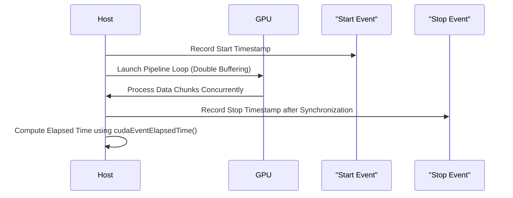

```markdown
# Day 25: Double Buffering Technique

In this lesson, we explore the **double buffering technique** in CUDA to overlap data transfers (communication) with computation. Double buffering is a common technique in high-performance computing to hide the latency of data transfers by using two sets of buffers: while one buffer is used for computation, the other is used for data transfer. This creates a pipeline where compute and copy operations run concurrently, thereby increasing throughput.

**Key Learning Objectives:**
- Understand the concept of double buffering.
- Learn how to implement a two-buffer pipeline using CUDA streams and asynchronous memory transfers.
- Recognize common pitfalls such as improper synchronization that can result in reading incomplete data.
- Use practical code examples with extensive inline comments.
- Visualize the process with detailed conceptual diagrams.
- Refer to precise documentation and best practices.

*Reference:*  
- [CUDA Concurrent Kernels Sample](https://docs.nvidia.com/cuda/cuda-samples/index.html)  
- [CUDA C Programming Guide – Asynchronous Transfers](https://docs.nvidia.com/cuda/cuda-c-programming-guide/index.html#asynchronous-transfers)

---

## Table of Contents

1. [Overview](#1-overview)  
2. [What is Double Buffering?](#2-what-is-double-buffering)  
3. [How Double Buffering Works in CUDA](#3-how-double-buffering-works-in-cuda)  
4. [Practical Exercise: Implementing a Two-Buffer Pipeline](#4-practical-exercise-implementing-a-two-buffer-pipeline)  
    - [a) Sample Kernel Code](#a-sample-kernel-code)  
    - [b) Host Code with Detailed Error Checking and Double Buffering](#b-host-code-with-detailed-error-checking-and-double-buffering)  
5. [Common Debugging Pitfalls](#5-common-debugging-pitfalls)  
6. [Conceptual Diagrams](#6-conceptual-diagrams)  
7. [References & Further Reading](#7-references--further-reading)  
8. [Conclusion](#8-conclusion)  
9. [Next Steps](#9-next-steps)  

---

## 1. Overview

In many CUDA applications, the performance bottleneck is often not the computation itself, but rather the **data transfer** between host and device. Double buffering addresses this problem by using two sets of buffers to overlap computation with data transfers. This technique ensures that while the GPU is processing data from one buffer, the next chunk of data is transferred into the alternate buffer.

---

## 2. What is Double Buffering?

**Double Buffering** is a technique where two buffers are used to alternate between transferring data and performing computations. The basic idea is:
- **Buffer 0** is used for computation while **Buffer 1** is being loaded with new data.
- Once the computation on Buffer 0 is finished, the roles are swapped.
- This overlap helps hide the latency of data transfers, leading to improved throughput.

---

## 3. How Double Buffering Works in CUDA

In CUDA, double buffering is typically implemented using:
- **Pinned (page-locked) host memory** for fast asynchronous transfers.
- **Two device buffers** that are used alternately.
- **CUDA Streams** to schedule asynchronous memory copies (`cudaMemcpyAsync()`) and kernel launches concurrently.
- **Synchronization** to ensure that the computation and memory transfers do not overlap incorrectly, which could result in reading incomplete data.

---

## 4. Practical Exercise: Implementing a Two-Buffer Pipeline

We will implement a simple vector addition using a double-buffering technique. The process involves:
1. Splitting the data into chunks.
2. Using two device buffers (Buffer 0 and Buffer 1) to overlap data transfers with computation.
3. Using CUDA streams and events for asynchronous operations and proper synchronization.

### a) Sample Kernel Code

```cpp
// vectorAddKernel.cu
#include <cuda_runtime.h>
#include <stdio.h>

// Simple vector addition kernel that processes one data chunk.
// Each thread computes one element of the output vector.
__global__ void vectorAddKernel(const float *A, const float *B, float *C, int chunkSize) {
    int idx = threadIdx.x + blockIdx.x * blockDim.x;
    if (idx < chunkSize) {
        C[idx] = A[idx] + B[idx];
    }
}
```

*Comments:*  
- This kernel is identical to a basic vector addition kernel.
- It processes a "chunk" of data, where the size of the chunk is passed as a parameter.

---

### b) Host Code with Detailed Error Checking and Double Buffering

Below is the host code that implements double buffering. It uses pinned memory for fast transfers and two device buffers to overlap memory transfers with kernel computation.

```cpp
// doubleBufferingPipeline.cu
#include <cuda_runtime.h>
#include <stdio.h>
#include <stdlib.h>
#include <time.h>

// Declaration of the vector addition kernel.
__global__ void vectorAddKernel(const float *A, const float *B, float *C, int chunkSize);

// Macro for error checking.
#define CUDA_CHECK(call) {                                    \
    cudaError_t err = call;                                   \
    if(err != cudaSuccess) {                                 \
        printf("CUDA Error at %s:%d - %s\n", __FILE__, __LINE__, cudaGetErrorString(err)); \
        exit(EXIT_FAILURE);                                   \
    }                                                         \
}

int main() {
    // Total vector size and chunk size.
    int totalElements = 1 << 22;  // e.g., 4M elements
    int chunkSize = 1 << 20;      // Process in chunks of 1M elements
    size_t chunkBytes = chunkSize * sizeof(float);
    size_t totalBytes = totalElements * sizeof(float);

    // Allocate pinned host memory for the entire input and output vectors.
    float *h_A, *h_B, *h_C;
    CUDA_CHECK(cudaMallocHost((void**)&h_A, totalBytes));
    CUDA_CHECK(cudaMallocHost((void**)&h_B, totalBytes));
    CUDA_CHECK(cudaMallocHost((void**)&h_C, totalBytes));

    // Initialize the host arrays with random values.
    srand(time(NULL));
    for (int i = 0; i < totalElements; i++) {
        h_A[i] = (float)(rand() % 100) / 10.0f;
        h_B[i] = (float)(rand() % 100) / 10.0f;
    }

    // Allocate two device buffers for double buffering.
    float *d_A0, *d_B0, *d_C0;
    float *d_A1, *d_B1, *d_C1;
    CUDA_CHECK(cudaMalloc((void**)&d_A0, chunkBytes));
    CUDA_CHECK(cudaMalloc((void**)&d_B0, chunkBytes));
    CUDA_CHECK(cudaMalloc((void**)&d_C0, chunkBytes));
    CUDA_CHECK(cudaMalloc((void**)&d_A1, chunkBytes));
    CUDA_CHECK(cudaMalloc((void**)&d_B1, chunkBytes));
    CUDA_CHECK(cudaMalloc((void**)&d_C1, chunkBytes));

    // Create two CUDA streams for asynchronous operations.
    cudaStream_t stream0, stream1;
    CUDA_CHECK(cudaStreamCreate(&stream0));
    CUDA_CHECK(cudaStreamCreate(&stream1));

    // Create CUDA events for timing.
    cudaEvent_t start, stop;
    CUDA_CHECK(cudaEventCreate(&start));
    CUDA_CHECK(cudaEventCreate(&stop));

    // Determine the number of chunks.
    int numChunks = totalElements / chunkSize;
    if (totalElements % chunkSize != 0) numChunks++;

    // Kernel configuration.
    int threadsPerBlock = 256;
    int blocksPerGrid = (chunkSize + threadsPerBlock - 1) / threadsPerBlock;

    // Start overall timing.
    CUDA_CHECK(cudaEventRecord(start, 0));

    // Loop through all chunks using double buffering.
    for (int chunk = 0; chunk < numChunks; chunk++) {
        // Calculate the offset for this chunk.
        int offset = chunk * chunkSize;
        // Determine current chunk size (last chunk may be smaller).
        int currentChunkSize = ((offset + chunkSize) <= totalElements) ? chunkSize : (totalElements - offset);
        size_t currentChunkBytes = currentChunkSize * sizeof(float);

        // Determine which device buffers to use (ping-pong switching).
        // If chunk is even, use buffers 0; if odd, use buffers 1.
        float *d_A = (chunk % 2 == 0) ? d_A0 : d_A1;
        float *d_B = (chunk % 2 == 0) ? d_B0 : d_B1;
        float *d_C = (chunk % 2 == 0) ? d_C0 : d_C1;
        cudaStream_t stream = (chunk % 2 == 0) ? stream0 : stream1;

        // Asynchronously copy the current chunk of data from host to device.
        CUDA_CHECK(cudaMemcpyAsync(d_A, h_A + offset, currentChunkBytes, cudaMemcpyHostToDevice, stream));
        CUDA_CHECK(cudaMemcpyAsync(d_B, h_B + offset, currentChunkBytes, cudaMemcpyHostToDevice, stream));

        // Launch the vector addition kernel on this chunk.
        vectorAddKernel<<<blocksPerGrid, threadsPerBlock, 0, stream>>>(d_A, d_B, d_C, currentChunkSize);

        // Asynchronously copy the result from device to host.
        CUDA_CHECK(cudaMemcpyAsync(h_C + offset, d_C, currentChunkBytes, cudaMemcpyDeviceToHost, stream));

        // Optional: Overlap additional computation or data transfer for subsequent chunks here.
    }

    // Wait for all streams to finish processing.
    CUDA_CHECK(cudaDeviceSynchronize());

    // Record the stop event.
    CUDA_CHECK(cudaEventRecord(stop, 0));
    CUDA_CHECK(cudaEventSynchronize(stop));

    // Calculate total elapsed time.
    float elapsedTime = 0;
    CUDA_CHECK(cudaEventElapsedTime(&elapsedTime, start, stop));
    printf("Total Pipeline Execution Time: %f ms\n", elapsedTime);

    // (Optional) Verify results: Print first 10 elements.
    printf("First 10 elements of result vector:\n");
    for (int i = 0; i < 10; i++) {
        printf("%f ", h_C[i]);
    }
    printf("\n");

    // Cleanup: Free device memory.
    CUDA_CHECK(cudaFree(d_A0));
    CUDA_CHECK(cudaFree(d_B0));
    CUDA_CHECK(cudaFree(d_C0));
    CUDA_CHECK(cudaFree(d_A1));
    CUDA_CHECK(cudaFree(d_B1));
    CUDA_CHECK(cudaFree(d_C1));

    // Destroy streams and events.
    CUDA_CHECK(cudaStreamDestroy(stream0));
    CUDA_CHECK(cudaStreamDestroy(stream1));
    CUDA_CHECK(cudaEventDestroy(start));
    CUDA_CHECK(cudaEventDestroy(stop));

    // Free pinned host memory.
    CUDA_CHECK(cudaFreeHost(h_A));
    CUDA_CHECK(cudaFreeHost(h_B));
    CUDA_CHECK(cudaFreeHost(h_C));

    return 0;
}
```

*Detailed Comments Explanation:*

- **Memory Allocation:**
  - **Pinned Memory Allocation:**  
    `cudaMallocHost()` is used to allocate host memory for arrays `h_A`, `h_B`, and `h_C` to enable high-throughput asynchronous transfers.
  - **Device Memory Allocation:**  
    Two sets of device buffers (`d_A0/d_B0/d_C0` and `d_A1/d_B1/d_C1`) are allocated, one for each of the two buffers used in double buffering.
  
- **Stream Creation:**
  - Two CUDA streams (`stream0` and `stream1`) are created to perform asynchronous transfers and kernel launches concurrently.
  
- **Event Creation and Timing:**
  - CUDA events (`start` and `stop`) are created to measure the total execution time of the entire pipeline.
  - The start event is recorded before beginning the loop, and the stop event is recorded after all processing is complete.
  
- **Processing Loop (Double Buffering Pipeline):**
  - The data is divided into **chunks**; each chunk is processed separately.
  - A **ping-pong mechanism** is used to alternate between two sets of device buffers, allowing one buffer to be used for computation while the other is being loaded/unloaded.
  - For each chunk:
    - **Asynchronous Memory Transfer:**  
      The current chunk of data is copied asynchronously from the pinned host memory to the appropriate device buffer using `cudaMemcpyAsync()`.
    - **Kernel Launch:**  
      The `vectorAddKernel` is launched in the corresponding stream, processing the current chunk.
    - **Result Copy:**  
      The result is copied back asynchronously to the host.
  - The host then synchronizes with `cudaDeviceSynchronize()` to ensure all streams have finished.
  
- **Cleanup:**
  - All device memory, streams, events, and pinned host memory are freed or destroyed properly.
  
- **Performance Measurement:**
  - The elapsed time is computed using `cudaEventElapsedTime()` and printed.

---

## 7. Conceptual Diagrams

### Diagram 1: Double Buffering Pipeline Workflow

```mermaid
flowchart TD
    A[Host: Allocate Pinned Memory for h_A, h_B, h_C]
    B[Host: Allocate Two Sets of Device Buffers (Buffer 0 & Buffer 1)]
    C[Host: Create Two CUDA Streams (stream0 & stream1)]
    D[Loop Over Data Chunks]
    E[Determine Current Chunk and Offset]
    F{Is Chunk Even?}
    G[Use Buffer 0 in stream0]
    H[Use Buffer 1 in stream1]
    I[Asynchronously copy data from host to device (cudaMemcpyAsync)]
    J[Launch Kernel on the current device buffer]
    K[Asynchronously copy results from device to host]
    L[Synchronize Stream]
    M[After Loop, Synchronize Device]
    N[Record Total Execution Time with CUDA Events]
    O[Host: Verify Results]
    
    A --> B
    B --> C
    C --> D
    D --> E
    E --> F
    F -- Yes --> G
    F -- No --> H
    G --> I
    H --> I
    I --> J
    J --> K
    K --> L
    L --> D
    D --> M
    M --> N
    N --> O
```

*Explanation:*  
- **A–C:** Setup of pinned host memory, two device buffers, and two streams.
- **D–E:** The data is divided into chunks; for each chunk, determine the starting offset.
- **F–H:** Use a ping-pong mechanism to choose between Buffer 0 and Buffer 1 based on whether the chunk index is even or odd.
- **I–K:** Asynchronous data transfers and kernel launches are performed in the selected stream.
- **L–N:** After processing all chunks, the device is synchronized and the elapsed time is measured using CUDA events.
- **O:** Results are copied back and verified.

### Diagram 2: Timing Workflow with CUDA Events



*Explanation:*  
- This sequence diagram outlines how the host records start and stop events around the entire double buffering pipeline.
- The elapsed time reflects the total time taken for all data transfers and kernel executions.

---

## 8. References & Further Reading

1. **CUDA C Programming Guide – Asynchronous Transfers**  
   [CUDA Asynchronous Transfers](https://docs.nvidia.com/cuda/cuda-c-programming-guide/index.html#asynchronous-transfers)
2. **CUDA C Programming Guide – Concurrent Kernels**  
   [CUDA Concurrent Kernels](https://docs.nvidia.com/cuda/cuda-c-programming-guide/index.html#concurrent-kernels)
3. **CUDA Concurrent Kernels Sample**  
   [NVIDIA CUDA Samples](https://docs.nvidia.com/cuda/cuda-samples/index.html)
4. **CUDA C Best Practices Guide**  
   [CUDA C Best Practices Guide](https://docs.nvidia.com/cuda/cuda-c-best-practices-guide/index.html)
5. **"Programming Massively Parallel Processors: A Hands-on Approach" by David B. Kirk and Wen-mei W. Hwu**  
6. **NVIDIA Developer Blog**  
   [NVIDIA Developer Blog](https://developer.nvidia.com/blog/)

---

## 9. Conclusion

In Day 25, you learned to implement a **double buffering technique** in CUDA to overlap computation with data transfers. Key takeaways include:
- **Double Buffering Technique:**  
  Using two device buffers to process data chunks concurrently—one buffer is used for computation while the other is used for memory transfers.
- **Asynchronous Operations:**  
  Utilizing `cudaMemcpyAsync()` with pinned memory and CUDA streams to overlap data transfer with kernel execution.
- **Synchronization:**  
  Ensuring proper synchronization to avoid reading incomplete data.
- **Timing:**  
  Using CUDA events to measure the total execution time of the pipeline.
- **Conceptual Diagrams:**  
  Visual representations of the double buffering workflow and timing mechanisms.

---

## 10. Next Steps

- **Experiment with different data sizes and buffer counts** to understand the scaling of double buffering.
- **Profile the pipeline** using NVIDIA NSight Systems to analyze overlapping performance.
- **Integrate double buffering into more complex applications** such as image processing or streaming data analytics.
- **Continue to optimize memory transfers** by adjusting stream priorities and exploring multi-stream setups.

Happy CUDA coding, and may your pipelines run as efficiently as possible!
```

```markdown
# Day 26: Constant Memory

In this lesson, we will explore **Constant Memory** in CUDA. Constant memory is a small region of memory that is cached on-chip and optimized for read-only data. It is especially useful for storing constants such as filter coefficients, lookup tables, or any other data that does not change during kernel execution.

This lesson covers:
- An in-depth explanation of constant memory and its advantages.
- How to allocate and use constant memory in CUDA.
- A detailed practical exercise implementing a vector operation that leverages constant memory for coefficients.
- Debugging pitfalls to avoid (e.g., exceeding constant memory limits or using constant memory for non-read-only data).
- Extensive code examples with thorough inline comments.
- Conceptual diagrams to illustrate how constant memory is accessed and cached.
- Precise reference links to the CUDA documentation and best practices.

---

## Table of Contents

1. [Overview](#overview)
2. [What is Constant Memory?](#what-is-constant-memory)
3. [Advantages and Limitations of Constant Memory](#advantages-and-limitations-of-constant-memory)
4. [Using Constant Memory in CUDA](#using-constant-memory-in-cuda)
5. [Practical Exercise: Vector Scaling with Constant Coefficients](#practical-exercise-vector-scaling-with-constant-coefficients)
    - [a) Kernel Code](#a-kernel-code)
    - [b) Host Code with Detailed Error Checking and Comments](#b-host-code-with-detailed-error-checking-and-comments)
6. [Common Debugging Pitfalls](#common-debugging-pitfalls)
7. [Conceptual Diagrams](#conceptual-diagrams)
8. [References & Further Reading](#references--further-reading)
9. [Conclusion](#conclusion)
10. [Next Steps](#next-steps)

---

## 1. Overview

In CUDA, **constant memory** is used to store data that does not change over the course of kernel execution. Because it is cached on-chip, constant memory provides very fast access for all threads in a warp when the data is accessed uniformly. However, constant memory is limited in size (typically 64KB on most architectures), so it must be used judiciously.

---

## 2. What is Constant Memory?

**Constant Memory** in CUDA is declared with the `__constant__` qualifier and is:
- **Read-only** during kernel execution.
- **Cached** on the GPU, allowing for low-latency access.
- Ideal for storing data such as coefficients, lookup tables, and fixed parameters.

**Declaration Example:**
```cpp
__constant__ float constCoeffs[16];
```
This declares a constant memory array that can be accessed by all threads but cannot be modified by the device kernels.

---

## 3. Advantages and Limitations of Constant Memory

### Advantages
- **Low Latency:**  
  Data in constant memory is cached, so when all threads access the same location, the value is broadcast to all threads quickly.
- **Efficient for Uniform Access:**  
  When many threads read the same value (or adjacent values) from constant memory, the hardware efficiently serves the request.
- **Simplifies Data Management:**  
  Useful for storing fixed parameters or coefficients without needing to update them during kernel execution.

### Limitations
- **Limited Size:**  
  Constant memory is typically limited to 64KB (architecture-dependent). Exceeding this limit will result in errors.
- **Read-Only Access:**  
  Data stored in constant memory must remain unchanged during kernel execution. Attempting to write to constant memory from device code will cause errors.
- **Access Patterns:**  
  For maximum performance, the data should be accessed uniformly across threads in a warp.

---

## 4. Using Constant Memory in CUDA

To use constant memory:
1. **Declare a constant variable** at global scope with the `__constant__` qualifier.
2. **Copy data to constant memory** from the host using `cudaMemcpyToSymbol()`.
3. **Access constant memory** within kernels like any other array. All threads can read from it at high speed.

**Example Declaration:**
```cpp
__constant__ float constCoeffs[16];
```

**Copying Data to Constant Memory (Host Code):**
```cpp
float h_coeffs[16] = { /* your constant coefficients */ };
cudaMemcpyToSymbol(constCoeffs, h_coeffs, 16 * sizeof(float));
```

*Reference:*  
- [CUDA C Programming Guide – Constant Memory](https://docs.nvidia.com/cuda/cuda-c-programming-guide/index.html#constant-memory)

---

## 5. Practical Exercise: Vector Scaling with Constant Coefficients

In this exercise, we will implement a simple vector scaling operation where each element of a vector is multiplied by a constant coefficient. The coefficient will be stored in constant memory.

### a) Kernel Code

```cpp
// vectorScaleKernel.cu
#include <cuda_runtime.h>
#include <stdio.h>

// Declare a constant memory variable to store the scaling factor.
__constant__ float scaleFactor;

// Kernel for scaling a vector using the constant scale factor.
__global__ void vectorScaleKernel(const float *input, float *output, int N) {
    // Compute global thread index.
    int idx = threadIdx.x + blockIdx.x * blockDim.x;
    
    // Check bounds to prevent out-of-bounds access.
    if (idx < N) {
        // Multiply each element by the constant scaling factor.
        output[idx] = input[idx] * scaleFactor;
    }
}
```

*Comments:*  
- The constant memory variable `scaleFactor` holds the read-only scaling factor.
- Each thread computes its global index and scales the corresponding element.
- The kernel uses a simple boundary check.

---

### b) Host Code with Detailed Error Checking and Comments

```cpp
// vectorScaleWithConstantMemory.cu
#include <cuda_runtime.h>
#include <stdio.h>
#include <stdlib.h>
#include <time.h>

// Declaration of the vector scaling kernel.
__global__ void vectorScaleKernel(const float *input, float *output, int N);

// Declare the constant memory variable to store the scale factor.
__constant__ float scaleFactor;

#define CUDA_CHECK(call) {                                      \
    cudaError_t err = call;                                     \
    if (err != cudaSuccess) {                                   \
        printf("CUDA Error at %s:%d - %s\n", __FILE__, __LINE__, cudaGetErrorString(err)); \
        exit(EXIT_FAILURE);                                     \
    }                                                           \
}

int main() {
    // Define vector size.
    int N = 1 << 20;  // 1 million elements.
    size_t size = N * sizeof(float);

    // Allocate host memory using standard malloc (for this example).
    float *h_input = (float*)malloc(size);
    float *h_output = (float*)malloc(size);
    if (!h_input || !h_output) {
        printf("Host memory allocation failed\n");
        exit(EXIT_FAILURE);
    }

    // Initialize the host input vector with random values.
    srand(time(NULL));
    for (int i = 0; i < N; i++) {
        h_input[i] = (float)(rand() % 100) / 10.0f;
    }

    // Allocate device memory.
    float *d_input, *d_output;
    CUDA_CHECK(cudaMalloc((void**)&d_input, size));
    CUDA_CHECK(cudaMalloc((void**)&d_output, size));

    // Copy input data from host to device.
    CUDA_CHECK(cudaMemcpy(d_input, h_input, size, cudaMemcpyHostToDevice));

    // Set the constant scale factor on the device using cudaMemcpyToSymbol.
    float h_scale = 2.5f;  // Example scale factor.
    CUDA_CHECK(cudaMemcpyToSymbol(scaleFactor, &h_scale, sizeof(float)));

    // Define kernel launch parameters.
    int threadsPerBlock = 256;
    int blocksPerGrid = (N + threadsPerBlock - 1) / threadsPerBlock;

    // Create CUDA events for timing.
    cudaEvent_t start, stop;
    CUDA_CHECK(cudaEventCreate(&start));
    CUDA_CHECK(cudaEventCreate(&stop));

    // Record the start event.
    CUDA_CHECK(cudaEventRecord(start, 0));

    // Launch the vector scaling kernel.
    vectorScaleKernel<<<blocksPerGrid, threadsPerBlock>>>(d_input, d_output, N);

    // Record the stop event.
    CUDA_CHECK(cudaEventRecord(stop, 0));
    CUDA_CHECK(cudaEventSynchronize(stop));

    // Calculate elapsed time.
    float elapsedTime = 0;
    CUDA_CHECK(cudaEventElapsedTime(&elapsedTime, start, stop));
    printf("Kernel Execution Time: %f ms\n", elapsedTime);

    // Copy the result vector from device back to host.
    CUDA_CHECK(cudaMemcpy(h_output, d_output, size, cudaMemcpyDeviceToHost));

    // Verify results by printing the first 10 elements.
    printf("First 10 elements of the scaled vector:\n");
    for (int i = 0; i < 10; i++) {
        printf("%f ", h_output[i]);
    }
    printf("\n");

    // Clean up: Free device memory, destroy events, and free host memory.
    CUDA_CHECK(cudaFree(d_input));
    CUDA_CHECK(cudaFree(d_output));
    CUDA_CHECK(cudaEventDestroy(start));
    CUDA_CHECK(cudaEventDestroy(stop));
    free(h_input);
    free(h_output);

    return 0;
}
```

*Detailed Comments Explanation:*
- **Host Memory Allocation:**  
  Uses standard `malloc()` for simplicity in this example.
- **Device Memory Allocation:**  
  Uses `cudaMalloc()` to allocate memory on the GPU.
- **Constant Memory Setup:**  
  The host sets the value of `scaleFactor` using `cudaMemcpyToSymbol()`, which copies the value to constant memory.
- **Kernel Launch:**  
  The kernel is launched with grid and block dimensions calculated from the vector size.
- **CUDA Events for Timing:**  
  CUDA events record the start and stop times of the kernel execution for performance measurement.
- **Result Verification:**  
  The output is copied back to host memory and printed to verify correct scaling.
- **Resource Cleanup:**  
  All resources (device memory, events, host memory) are properly freed to prevent leaks.

---

## 7. Conceptual Diagrams

### Diagram 1: Constant Memory Usage Flow
```mermaid
flowchart TD
    A[Host: Define Constant Data (scaleFactor)]
    B[Host: Allocate Unified/Device Memory for Data]
    C[Copy Data to Device using cudaMemcpyToSymbol]
    D[Kernel: Access scaleFactor from Constant Memory]
    E[Kernel: Compute Output using scaleFactor]
    F[Host: Copy Result from Device to Host]

    A --> B
    B --> C
    C --> D
    D --> E
    E --> F
```

*Explanation:*  
- The host defines constant data and uses `cudaMemcpyToSymbol` to copy it into constant memory.
- The kernel accesses this constant data to perform computations.
- The result is then copied back to the host.

### Diagram 2: Overall Vector Scaling with Constant Memory
```mermaid
flowchart TD
    A[Allocate Host Memory for Input/Output]
    B[Initialize Input Data]
    C[Allocate Device Memory]
    D[Copy Input Data from Host to Device]
    E[Copy Constant Scale Factor to Constant Memory]
    F[Launch Vector Scaling Kernel]
    G[Kernel Execution: Each Thread Reads scaleFactor]
    H[Compute: output[i] = input[i] * scaleFactor]
    I[Copy Results from Device to Host]
    J[Verify Output]

    A --> B
    B --> C
    C --> D
    D --> E
    E --> F
    F --> G
    G --> H
    H --> I
    I --> J
```

*Explanation:*  
- This diagram outlines the complete workflow of a vector scaling operation using constant memory.
- It shows the process from memory allocation and initialization to kernel execution and result verification.

---

## 8. References & Further Reading

1. **CUDA C Programming Guide – Constant Memory**  
   [CUDA Constant Memory Documentation](https://docs.nvidia.com/cuda/cuda-c-programming-guide/index.html#constant-memory)  
   Comprehensive details on how constant memory works and its best use cases.
   
2. **CUDA C Best Practices Guide – Memory**  
   [CUDA C Best Practices Guide](https://docs.nvidia.com/cuda/cuda-c-best-practices-guide/index.html#constant-memory)  
   Best practices for using constant memory effectively.
   
3. **NVIDIA Developer Blog – Constant Memory**  
   [NVIDIA Developer Blog on Constant Memory](https://developer.nvidia.com/blog/)  
   Articles and case studies on constant memory usage and optimization.
   
4. **"Programming Massively Parallel Processors: A Hands-on Approach" by David B. Kirk and Wen-mei W. Hwu**  
   A comprehensive resource for understanding CUDA memory hierarchies, including constant memory.

---

## 9. Conclusion

In Day 26, we have covered:
- **What constant memory is** and why it is ideal for storing read-only data.
- **How to allocate constant memory** using the `__constant__` qualifier and `cudaMemcpyToSymbol()`.
- **How to implement a simple vector scaling operation** that leverages constant memory.
- **Common pitfalls** such as exceeding constant memory limits or using constant memory incorrectly.
- **Extensive code examples** with detailed inline comments and conceptual diagrams for clear understanding.

---

## 10. Next Steps

- **Experiment:**  
  Extend the vector scaling example to more complex applications, such as filtering or applying transformation matrices stored in constant memory.
- **Profile:**  
  Use NVIDIA NSight Compute to profile constant memory usage and its impact on performance.
- **Optimize:**  
  Explore strategies for maximizing constant memory performance and ensuring that your access patterns are optimal.
- **Expand:**  
  Integrate constant memory techniques into larger projects, such as image processing pipelines or deep neural network inference.

Happy CUDA coding, and continue to refine your skills in high-performance GPU programming!
```
