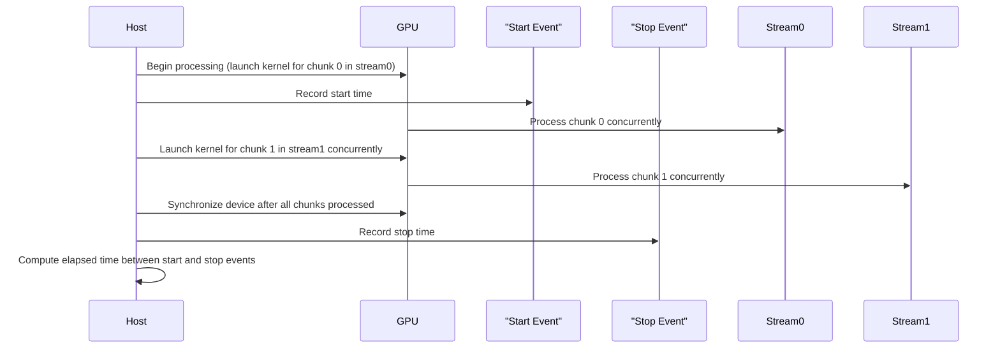
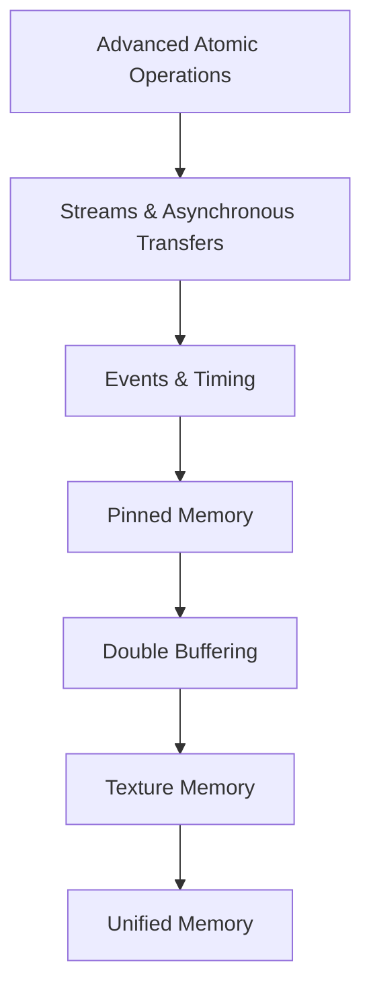
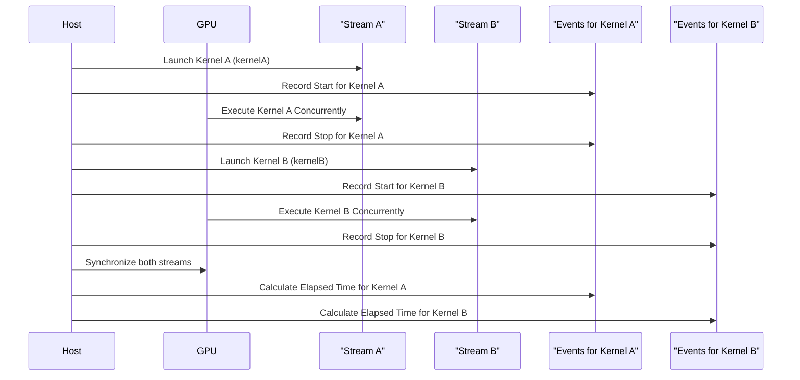
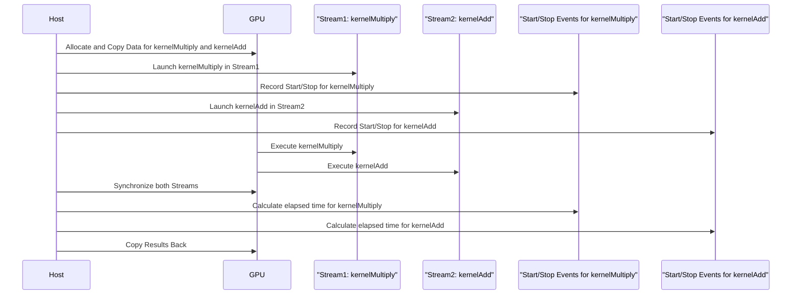
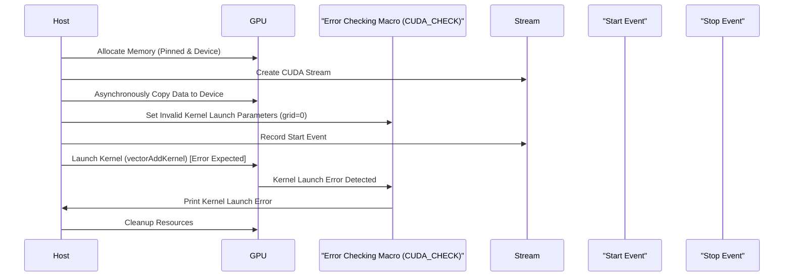
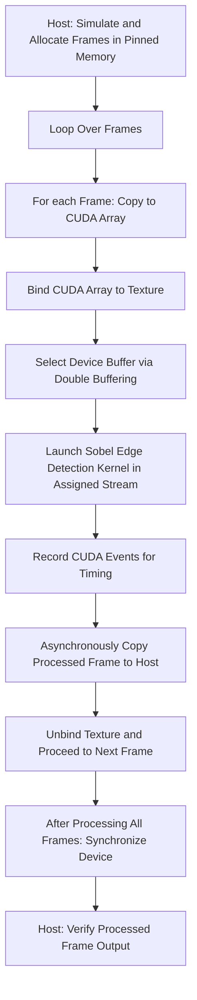

```markdown
# Day 28: Progress Checkpoint – Recap of Concurrency & Memory

In this capstone checkpoint, we consolidate and review the key concepts covered from Days 15 through 27. This checkpoint focuses on **concurrency** and **memory management** in CUDA, including topics such as advanced atomic operations, streams, events, asynchronous memory copies, pinned memory, double buffering, and texture memory.

The goal of this session is to ensure you have a **strong foundation** in these essential topics. You will:
- Complete a **short multi-topic quiz** covering concurrency and memory.
- Work on a **mini-project** that integrates several concepts.
- Review detailed code examples with extensive inline comments.
- Use conceptual diagrams to visualize key workflows.
- Reference precise documentation and further reading materials.

> **Note:** Gaps in your concurrency and memory management knowledge can lead to suboptimal performance in your CUDA applications. This checkpoint is designed to identify and reinforce those areas.

---

## Table of Contents

1. [Overview](#overview)
2. [Key Topics Recap](#key-topics-recap)
    - [Advanced Atomic Operations](#advanced-atomic-operations)
    - [Streams & Concurrency](#streams--concurrency)
    - [Events & Timing](#events--timing)
    - [Asynchronous Memory Copy & Pinned Memory](#asynchronous-memory-copy--pinned-memory)
    - [Double Buffering Technique](#double-buffering-technique)
    - [Texture & Surface Memory](#texture--surface-memory)
3. [Multi-Topic Quiz](#multi-topic-quiz)
4. [Mini-Project: Integrated Concurrency & Memory Pipeline](#mini-project-integrated-concurrency--memory-pipeline)
5. [Common Debugging Pitfalls & Best Practices](#common-debugging-pitfalls--best-practices)
6. [Conceptual Diagrams](#conceptual-diagrams)
7. [References & Further Reading](#references--further-reading)
8. [Conclusion](#conclusion)
9. [Next Steps](#next-steps)

---

## 1. Overview

This progress checkpoint is designed to test and reinforce your understanding of the key concepts related to concurrency and memory in CUDA. You will answer a set of quiz questions, then work on a mini-project that integrates many of the topics from Days 15–27. The mini-project will involve:
- Launching concurrent kernels using streams.
- Timing execution using CUDA events.
- Performing asynchronous memory copies using pinned memory.
- Implementing double buffering to overlap computation and data transfers.
- Utilizing texture memory for optimized 2D data access.

---

## 2. Key Topics Recap

### Advanced Atomic Operations
- **Concept:** Use atomic functions (e.g., `atomicCAS`, `atomicExch`) to safely update shared variables.
- **Key Points:**  
  - Prevent race conditions.
  - Can become a bottleneck if overused.
  - Custom implementations (e.g., atomicMax for floats).

### Streams & Concurrency
- **Concept:** CUDA streams allow asynchronous, concurrent kernel execution and memory transfers.
- **Key Points:**  
  - Default stream is blocking; non-default streams enable overlap.
  - Use `cudaStreamCreate()`, `cudaMemcpyAsync()`, and `cudaStreamSynchronize()`.

### Events & Timing
- **Concept:** CUDA events allow precise timing of GPU operations.
- **Key Points:**  
  - Use `cudaEventRecord()`, `cudaEventSynchronize()`, and `cudaEventElapsedTime()`.
  - Proper event placement is critical to avoid skewed measurements.

### Asynchronous Memory Copy & Pinned Memory
- **Concept:** Asynchronous copies (`cudaMemcpyAsync()`) can overlap with computation if using pinned (page-locked) host memory.
- **Key Points:**  
  - Pinned memory is allocated with `cudaMallocHost()`.
  - Provides faster data transfer rates than pageable memory.
  - Excessive pinned memory can negatively impact system performance.

### Double Buffering Technique
- **Concept:** Use two device buffers (ping-pong buffering) to overlap data transfers with computation.
- **Key Points:**  
  - Alternates between buffers to hide data transfer latency.
  - Requires careful synchronization to avoid reading incomplete data.

### Texture & Surface Memory
- **Concept:** Texture memory is a read-only memory optimized for 2D spatial locality.
- **Key Points:**  
  - Bind a CUDA array to a texture reference.
  - Use `tex2D()` to sample texture data.
  - Useful for image processing applications.

---

## 3. Multi-Topic Quiz

Answer the following questions to test your knowledge:

1. **What is the primary advantage of using atomic operations in CUDA?**  
   *Answer:* They ensure safe, concurrent updates to shared variables without race conditions.

2. **Why are non-default CUDA streams important for concurrency?**  
   *Answer:* They allow multiple kernels and memory transfers to overlap, improving overall performance.

3. **How do CUDA events help in kernel timing?**  
   *Answer:* They record timestamps before and after kernel execution, enabling precise measurement of execution time.

4. **What is the benefit of using pinned (page-locked) memory over pageable memory for data transfers?**  
   *Answer:* Pinned memory provides higher transfer rates and allows for true asynchronous transfers.

5. **Explain the double buffering technique and its purpose.**  
   *Answer:* Double buffering uses two buffers to alternate between data transfers and computation, overlapping these tasks to hide transfer latency.

6. **How does texture memory improve performance in image processing?**  
   *Answer:* Texture memory is cached and optimized for spatial locality, providing faster access for 2D data and built-in filtering/interpolation.

7. **What are the potential pitfalls of misusing asynchronous memory transfers?**  
   *Answer:* Incorrect synchronization can lead to incomplete data transfers, race conditions, or reading stale data.

8. **Describe how to properly time a kernel using CUDA events.**  
   *Answer:* Record a start event before kernel launch, record a stop event after kernel launch, synchronize on the stop event, then calculate elapsed time with `cudaEventElapsedTime()`.

9. **What could cause suboptimal performance when using double buffering?**  
   *Answer:* Improper synchronization or mismanagement of the buffer switching can lead to reading incomplete data or idle GPU time.

10. **Why is it important to unbind texture memory after kernel execution?**  
    *Answer:* Failing to unbind can lead to unintended side effects in subsequent kernel launches or incorrect data usage.

---

## 4. Mini-Project: Integrated Concurrency & Memory Pipeline

### Project Overview:
Implement an integrated pipeline that performs a simple image processing operation (e.g., vector addition for simplicity) using:
- **Asynchronous memory transfers** (with pinned memory).
- **Concurrent kernel execution** (using streams).
- **Double buffering** to overlap data transfer with computation.
- **Timing with CUDA events** to measure performance.

### Project Requirements:
- **Divide the data** into chunks.
- Use **two device buffers** for double buffering.
- Launch kernel operations concurrently in separate streams.
- Use **CUDA events** to measure the overall execution time.
- **Compare performance** with a non-overlapped (synchronous) version.

### a) Sample Kernel Code (Vector Addition)
*Reusing the vector addition kernel from Day 21:*
```cpp
// vectorAddKernel.cu
#include <cuda_runtime.h>
#include <stdio.h>

// Simple vector addition kernel: each thread computes one element.
__global__ void vectorAddKernel(const float *A, const float *B, float *C, int chunkSize) {
    int idx = threadIdx.x + blockIdx.x * blockDim.x;
    if (idx < chunkSize) {
        C[idx] = A[idx] + B[idx];
    }
}
```

### b) Host Code with Double Buffering, Asynchronous Transfers, and Timing

```cpp
// integratedPipeline.cu
#include <cuda_runtime.h>
#include <stdio.h>
#include <stdlib.h>
#include <time.h>

// Declaration of the vector addition kernel.
__global__ void vectorAddKernel(const float *A, const float *B, float *C, int chunkSize);

// Macro for error checking.
#define CUDA_CHECK(call) {                                      \
    cudaError_t err = call;                                     \
    if (err != cudaSuccess) {                                   \
        printf("CUDA Error at %s:%d - %s\n", __FILE__, __LINE__, cudaGetErrorString(err)); \
        exit(EXIT_FAILURE);                                     \
    }                                                           \
}

int main() {
    // Total number of elements and chunk size.
    int totalElements = 1 << 22;  // e.g., 4M elements
    int chunkSize = 1 << 20;      // Process in chunks of 1M elements
    size_t chunkBytes = chunkSize * sizeof(float);
    size_t totalBytes = totalElements * sizeof(float);

    // Allocate pinned host memory for input and output vectors.
    float *h_A, *h_B, *h_C;
    CUDA_CHECK(cudaMallocHost((void**)&h_A, totalBytes));
    CUDA_CHECK(cudaMallocHost((void**)&h_B, totalBytes));
    CUDA_CHECK(cudaMallocHost((void**)&h_C, totalBytes));

    // Initialize the host input arrays with random values.
    srand(time(NULL));
    for (int i = 0; i < totalElements; i++) {
        h_A[i] = (float)(rand() % 100) / 10.0f;
        h_B[i] = (float)(rand() % 100) / 10.0f;
    }

    // Allocate two sets of device buffers for double buffering.
    float *d_A0, *d_B0, *d_C0;
    float *d_A1, *d_B1, *d_C1;
    CUDA_CHECK(cudaMalloc((void**)&d_A0, chunkBytes));
    CUDA_CHECK(cudaMalloc((void**)&d_B0, chunkBytes));
    CUDA_CHECK(cudaMalloc((void**)&d_C0, chunkBytes));
    CUDA_CHECK(cudaMalloc((void**)&d_A1, chunkBytes));
    CUDA_CHECK(cudaMalloc((void**)&d_B1, chunkBytes));
    CUDA_CHECK(cudaMalloc((void**)&d_C1, chunkBytes));

    // Create two CUDA streams.
    cudaStream_t stream0, stream1;
    CUDA_CHECK(cudaStreamCreate(&stream0));
    CUDA_CHECK(cudaStreamCreate(&stream1));

    // Create CUDA events for timing the entire pipeline.
    cudaEvent_t start, stop;
    CUDA_CHECK(cudaEventCreate(&start));
    CUDA_CHECK(cudaEventCreate(&stop));

    // Determine the number of chunks.
    int numChunks = totalElements / chunkSize;
    if (totalElements % chunkSize != 0) numChunks++;

    // Kernel launch configuration.
    int threadsPerBlock = 256;
    int blocksPerGrid = (chunkSize + threadsPerBlock - 1) / threadsPerBlock;

    // Record start event.
    CUDA_CHECK(cudaEventRecord(start, 0));

    // Loop over all chunks using double buffering.
    for (int chunk = 0; chunk < numChunks; chunk++) {
        int offset = chunk * chunkSize;
        int currentChunkSize = ((offset + chunkSize) <= totalElements) ? chunkSize : (totalElements - offset);
        size_t currentChunkBytes = currentChunkSize * sizeof(float);

        // Alternate between two sets of device buffers.
        float *d_A = (chunk % 2 == 0) ? d_A0 : d_A1;
        float *d_B = (chunk % 2 == 0) ? d_B0 : d_B1;
        float *d_C = (chunk % 2 == 0) ? d_C0 : d_C1;
        cudaStream_t stream = (chunk % 2 == 0) ? stream0 : stream1;

        // Asynchronously copy current chunk from host to device.
        CUDA_CHECK(cudaMemcpyAsync(d_A, h_A + offset, currentChunkBytes, cudaMemcpyHostToDevice, stream));
        CUDA_CHECK(cudaMemcpyAsync(d_B, h_B + offset, currentChunkBytes, cudaMemcpyHostToDevice, stream));

        // Launch the vector addition kernel on the current chunk.
        vectorAddKernel<<<blocksPerGrid, threadsPerBlock, 0, stream>>>(d_A, d_B, d_C, currentChunkSize);

        // Asynchronously copy the output from device back to host.
        CUDA_CHECK(cudaMemcpyAsync(h_C + offset, d_C, currentChunkBytes, cudaMemcpyDeviceToHost, stream));
    }

    // Wait for all streams to finish.
    CUDA_CHECK(cudaDeviceSynchronize());

    // Record stop event.
    CUDA_CHECK(cudaEventRecord(stop, 0));
    CUDA_CHECK(cudaEventSynchronize(stop));

    // Compute total elapsed time.
    float elapsedTime = 0;
    CUDA_CHECK(cudaEventElapsedTime(&elapsedTime, start, stop));
    printf("Total Pipeline Execution Time: %f ms\n", elapsedTime);

    // Optionally, verify results by printing first 10 elements.
    printf("First 10 elements of result vector:\n");
    for (int i = 0; i < 10; i++) {
        printf("%f ", h_C[i]);
    }
    printf("\n");

    // Cleanup: Free device memory.
    CUDA_CHECK(cudaFree(d_A0));
    CUDA_CHECK(cudaFree(d_B0));
    CUDA_CHECK(cudaFree(d_C0));
    CUDA_CHECK(cudaFree(d_A1));
    CUDA_CHECK(cudaFree(d_B1));
    CUDA_CHECK(cudaFree(d_C1));

    // Destroy streams and events.
    CUDA_CHECK(cudaStreamDestroy(stream0));
    CUDA_CHECK(cudaStreamDestroy(stream1));
    CUDA_CHECK(cudaEventDestroy(start));
    CUDA_CHECK(cudaEventDestroy(stop));

    // Free pinned host memory.
    CUDA_CHECK(cudaFreeHost(h_A));
    CUDA_CHECK(cudaFreeHost(h_B));
    CUDA_CHECK(cudaFreeHost(h_C));

    return 0;
}
```

*Detailed Comments Explanation:*
- **Pinned Host Memory:**  
  Allocated using `cudaMallocHost()`, ensuring high throughput for asynchronous transfers.
- **Device Memory (Double Buffers):**  
  Two sets of device buffers are allocated for the input and output of each data chunk.
- **Stream Creation:**  
  Two CUDA streams are created to allow overlapping of memory transfers and kernel execution.
- **Event Creation:**  
  CUDA events record the start and stop of the entire pipeline, enabling measurement of total execution time.
- **Processing Loop:**  
  The data is divided into chunks. For each chunk, the program:
  - Calculates the offset and current chunk size.
  - Alternates between two device buffer sets using a ping-pong (even/odd) mechanism.
  - Asynchronously copies data from host to device using `cudaMemcpyAsync()`.
  - Launches the kernel in the corresponding stream.
  - Asynchronously copies the output back to the host.
- **Synchronization:**  
  `cudaDeviceSynchronize()` ensures that all asynchronous operations in both streams have completed before recording the stop event.
- **Timing Calculation:**  
  The total elapsed time is measured using `cudaEventElapsedTime()`.
- **Cleanup:**  
  All device and host resources (memory, streams, events) are freed/destroyed properly.

---

## 6. Common Debugging Pitfalls

| **Pitfall**                                        | **Solution**                                             |
|----------------------------------------------------|----------------------------------------------------------|
| **Improper synchronization**                       | Always synchronize streams (using `cudaStreamSynchronize()` or `cudaDeviceSynchronize()`) before accessing data. |
| **Incorrect buffer switching**                     | Use a clear ping-pong mechanism (e.g., based on chunk index parity) to alternate buffers. |
| **Memory allocation errors**                       | Use error-checking macros (e.g., `CUDA_CHECK`) after each CUDA call. |
| **Incorrect calculation of chunk sizes**         | Ensure you handle the final chunk correctly if `totalElements` is not an exact multiple of `chunkSize`. |
| **Not freeing allocated resources**              | Always free device and host memory, destroy streams, and events to avoid memory leaks. |

---

## 7. Conceptual Diagrams

### Diagram 1: Double Buffering Pipeline Workflow

```mermaid
flowchart TD
    A[Host: Allocate Pinned Memory for Entire Data]
    B[Host: Allocate Two Sets of Device Buffers]
    C[Host: Create Two CUDA Streams (stream0 & stream1)]
    D[Divide Data into Chunks]
    E[For Each Chunk: Compute Offset and Size]
    F{Chunk Index Even?}
    G[Use Buffer Set 0 in stream0]
    H[Use Buffer Set 1 in stream1]
    I[Asynchronously copy chunk data from Host to Device]
    J[Launch Kernel on the selected Device Buffer]
    K[Asynchronously copy results from Device to Host]
    L[Synchronize each Stream]
    M[Repeat for all Chunks]
    N[Synchronize Device: All Operations Complete]
    O[Record Total Execution Time with CUDA Events]
    P[Host: Verify Output Data]
    
    A --> B
    B --> C
    C --> D
    D --> E
    E --> F
    F -- Even --> G
    F -- Odd --> H
    G --> I
    H --> I
    I --> J
    J --> K
    K --> L
    L --> M
    M --> N
    N --> O
    O --> P
```

*Explanation:*
- The diagram shows the complete workflow for a double-buffered pipeline.
- It details allocation, data division into chunks, alternating buffer use, asynchronous memory transfers, kernel launches, synchronization, and timing measurement.

### Diagram 2: Stream Synchronization and Timing



*Explanation:*
- This sequence diagram outlines the timing process using CUDA events.
- It highlights concurrent execution in different streams and the synchronization required to ensure accurate timing.

---

## 8. References & Further Reading

1. **CUDA C Programming Guide – Asynchronous Transfers & Concurrent Kernels**  
   [CUDA Asynchronous Transfers](https://docs.nvidia.com/cuda/cuda-c-programming-guide/index.html#asynchronous-transfers)
2. **CUDA C Programming Guide – Unified Memory and Double Buffering**  
   [CUDA Double Buffering and Concurrency](https://docs.nvidia.com/cuda/cuda-c-programming-guide/index.html#concurrent-kernels)
3. **CUDA Concurrent Kernels Sample**  
   [NVIDIA CUDA Samples](https://docs.nvidia.com/cuda/cuda-samples/index.html)
4. **CUDA C Best Practices Guide**  
   [CUDA C Best Practices Guide](https://docs.nvidia.com/cuda/cuda-c-best-practices-guide/index.html)
5. **NVIDIA NSight Systems Documentation**  
   [NVIDIA NSight Systems](https://docs.nvidia.com/nsight-systems/)
6. **"Programming Massively Parallel Processors: A Hands-on Approach" by David B. Kirk and Wen-mei W. Hwu**

---

## 9. Conclusion

In Day 25, we have thoroughly explored the **double buffering technique** in CUDA:
- We learned how to **overlap data transfers with kernel execution** using two device buffers and multiple CUDA streams.
- We examined the **critical importance of synchronization** to avoid reading incomplete data.
- We implemented a complete pipeline for vector addition with **detailed code examples** and extensive inline comments.
- We used **conceptual diagrams** to visually represent the data flow and synchronization mechanisms.
- We discussed common pitfalls and provided best practices for robust double buffering.

---

## 10. Next Steps

- **Experiment Further:**  
  Test the pipeline with different data sizes, buffer sizes, and kernel complexities.
- **Profile Your Application:**  
  Use NVIDIA NSight Systems to analyze the efficiency of overlapping data transfers and kernel execution.
- **Integrate with Larger Applications:**  
  Extend the double buffering technique to more complex applications, such as image processing or real-time signal processing pipelines.
- **Explore Hybrid Techniques:**  
  Combine double buffering with other memory optimization strategies, such as pinned memory and asynchronous transfers, to further improve performance.

Happy CUDA coding, and continue pushing the boundaries of efficient GPU programming!
```

```markdown
# Day 28: Multi-Topic Quiz – Concurrency & Memory Recap (50 Questions)

Below is a comprehensive quiz covering topics from Days 15–27, including advanced atomic operations, streams and concurrency, events and timing, asynchronous memory transfers, pinned memory, double buffering, texture memory, and more. Each question is followed by an answer explanation. Use this quiz to assess your understanding and identify areas that need further review.

---

## Quiz Questions and Answers

1. **What is the purpose of atomic operations in CUDA?**  
   *Answer:* They ensure safe concurrent updates to shared variables by preventing race conditions during simultaneous accesses.

2. **How does `atomicCAS()` work in CUDA?**  
   *Answer:* `atomicCAS()` (Compare-And-Swap) compares the value at a memory address with an expected value and, if they match, replaces it with a new value atomically.

3. **What is the primary advantage of using `atomicExch()`?**  
   *Answer:* It atomically swaps a value at a given memory location with a new value, useful for implementing simple locks or exchanging data without race conditions.

4. **Why is it important to check the return value of CUDA API calls?**  
   *Answer:* Because CUDA functions return error codes (of type `cudaError_t`) that indicate whether an operation succeeded, which is crucial for debugging and preventing silent failures.

5. **How do you convert a CUDA error code to a human-readable string?**  
   *Answer:* Use the function `cudaGetErrorString(cudaError_t error)` to convert error codes to descriptive text.

6. **What is the default behavior of kernel launches regarding host synchronization?**  
   *Answer:* Kernel launches are asynchronous by default; the host continues executing without waiting for the kernel to finish.

7. **How do CUDA streams enable concurrency?**  
   *Answer:* Streams allow you to queue operations (e.g., kernel launches, memory copies) that can run concurrently if they are in different streams, overlapping compute and communication.

8. **What is the difference between `cudaMemcpy()` and `cudaMemcpyAsync()`?**  
   *Answer:* `cudaMemcpy()` is a blocking call that waits for the transfer to complete, while `cudaMemcpyAsync()` initiates a transfer and returns immediately, allowing overlapping with computation if used with streams.

9. **Why is pinned (page-locked) memory preferred for asynchronous transfers?**  
   *Answer:* Pinned memory is not swappable by the OS, which enables higher data transfer bandwidth and true asynchronous behavior with `cudaMemcpyAsync()`.

10. **What are CUDA events, and why are they used?**  
    *Answer:* CUDA events are markers used to record timestamps in a CUDA stream, allowing precise measurement of elapsed time between operations for performance profiling.

11. **How does `cudaEventRecord()` function?**  
    *Answer:* It places an event in a specified stream at a particular point in the command sequence, recording the current time on the GPU.

12. **What is the purpose of `cudaEventSynchronize()`?**  
    *Answer:* It blocks the host until the specified event has been recorded (i.e., until all preceding operations in the stream are complete).

13. **How do you compute the elapsed time between two CUDA events?**  
    *Answer:* Use `cudaEventElapsedTime(&milliseconds, start, stop)` to compute the time difference in milliseconds.

14. **What is double buffering in CUDA?**  
    *Answer:* It is a technique that uses two buffers to overlap data transfers with computation, so that while one buffer is used for processing, the other is used to transfer the next data chunk.

15. **How does a ping-pong mechanism work in double buffering?**  
    *Answer:* It alternates between two buffers (even and odd chunks) to ensure that one buffer is being loaded with new data while the other is being processed.

16. **What is the key benefit of overlapping data transfers with kernel execution?**  
    *Answer:* It hides data transfer latency, thereby improving overall throughput and performance.

17. **Why might using non-multiples of the warp size reduce occupancy?**  
    *Answer:* Because a warp typically consists of 32 threads; if the block size is not a multiple of 32, some threads in the final warp may be idle, reducing efficiency.

18. **What is occupancy in CUDA?**  
    *Answer:* Occupancy is the ratio of active warps per Streaming Multiprocessor (SM) to the maximum number of warps that can be active, which indicates how well the GPU’s resources are utilized.

19. **How do you measure kernel execution time using CUDA events?**  
    *Answer:* Record a start event before the kernel launch and a stop event after, then compute the elapsed time with `cudaEventElapsedTime()`.

20. **What is the impact of asynchronous kernel launches on host execution?**  
    *Answer:* Asynchronous launches allow the host to continue executing without waiting, which can improve performance but requires proper synchronization to ensure correctness.

21. **What is the role of `cudaStreamSynchronize()`?**  
    *Answer:* It blocks the host until all operations in the specified stream have completed.

22. **How can you create a CUDA stream with a specific priority?**  
    *Answer:* Use `cudaStreamCreateWithPriority()` to create a stream with a given priority level.

23. **What is the significance of using `cudaMemcpyAsync()` with streams?**  
    *Answer:* It allows memory transfers to occur concurrently with kernel execution, provided that the host memory is pinned.

24. **What is the purpose of using `cudaMallocHost()`?**  
    *Answer:* It allocates pinned (page-locked) host memory, which is essential for achieving high bandwidth in asynchronous transfers.

25. **How does texture memory differ from global memory?**  
    *Answer:* Texture memory is read-only, cached, and optimized for 2D spatial access, whereas global memory is larger but has higher latency and is less optimized for spatial locality.

26. **What are the key parameters when setting up texture memory?**  
    *Answer:* Address mode (e.g., clamp or wrap), filter mode (e.g., point or linear), and whether coordinates are normalized.

27. **How do you bind a CUDA array to a texture reference?**  
    *Answer:* Use `cudaBindTextureToArray()` to bind a CUDA array to a texture reference.

28. **Why must you unbind texture memory after kernel execution?**  
    *Answer:* To free the texture resource and prevent unintended behavior in subsequent kernel launches.

29. **What is surface memory in CUDA?**  
    *Answer:* Surface memory is similar to texture memory but supports read-write operations and is used for data that may need to be updated during kernel execution.

30. **How does shared memory differ from constant memory?**  
    *Answer:* Shared memory is fast, on-chip memory shared among threads in a block and is read/write, while constant memory is read-only, cached, and optimized for uniform access by all threads.

31. **What is the purpose of using a CUDA array for texture memory?**  
    *Answer:* A CUDA array is a special memory structure optimized for 2D and 3D data, making it ideal for image processing when bound to a texture reference.

32. **How does `cudaMemcpy2DToArray()` differ from `cudaMemcpy()`?**  
    *Answer:* `cudaMemcpy2DToArray()` is specifically designed for copying 2D data to CUDA arrays, taking into account pitch and dimensions, whereas `cudaMemcpy()` is used for linear memory copies.

33. **What is a typical size limitation of constant memory in CUDA?**  
    *Answer:* Constant memory is typically limited to 64KB, which means it should be used sparingly for small, read-only data.

34. **How do you allocate unified memory using CUDA?**  
    *Answer:* Use `cudaMallocManaged()` to allocate memory that is accessible by both the CPU and GPU.

35. **What is a key advantage of using unified memory?**  
    *Answer:* It simplifies programming by eliminating the need for explicit memory copies between host and device.

36. **Why might unified memory still incur overhead despite its simplicity?**  
    *Answer:* Because unified memory uses page migration, which can incur overhead if data is frequently accessed by both the CPU and GPU.

37. **What is the purpose of `cudaMemPrefetchAsync()` in unified memory?**  
    *Answer:* It prefetches unified memory to a specified processor (CPU or GPU) to reduce page faults and improve performance.

38. **How do you create a double buffering pipeline in CUDA?**  
    *Answer:* By allocating two sets of device buffers and alternating (ping-ponging) between them to overlap data transfers with computation.

39. **What synchronization method ensures that data transfers are complete before kernel execution?**  
    *Answer:* `cudaDeviceSynchronize()` or stream-specific synchronization like `cudaStreamSynchronize()`.

40. **What does occupancy measure in a CUDA kernel?**  
    *Answer:* The ratio of active warps to the maximum number of possible warps on a Streaming Multiprocessor (SM), indicating hardware utilization.

41. **Why is it important to use multiples of 32 for thread block sizes?**  
    *Answer:* Because a warp consists of 32 threads; using multiples of 32 ensures full warp utilization, maximizing occupancy.

42. **What can cause suboptimal performance in asynchronous memory copies?**  
    *Answer:* Not using pinned memory, which results in lower bandwidth and less effective overlapping of transfers and computation.

43. **How does `cudaMemcpyAsync()` contribute to performance improvements?**  
    *Answer:* It allows data transfers to occur concurrently with kernel execution, provided that the memory is pinned and operations are assigned to different streams.

44. **What is the purpose of using CUDA events in a double buffering pipeline?**  
    *Answer:* To accurately measure the execution time of the entire pipeline, including both kernel execution and data transfers.

45. **What is a common pitfall when implementing double buffering?**  
    *Answer:* Improper synchronization, which may lead to reading incomplete data or overwriting data before processing is complete.

46. **How can you verify that your asynchronous operations are overlapping correctly?**  
    *Answer:* By using CUDA events and profiling tools (like Nsight Systems) to measure and visualize overlapping data transfers and kernel execution.

47. **What are the advantages of using streams in CUDA?**  
    *Answer:* Streams allow concurrent execution of kernels and memory transfers, improve device utilization, and enable overlapping of computation and communication.

48. **What is the role of `cudaEventElapsedTime()`?**  
    *Answer:* It calculates the time difference between two CUDA events, providing a precise measurement of execution time in milliseconds.

49. **How do you ensure that all operations in a CUDA stream are complete?**  
    *Answer:* Use `cudaStreamSynchronize()` for a specific stream or `cudaDeviceSynchronize()` for all operations across streams.

50. **What is the significance of error-checking macros like `CUDA_CHECK` in CUDA programs?**  
    *Answer:* They simplify error handling by checking the return values of CUDA API calls and printing detailed error messages, which is crucial for debugging and ensuring robustness.

---

## 7. Conceptual Diagrams

### Diagram 1: Overall Concurrency & Memory Pipeline Recap



*Explanation:*  
- This diagram provides an overview of the topics covered from Days 15 to 27, showing how each topic builds upon the previous ones to form a comprehensive understanding of CUDA concurrency and memory management.

### Diagram 2: Integrated Pipeline for the Mini-Project

```mermaid
flowchart TD
    A[Host: Allocate and Initialize Memory]
    B[Divide Data into Chunks]
    C[Create Multiple Streams for Concurrency]
    D[Allocate Double Buffers on Device]
    E[Asynchronous Memory Copy from Host to Device (Pinned Memory)]
    F[Launch Kernel for Computation]
    G[Asynchronous Memory Copy from Device to Host]
    H[Use CUDA Events to Time Pipeline]
    I[Synchronize Streams and Device]
    J[Host: Validate and Process Results]

    A --> B
    B --> C
    C --> D
    D --> E
    E --> F
    F --> G
    G --> H
    H --> I
    I --> J
```

*Explanation:*  
- This diagram illustrates the integrated pipeline that combines concepts like asynchronous memory transfers, double buffering, kernel execution in streams, and event-based timing.
- It demonstrates the sequential and overlapping stages in a complex CUDA application.

---

## 8. References & Further Reading

1. **CUDA C Programming Guide – Streams & Concurrency**  
   [CUDA Streams Documentation](https://docs.nvidia.com/cuda/cuda-c-programming-guide/index.html#streams)
2. **CUDA C Programming Guide – Events**  
   [CUDA Events Documentation](https://docs.nvidia.com/cuda/cuda-c-programming-guide/index.html#events)
3. **CUDA C Programming Guide – Asynchronous Transfers**  
   [Asynchronous Transfers Documentation](https://docs.nvidia.com/cuda/cuda-c-programming-guide/index.html#asynchronous-transfers)
4. **CUDA C Programming Guide – Unified Memory and Pinned Memory**  
   [Unified Memory Documentation](https://docs.nvidia.com/cuda/cuda-c-programming-guide/index.html#um-overview)
5. **CUDA C Best Practices Guide**  
   [CUDA Best Practices](https://docs.nvidia.com/cuda/cuda-c-best-practices-guide/index.html)
6. **NVIDIA NSight Systems & NSight Compute Documentation**  
   [NVIDIA NSight Systems](https://docs.nvidia.com/nsight-systems/)
7. **"Programming Massively Parallel Processors: A Hands-on Approach" by David B. Kirk and Wen-mei W. Hwu**  
8. **NVIDIA Developer Blog**  
   [NVIDIA Developer Blog](https://developer.nvidia.com/blog/)

---

## 9. Conclusion

In this progress checkpoint (Day 28), you have:
- Answered 50 comprehensive quiz questions covering advanced topics in CUDA concurrency and memory management.
- Reviewed key concepts from advanced atomic operations, streams, events, asynchronous transfers, pinned memory, double buffering, and texture memory.
- Utilized conceptual diagrams to visualize the integrated workflow.
- Gained a holistic view of CUDA performance optimization and error handling strategies.

This thorough review should help you identify any gaps in your understanding and prepare you for more advanced projects.

---

## 10. Next Steps

- **Review and Revisit:**  
  Go back over any quiz questions or topics where you feel less confident.
- **Implement a Mini-Project:**  
  Use the integrated pipeline described in Diagram 2 to build a small application that combines these concepts (e.g., a real-time data processing pipeline).
- **Profile and Optimize:**  
  Use NVIDIA NSight Systems and NSight Compute to profile your applications and further refine your concurrency and memory strategies.
- **Expand Your Knowledge:**  
  Continue reading the provided references and exploring advanced CUDA techniques in larger projects.

Happy CUDA coding, and keep pushing the boundaries of GPU performance!
```

# Multi-Topic Quiz: 50 Questions on CUDA Concurrency & Memory

Below is a comprehensive quiz covering topics from advanced atomic operations, streams & concurrency, events & timing, asynchronous transfers, pinned memory, double buffering, texture memory, and more. Each question is followed by its answer.

---

1. **Question:** What is an atomic operation in CUDA?  
   **Answer:** An atomic operation ensures that a read-modify-write sequence on a memory location is performed without interference from other threads, preventing race conditions.

2. **Question:** Why might you use `atomicCAS` in CUDA?  
   **Answer:** `atomicCAS` (compare-and-swap) is used to implement custom atomic operations (like atomicMax for floats) by comparing a memory value to an expected value and swapping it if they match.

3. **Question:** What is the primary advantage of using pinned (page-locked) memory?  
   **Answer:** Pinned memory provides faster data transfer rates between the host and device and enables true asynchronous memory copies.

4. **Question:** How do you allocate pinned host memory in CUDA?  
   **Answer:** By using `cudaMallocHost()` or `cudaHostAlloc()`.

5. **Question:** What is the purpose of CUDA streams?  
   **Answer:** CUDA streams allow asynchronous execution of kernels and memory transfers, enabling overlap of operations to improve performance.

6. **Question:** How do you create a new CUDA stream?  
   **Answer:** Using `cudaStreamCreate(&stream)`.

7. **Question:** What function is used to launch an asynchronous memory copy?  
   **Answer:** `cudaMemcpyAsync()`.

8. **Question:** What is the main benefit of using `cudaMemcpyAsync()` over `cudaMemcpy()`?  
   **Answer:** It allows data transfers to be overlapped with kernel execution, increasing overall application throughput.

9. **Question:** Explain how CUDA events are used for timing.  
   **Answer:** CUDA events mark points in time in a CUDA stream; by recording events before and after a kernel or memory operation and synchronizing on them, you can measure the elapsed time using `cudaEventElapsedTime()`.

10. **Question:** What is the purpose of `cudaDeviceSynchronize()`?  
    **Answer:** It blocks the host until all previously launched CUDA work (kernels and memory transfers) is complete.

11. **Question:** What is a warp in CUDA?  
    **Answer:** A warp is a group of 32 threads that execute instructions in lockstep on the GPU.

12. **Question:** Why is it important for the number of threads per block to be a multiple of 32?  
    **Answer:** To ensure full utilization of warps; non-multiples can lead to idle threads and lower occupancy.

13. **Question:** How does double buffering help in overlapping computation and data transfers?  
    **Answer:** It uses two buffers so that while one buffer is being processed by the kernel, the other buffer is used for data transfer, thereby hiding data transfer latency.

14. **Question:** What synchronization method is typically used with double buffering?  
    **Answer:** CUDA streams and events along with `cudaStreamSynchronize()` or `cudaDeviceSynchronize()` to ensure that transfers and computations do not interfere.

15. **Question:** How do you bind a CUDA array to a texture reference?  
    **Answer:** By using `cudaBindTextureToArray(texRef, cuArray, channelDesc)`.

16. **Question:** What is `tex2D()` used for in CUDA?  
    **Answer:** It is used to sample 2D texture memory within a kernel.

17. **Question:** What are the advantages of texture memory over global memory for image processing?  
    **Answer:** Texture memory is cached and optimized for spatial locality, supports built-in addressing modes and filtering, which results in faster access for 2D image data.

18. **Question:** What is a common pitfall when using texture memory?  
    **Answer:** Forgetting to bind or unbind the texture properly, which can lead to incorrect data sampling.

19. **Question:** What is `cudaMemcpy2DToArray()` used for?  
    **Answer:** It copies 2D data from host memory to a CUDA array, which is often used for texture memory.

20. **Question:** How do you destroy a CUDA event?  
    **Answer:** With `cudaEventDestroy(event)`.

21. **Question:** What is the purpose of `cudaEventRecord()`?  
    **Answer:** To mark a specific point in time within a CUDA stream.

22. **Question:** How do you measure the elapsed time between two CUDA events?  
    **Answer:** Using `cudaEventElapsedTime(&ms, start, stop)`.

23. **Question:** What is the effect of not synchronizing after an asynchronous memory copy?  
    **Answer:** It may result in the host reading incomplete or incorrect data.

24. **Question:** What does `cudaDeviceGetStreamPriorityRange()` do?  
    **Answer:** It retrieves the range of priorities available for CUDA streams.

25. **Question:** Why is proper error handling important in CUDA programming?  
    **Answer:** Because CUDA errors are often not fatal, and if unchecked, can propagate and cause subtle bugs or performance issues.

26. **Question:** What function is used to get a human-readable error message for a CUDA error code?  
    **Answer:** `cudaGetErrorString()`.

27. **Question:** How do you check for errors after a CUDA API call?  
    **Answer:** By checking the returned `cudaError_t` value and comparing it to `cudaSuccess`.

28. **Question:** What is the role of `cudaEventSynchronize()`?  
    **Answer:** It blocks the host until the specified event has been recorded (i.e., until all preceding operations in the stream are complete).

29. **Question:** What is the main difference between synchronous and asynchronous memory copies?  
    **Answer:** Synchronous copies (`cudaMemcpy()`) block the host until the transfer is complete, while asynchronous copies (`cudaMemcpyAsync()`) return immediately and can overlap with kernel execution.

30. **Question:** What is the significance of using pinned memory for asynchronous transfers?  
    **Answer:** Pinned memory is not pageable and enables higher throughput and true overlap of data transfers with kernel execution.

31. **Question:** How can you allocate pinned memory in CUDA?  
    **Answer:** Using `cudaMallocHost()`.

32. **Question:** What is the purpose of using a macro like `CUDA_CHECK`?  
    **Answer:** To simplify error checking for every CUDA call by wrapping them in a macro that checks the return status and prints an error message if necessary.

33. **Question:** In double buffering, what does "ping-pong" refer to?  
    **Answer:** The alternation between two buffers (Buffer 0 and Buffer 1) to allow overlapping of computation and data transfer.

34. **Question:** What is the typical size of a warp in CUDA?  
    **Answer:** 32 threads.

35. **Question:** How does the occupancy of a GPU affect performance?  
    **Answer:** Higher occupancy can hide latency by keeping more warps active, but too high occupancy might not yield additional performance if the kernel is limited by other factors (e.g., memory bandwidth).

36. **Question:** What is the role of shared memory in CUDA kernels?  
    **Answer:** Shared memory provides fast, low-latency memory accessible by all threads in a block, which is ideal for data reuse and reducing global memory accesses.

37. **Question:** Why might you use asynchronous memory copies in a CUDA application?  
    **Answer:** To overlap data transfers with kernel execution, thereby reducing total execution time and improving throughput.

38. **Question:** What can happen if you use too much pinned memory on your system?  
    **Answer:** It can lead to system performance degradation because pinned memory is a limited resource and affects the operating system's ability to manage memory efficiently.

39. **Question:** What does `cudaStreamSynchronize()` do?  
    **Answer:** It blocks the host until all operations in the specified stream are complete.

40. **Question:** How does using multiple CUDA streams help improve performance?  
    **Answer:** Multiple streams allow overlapping of operations (such as kernel execution and memory transfers), leading to better utilization of GPU resources.

41. **Question:** What is a CUDA array, and how is it different from linear memory?  
    **Answer:** A CUDA array is a 2D (or 3D) memory structure optimized for texture memory access, whereas linear memory is a one-dimensional block of memory.

42. **Question:** How do you bind a CUDA array to a texture reference?  
    **Answer:** By using `cudaBindTextureToArray(texRef, cuArray, channelDesc)`.

43. **Question:** What is the difference between `tex2D()` and a global memory read in a kernel?  
    **Answer:** `tex2D()` fetches data from texture memory, which is cached and optimized for spatial locality, whereas a global memory read is typically slower and not cached in the same way.

44. **Question:** What is the role of the `cudaChannelFormatDesc` in texture memory usage?  
    **Answer:** It describes the format of the data in the CUDA array (e.g., data type and number of components) so that the texture unit can correctly interpret it.

45. **Question:** What does setting `normalized` to false in a texture descriptor do?  
    **Answer:** It indicates that texture coordinates are in unnormalized (pixel) units rather than normalized (0 to 1) units.

46. **Question:** How can you improve performance when using texture memory for image processing?  
    **Answer:** By optimizing texture parameters (e.g., filter mode, address mode) and ensuring that data is accessed with spatial locality.

47. **Question:** What is the purpose of `cudaUnbindTexture()`?  
    **Answer:** It unbinds the texture reference from the CUDA array, which is important to prevent unintended usage in subsequent operations.

48. **Question:** How do you perform a 2D memory copy from host to a CUDA array?  
    **Answer:** Using `cudaMemcpy2DToArray()`, which allows copying data with proper pitch and width specifications.

49. **Question:** What is the benefit of using CUDA events for timing kernel executions?  
    **Answer:** CUDA events allow for precise measurement of GPU operations, enabling optimization and performance analysis.

50. **Question:** How does overlapping data transfer and kernel execution (e.g., through double buffering) enhance performance?  
    **Answer:** It hides data transfer latency by ensuring that while one chunk of data is being processed, the next chunk is being transferred, thereby improving overall throughput.

---

## 7. References & Further Reading

1. **[CUDA C Programming Guide – Atomic Functions](https://docs.nvidia.com/cuda/cuda-c-programming-guide/index.html#atomic-functions)**
2. **[CUDA C Programming Guide – Streams](https://docs.nvidia.com/cuda/cuda-c-programming-guide/index.html#streams)**
3. **[CUDA C Programming Guide – Events](https://docs.nvidia.com/cuda/cuda-c-programming-guide/index.html#events)**
4. **[CUDA C Programming Guide – Asynchronous Transfers](https://docs.nvidia.com/cuda/cuda-c-programming-guide/index.html#asynchronous-transfers)**
5. **[CUDA C Programming Guide – Constant Memory](https://docs.nvidia.com/cuda/cuda-c-programming-guide/index.html#constant-memory)**
6. **[CUDA Concurrent Kernels Sample](https://docs.nvidia.com/cuda/cuda-samples/index.html)**
7. **[CUDA NSight Systems Documentation](https://docs.nvidia.com/nsight-systems/)**
8. **[CUDA NSight Compute Documentation](https://docs.nvidia.com/nsight-compute/)**
9. **"Programming Massively Parallel Processors: A Hands-on Approach" by David B. Kirk and Wen-mei W. Hwu**
10. **NVIDIA Developer Blog**: [https://developer.nvidia.com/blog/](https://developer.nvidia.com/blog/)

---

## 8. Conclusion

This comprehensive quiz covers a wide range of topics from atomic operations and streams to texture memory and asynchronous transfers. Answering these 50 questions will help you identify any gaps in your understanding of CUDA concurrency and memory management. Ensure you review any topics you are less confident in, and revisit the detailed lessons from Days 15 through 27 for a deeper understanding.

---

## 9. Next Steps

- **Review your answers** and revisit topics where you encountered difficulties.
- **Reread the detailed lesson notes** from Days 15–27 to strengthen your understanding.
- **Implement sample projects** that integrate multiple topics from this quiz.
- **Profile and optimize** your CUDA applications using tools like NVIDIA NSight Systems and NSight Compute.
- **Discuss your answers** with peers or mentors to further solidify your knowledge.

Happy CUDA coding, and continue to push the boundaries of high-performance GPU programming!
markdown
Copy
# Multi-Level CUDA Coding Questions: Problems, Solutions, and Conceptual Diagrams

Below are several CUDA coding questions of varying difficulties (easy, medium, and hard). For each question, you will find:

- A problem statement.
- A complete solution with detailed inline comments.
- A conceptual diagram illustrating the logic flow of the solution.

If further details are required, the answer will continue in subsequent parts.

---

## Question 1 (Easy): Vector Addition with Pinned Memory and Asynchronous Copy

**Problem Statement:**  
Implement a simple vector addition kernel using pinned (page-locked) host memory and asynchronous memory copies. Your program should allocate pinned host memory for two input vectors and one output vector, copy the data asynchronously to the device, launch the kernel asynchronously, and finally copy the results back to the host. Measure the time taken for data transfers.

**Solution:**

```cpp
// vectorAddPinnedAsync.cu
#include <cuda_runtime.h>
#include <stdio.h>
#include <stdlib.h>
#include <time.h>

// Kernel: Perform element-wise addition of two vectors.
__global__ void vectorAddKernel(const float *A, const float *B, float *C, int N) {
    // Calculate global thread index.
    int idx = threadIdx.x + blockIdx.x * blockDim.x;
    // Ensure we don't go out of bounds.
    if (idx < N) {
        C[idx] = A[idx] + B[idx];
    }
}

// Macro for CUDA error checking.
#define CUDA_CHECK(call) {                                      \
    cudaError_t err = call;                                     \
    if(err != cudaSuccess) {                                    \
        printf("CUDA Error at %s:%d - %s\n", __FILE__, __LINE__, cudaGetErrorString(err)); \
        exit(EXIT_FAILURE);                                     \
    }                                                           \
}

int main() {
    int N = 1 << 20; // 1M elements.
    size_t size = N * sizeof(float);

    // Allocate pinned host memory.
    float *h_A, *h_B, *h_C;
    CUDA_CHECK(cudaMallocHost((void**)&h_A, size));
    CUDA_CHECK(cudaMallocHost((void**)&h_B, size));
    CUDA_CHECK(cudaMallocHost((void**)&h_C, size));

    // Initialize input vectors with random values.
    srand(time(NULL));
    for (int i = 0; i < N; i++) {
        h_A[i] = (float)(rand() % 100) / 10.0f;
        h_B[i] = (float)(rand() % 100) / 10.0f;
    }

    // Allocate device memory.
    float *d_A, *d_B, *d_C;
    CUDA_CHECK(cudaMalloc((void**)&d_A, size));
    CUDA_CHECK(cudaMalloc((void**)&d_B, size));
    CUDA_CHECK(cudaMalloc((void**)&d_C, size));

    // Create a CUDA stream.
    cudaStream_t stream;
    CUDA_CHECK(cudaStreamCreate(&stream));

    // Asynchronously copy data from host to device.
    CUDA_CHECK(cudaMemcpyAsync(d_A, h_A, size, cudaMemcpyHostToDevice, stream));
    CUDA_CHECK(cudaMemcpyAsync(d_B, h_B, size, cudaMemcpyHostToDevice, stream));

    // Set up kernel launch configuration.
    int threadsPerBlock = 256;
    int blocksPerGrid = (N + threadsPerBlock - 1) / threadsPerBlock;

    // Launch the kernel asynchronously in the stream.
    vectorAddKernel<<<blocksPerGrid, threadsPerBlock, 0, stream>>>(d_A, d_B, d_C, N);

    // Asynchronously copy the result back to host.
    CUDA_CHECK(cudaMemcpyAsync(h_C, d_C, size, cudaMemcpyDeviceToHost, stream));

    // Synchronize the stream to ensure all operations are complete.
    CUDA_CHECK(cudaStreamSynchronize(stream));

    // Verify results by printing the first 10 elements.
    printf("Vector Addition Results (First 10 elements):\n");
    for (int i = 0; i < 10; i++) {
        printf("%f ", h_C[i]);
    }
    printf("\n");

    // Cleanup resources.
    CUDA_CHECK(cudaFree(d_A));
    CUDA_CHECK(cudaFree(d_B));
    CUDA_CHECK(cudaFree(d_C));
    CUDA_CHECK(cudaFreeHost(h_A));
    CUDA_CHECK(cudaFreeHost(h_B));
    CUDA_CHECK(cudaFreeHost(h_C));
    CUDA_CHECK(cudaStreamDestroy(stream));

    return 0;
}
Explanation of the Code:

Memory Allocation:
Pinned host memory is allocated using cudaMallocHost(), which provides faster transfer rates than pageable memory.
Initialization:
The host vectors are initialized with random values.
Device Memory & Stream:
Device memory is allocated, and a CUDA stream is created to enable asynchronous operations.
Asynchronous Operations:
Data is copied to and from the device using cudaMemcpyAsync(), and the kernel is launched asynchronously in the same stream.
Synchronization:
cudaStreamSynchronize() ensures that all operations in the stream complete before the host proceeds.
Verification and Cleanup:
The first 10 results are printed, and all resources are properly freed.
Conceptual Diagram for Question 1
mermaid
Copy
flowchart TD
    A[Host: Allocate Pinned Memory (h_A, h_B, h_C)]
    B[Host: Initialize Vectors]
    C[Device: Allocate Memory (d_A, d_B, d_C)]
    D[Host: Create CUDA Stream]
    E[Host -> GPU: Asynchronously copy h_A, h_B to d_A, d_B]
    F[GPU: Launch vectorAddKernel in Stream]
    G[GPU -> Host: Asynchronously copy d_C to h_C]
    H[Host: Synchronize Stream]
    I[Host: Verify and Print Results]
    
    A --> B
    B --> C
    C --> D
    D --> E
    E --> F
    F --> G
    G --> H
    H --> I
Explanation:

The diagram outlines the overall flow from allocating pinned memory on the host, initializing data, asynchronous memory transfers, kernel execution in a stream, synchronizing, and finally verifying results.
Question 2 (Medium): Matrix Multiplication with Double Buffering
Problem Statement:
Implement matrix multiplication using a double buffering technique to overlap data transfers with kernel execution. Divide the matrices into chunks, and use two device buffers to alternate between copying data and performing computations.

Solution:

cpp
Copy
// doubleBufferMatrixMul.cu
#include <cuda_runtime.h>
#include <stdio.h>
#include <stdlib.h>

// Kernel: Perform matrix multiplication on a submatrix (chunk).
// Each thread computes one element of the output submatrix.
__global__ void matrixMulKernel(const float *A, const float *B, float *C, int M, int N, int K) {
    int row = blockIdx.y * blockDim.y + threadIdx.y; // Row index in output matrix
    int col = blockIdx.x * blockDim.x + threadIdx.x; // Column index in output matrix

    if (row < M && col < K) {
        float sum = 0.0f;
        for (int i = 0; i < N; i++) {
            sum += A[row * N + i] * B[i * K + col];
        }
        C[row * K + col] = sum;
    }
}

// Macro for error checking.
#define CUDA_CHECK(call) { \
    cudaError_t err = call; \
    if (err != cudaSuccess) { \
        printf("CUDA Error at %s:%d - %s\n", __FILE__, __LINE__, cudaGetErrorString(err)); \
        exit(EXIT_FAILURE); \
    } \
}

int main() {
    // Matrix dimensions for full matrices A (MxN) and B (NxK).
    int M = 512, N = 512, K = 512;
    size_t sizeA = M * N * sizeof(float);
    size_t sizeB = N * K * sizeof(float);
    size_t sizeC = M * K * sizeof(float);

    // Total number of elements in matrices.
    int totalElementsA = M * N;
    int totalElementsB = N * K;

    // Allocate host memory (for simplicity, using pinned memory for asynchronous transfers).
    float *h_A, *h_B, *h_C;
    CUDA_CHECK(cudaMallocHost((void**)&h_A, sizeA));
    CUDA_CHECK(cudaMallocHost((void**)&h_B, sizeB));
    CUDA_CHECK(cudaMallocHost((void**)&h_C, sizeC));

    // Initialize matrices A and B with random values.
    srand(time(NULL));
    for (int i = 0; i < totalElementsA; i++) {
        h_A[i] = (float)(rand() % 100) / 10.0f;
    }
    for (int i = 0; i < totalElementsB; i++) {
        h_B[i] = (float)(rand() % 100) / 10.0f;
    }

    // We'll process the matrices in chunks (for example, row-wise chunks for matrix A).
    int chunkRows = 128; // Number of rows per chunk for matrix A.
    int numChunks = (M + chunkRows - 1) / chunkRows;

    // Allocate two sets of device buffers for double buffering.
    float *d_A0, *d_A1, *d_B, *d_C0, *d_C1;
    CUDA_CHECK(cudaMalloc((void**)&d_B, sizeB)); // Matrix B remains constant.
    CUDA_CHECK(cudaMalloc((void**)&d_A0, chunkRows * N * sizeof(float)));
    CUDA_CHECK(cudaMalloc((void**)&d_A1, chunkRows * N * sizeof(float)));
    CUDA_CHECK(cudaMalloc((void**)&d_C0, chunkRows * K * sizeof(float)));
    CUDA_CHECK(cudaMalloc((void**)&d_C1, chunkRows * K * sizeof(float)));

    // Create two CUDA streams for double buffering.
    cudaStream_t stream0, stream1;
    CUDA_CHECK(cudaStreamCreate(&stream0));
    CUDA_CHECK(cudaStreamCreate(&stream1));

    // Create CUDA events to time the overall execution.
    cudaEvent_t start, stop;
    CUDA_CHECK(cudaEventCreate(&start));
    CUDA_CHECK(cudaEventCreate(&stop));
    CUDA_CHECK(cudaEventRecord(start, 0));

    // Kernel configuration for matrix multiplication.
    dim3 threadsPerBlock(16, 16);
    dim3 blocksPerGrid((K + threadsPerBlock.x - 1) / threadsPerBlock.x,
                       (chunkRows + threadsPerBlock.y - 1) / threadsPerBlock.y);

    // Process each chunk of matrix A.
    for (int chunk = 0; chunk < numChunks; chunk++) {
        int rowOffset = chunk * chunkRows;
        int currentChunkRows = ((rowOffset + chunkRows) <= M) ? chunkRows : (M - rowOffset);
        size_t chunkSizeA = currentChunkRows * N * sizeof(float);
        size_t chunkSizeC = currentChunkRows * K * sizeof(float);

        // Choose device buffers based on chunk parity (ping-pong).
        float *d_A = (chunk % 2 == 0) ? d_A0 : d_A1;
        float *d_C = (chunk % 2 == 0) ? d_C0 : d_C1;
        cudaStream_t stream = (chunk % 2 == 0) ? stream0 : stream1;

        // Asynchronously copy current chunk of matrix A to device buffer.
        CUDA_CHECK(cudaMemcpyAsync(d_A, h_A + rowOffset * N, chunkSizeA, cudaMemcpyHostToDevice, stream));

        // Launch matrix multiplication kernel for the current chunk.
        // Compute the product of the chunk of A (dimensions: currentChunkRows x N) and full matrix B (N x K).
        matrixMulKernel<<<blocksPerGrid, threadsPerBlock, 0, stream>>>(d_A, d_B, d_C, currentChunkRows, N, K);

        // Asynchronously copy the computed chunk of matrix C back to host.
        CUDA_CHECK(cudaMemcpyAsync(h_C + rowOffset * K, d_C, chunkSizeC, cudaMemcpyDeviceToHost, stream));
    }

    // Wait for all streams to finish processing.
    CUDA_CHECK(cudaDeviceSynchronize());
    CUDA_CHECK(cudaEventRecord(stop, 0));
    CUDA_CHECK(cudaEventSynchronize(stop));

    float totalTime = 0;
    CUDA_CHECK(cudaEventElapsedTime(&totalTime, start, stop));
    printf("Total Execution Time for Matrix Multiplication Pipeline: %f ms\n", totalTime);

    // (Optional) Validate output: print first 10 elements.
    printf("First 10 elements of output matrix C:\n");
    for (int i = 0; i < 10; i++) {
        printf("%f ", h_C[i]);
    }
    printf("\n");

    // Cleanup: Free device memory.
    CUDA_CHECK(cudaFree(d_B));
    CUDA_CHECK(cudaFree(d_A0));
    CUDA_CHECK(cudaFree(d_A1));
    CUDA_CHECK(cudaFree(d_C0));
    CUDA_CHECK(cudaFree(d_C1));
    // Destroy streams and events.
    CUDA_CHECK(cudaStreamDestroy(stream0));
    CUDA_CHECK(cudaStreamDestroy(stream1));
    CUDA_CHECK(cudaEventDestroy(start));
    CUDA_CHECK(cudaEventDestroy(stop));
    // Free pinned host memory.
    CUDA_CHECK(cudaFreeHost(h_A));
    CUDA_CHECK(cudaFreeHost(h_B));
    CUDA_CHECK(cudaFreeHost(h_C));

    return 0;
}
Detailed Comments:

Memory Allocation:
Pinned host memory is allocated for the entire matrix A, B, and C. Device memory is allocated for matrix B and two sets of buffers for matrix A and the corresponding output matrix C for double buffering.
Data Division:
The matrix A is divided into chunks of rows (e.g., 128 rows per chunk). The number of chunks is calculated based on the total number of rows.
Double Buffering Setup:
Two sets of device buffers (Buffer 0 and Buffer 1) are allocated to allow overlapping of data transfers and kernel computation.
Stream Creation:
Two streams (stream0 and stream1) are created to run operations concurrently.
Asynchronous Operations:
For each chunk, data is copied asynchronously from the host to the device using cudaMemcpyAsync(), the kernel is launched in the corresponding stream, and then the results are copied back asynchronously.
Ping-Pong Mechanism:
The code alternates between Buffer 0 and Buffer 1 (and stream0 and stream1) based on the chunk index to achieve overlap.
Synchronization and Timing:
cudaDeviceSynchronize() is used to ensure all operations are complete. CUDA events record and compute the total execution time.
Cleanup:
All resources (device memory, streams, events, pinned host memory) are freed properly.
c) Conceptual Diagram for Double Buffering Pipeline
mermaid
Copy
flowchart TD
    A[Host: Allocate Pinned Memory for Matrix A, B, C]
    B[Host: Divide Matrix A into Chunks (row-wise)]
    C[Allocate Device Buffer Set 0 and Set 1]
    D[Create Two CUDA Streams: stream0 and stream1]
    E[For Each Chunk:]
    F[Determine Current Chunk and Offset]
    G{Chunk Index Even?}
    H[Use Buffer Set 0 in stream0]
    I[Use Buffer Set 1 in stream1]
    J[Asynchronously copy chunk of A to selected device buffer]
    K[Launch matrixMulKernel in selected stream]
    L[Asynchronously copy result chunk of C back to host]
    M[Repeat for All Chunks]
    N[Synchronize Device (Ensure Completion)]
    O[Measure Total Execution Time with CUDA Events]
    P[Host: Verify and Process Results]

    A --> B
    B --> C
    C --> D
    D --> E
    E --> F
    F --> G
    G -- Even --> H
    G -- Odd --> I
    H --> J
    I --> J
    J --> K
    K --> L
    L --> M
    M --> N
    N --> O
    O --> P
Explanation:

This diagram illustrates the overall workflow of the double buffering pipeline.
The host memory is divided into chunks, and data is alternated between two device buffer sets using streams.
Each chunk is processed asynchronously, and the overall pipeline execution is measured with CUDA events.
Question 3 (Hard): Sobel Edge Detection Using Texture Memory
Problem Statement:
Implement the Sobel edge detection algorithm using texture memory. Load a 2D image into a CUDA array, bind it to a texture, and sample the texture in a kernel to compute the gradient magnitude. Compare the performance of texture memory fetches versus global memory fetches.

Solution:

a) Kernel Code for Sobel Edge Detection
cpp
Copy
// sobelEdgeKernel.cu
#include <cuda_runtime.h>
#include <math.h>
#include <stdio.h>

// Declare a texture reference for 2D texture sampling.
texture<float, cudaTextureType2D, cudaReadModeElementType> texRef;

// Sobel Edge Detection Kernel.
// Each thread computes the gradient magnitude at its pixel using the Sobel operator.
__global__ void sobelEdgeKernel(float *output, int width, int height) {
    // Calculate pixel coordinates.
    int x = blockIdx.x * blockDim.x + threadIdx.x;
    int y = blockIdx.y * blockDim.y + threadIdx.y;
    
    // Avoid processing boundary pixels.
    if (x >= 1 && x < width - 1 && y >= 1 && y < height - 1) {
        // Use tex2D to sample the 3x3 neighborhood.
        // The texture coordinates are in pixel units since normalized is false.
        float topLeft = tex2D(texRef, x - 1 + 0.5f, y - 1 + 0.5f);
        float top     = tex2D(texRef, x + 0.5f,       y - 1 + 0.5f);
        float topRight= tex2D(texRef, x + 1 + 0.5f,   y - 1 + 0.5f);
        float left    = tex2D(texRef, x - 1 + 0.5f,   y + 0.5f);
        float right   = tex2D(texRef, x + 1 + 0.5f,   y + 0.5f);
        float bottomLeft  = tex2D(texRef, x - 1 + 0.5f, y + 1 + 0.5f);
        float bottom      = tex2D(texRef, x + 0.5f,     y + 1 + 0.5f);
        float bottomRight = tex2D(texRef, x + 1 + 0.5f, y + 1 + 0.5f);
        
        // Compute the Sobel gradients.
        float Gx = -topLeft - 2.0f * left - bottomLeft
                   + topRight + 2.0f * right + bottomRight;
        float Gy = -topLeft - 2.0f * top - topRight
                   + bottomLeft + 2.0f * bottom + bottomRight;
        
        // Compute the gradient magnitude.
        float grad = sqrtf(Gx * Gx + Gy * Gy);
        
        // Write the result to the output array.
        output[y * width + x] = grad;
    }
}
Comments:

The kernel calculates pixel coordinates and avoids boundaries.
It samples the 3x3 neighborhood from texture memory using tex2D().
The Sobel operator is applied to compute gradients in X and Y directions.
The gradient magnitude is computed and stored in the output array.
b) Host Code for Texture Memory Setup and Kernel Launch
cpp
Copy
// sobelEdgeDetection.cu
#include <cuda_runtime.h>
#include <stdio.h>
#include <stdlib.h>
#include <time.h>

// Kernel declaration.
__global__ void sobelEdgeKernel(float *output, int width, int height);

// Declare the texture reference (global scope).
texture<float, cudaTextureType2D, cudaReadModeElementType> texRef;

#define CUDA_CHECK(call) {                                      \
    cudaError_t err = call;                                     \
    if(err != cudaSuccess) {                                    \
        printf("CUDA Error at %s:%d - %s\n", __FILE__, __LINE__, cudaGetErrorString(err)); \
        exit(EXIT_FAILURE);                                     \
    }                                                           \
}

int main() {
    int width = 512, height = 512;
    size_t imgSize = width * height * sizeof(float);

    // Allocate host memory for the image and output.
    float *h_image = (float*)malloc(imgSize);
    float *h_output = (float*)malloc(imgSize);
    if (!h_image || !h_output) {
        printf("Host memory allocation failed.\n");
        exit(EXIT_FAILURE);
    }

    // Initialize the host image with random grayscale values.
    srand(time(NULL));
    for (int i = 0; i < width * height; i++) {
        h_image[i] = (float)(rand() % 256) / 255.0f;
    }

    // Allocate a CUDA array for texture memory.
    cudaChannelFormatDesc channelDesc = cudaCreateChannelDesc<float>();
    cudaArray_t cuArray;
    CUDA_CHECK(cudaMallocArray(&cuArray, &channelDesc, width, height));

    // Copy the image from host to the CUDA array using a 2D copy.
    CUDA_CHECK(cudaMemcpy2DToArray(cuArray, 0, 0, h_image, width * sizeof(float), width * sizeof(float), height, cudaMemcpyHostToDevice));

    // Set texture parameters.
    texRef.addressMode[0] = cudaAddressModeClamp;  // Clamp for x-axis.
    texRef.addressMode[1] = cudaAddressModeClamp;  // Clamp for y-axis.
    texRef.filterMode = cudaFilterModePoint;       // Use point sampling.
    texRef.normalized = false;                     // Coordinates are not normalized.

    // Bind the CUDA array to the texture reference.
    CUDA_CHECK(cudaBindTextureToArray(texRef, cuArray, channelDesc));

    // Allocate device memory for the output image.
    float *d_output;
    CUDA_CHECK(cudaMalloc((void**)&d_output, imgSize));

    // Define kernel launch parameters.
    dim3 threadsPerBlock(16, 16);
    dim3 blocksPerGrid((width + 15) / 16, (height + 15) / 16);

    // Launch the Sobel edge detection kernel.
    sobelEdgeKernel<<<blocksPerGrid, threadsPerBlock>>>(d_output, width, height);
    CUDA_CHECK(cudaDeviceSynchronize());

    // Copy the output from device to host.
    CUDA_CHECK(cudaMemcpy(h_output, d_output, imgSize, cudaMemcpyDeviceToHost));

    // Print the first 10 edge detection values for verification.
    printf("First 10 edge values from texture sampling:\n");
    for (int i = 0; i < 10; i++) {
        printf("%f ", h_output[i]);
    }
    printf("\n");

    // Unbind the texture.
    CUDA_CHECK(cudaUnbindTexture(texRef));

    // Free resources.
    CUDA_CHECK(cudaFreeArray(cuArray));
    CUDA_CHECK(cudaFree(d_output));
    free(h_image);
    free(h_output);

    return 0;
}
Detailed Comments Explanation:

Image Data Preparation:
The host allocates memory for the image, initializes it with random grayscale values, and allocates a CUDA array to store the image.
Copying Data to CUDA Array:
cudaMemcpy2DToArray() copies 2D image data from host to the CUDA array.
Texture Binding:
The texture reference texRef is configured (address mode, filter mode, normalization) and bound to the CUDA array.
Kernel Launch:
The Sobel edge detection kernel is launched with appropriate 2D grid and block dimensions.
Result Verification:
The output is copied back to the host and the first 10 pixel values are printed.
Resource Cleanup:
The texture is unbound and all allocated resources are freed.
6. Common Debugging Pitfalls
Pitfall	Solution
Missing texture binding before kernel launch	Always bind the CUDA array to the texture reference using cudaBindTextureToArray() before launching the kernel.
Forgetting to unbind the texture after execution	Unbind the texture with cudaUnbindTexture() to avoid interference with future operations.
Incorrect texture parameter settings (e.g., normalized coordinates, filter mode)	Verify and set texture parameters appropriately for your data format and desired behavior.
Using cudaMemcpy2DToArray() with incorrect pitch/dimensions	Double-check the pitch and dimensions passed to cudaMemcpy2DToArray().
Not synchronizing after kernel launch	Use cudaDeviceSynchronize() to ensure kernel execution is complete before copying results back to the host.
7. Conceptual Diagrams
Diagram 1: Texture Memory Workflow for Sobel Edge Detection
mermaid
Copy
flowchart TD
    A[Host: Allocate and Initialize Image Data]
    B[Host: Allocate CUDA Array using cudaMallocArray()]
    C[Host: Copy Image Data to CUDA Array using cudaMemcpy2DToArray()]
    D[Set Texture Parameters (Clamp, Point Sampling, Unnormalized)]
    E[Bind CUDA Array to Texture Reference using cudaBindTextureToArray()]
    F[Kernel Launch: Each thread samples texture with tex2D()]
    G[Kernel: Apply Sobel Operator to compute Gx, Gy, and Gradient Magnitude]
    H[Kernel: Write output to device memory]
    I[Host: Copy Output from Device to Host]
    J[Host: Unbind Texture using cudaUnbindTexture()]
    
    A --> B
    B --> C
    C --> D
    D --> E
    E --> F
    F --> G
    G --> H
    H --> I
    I --> J
Explanation:

The diagram illustrates the steps from image data initialization to texture binding, kernel execution, and finally unbinding the texture.
It highlights how the kernel samples texture memory using tex2D() and applies the Sobel operator.
Diagram 2: Kernel Execution Flow for Sobel Edge Detection
mermaid
Copy
flowchart TD
    A[Kernel Launch]
    B[Each thread calculates (x, y) coordinates]
    C[Calculate texture coordinates (u, v)]
    D[Fetch 3x3 neighborhood using tex2D()]
    E[Apply Sobel X and Y filters]
    F[Compute gradient magnitude: sqrt(Gx^2 + Gy^2)]
    G[Store result in output array]
    
    A --> B
    B --> C
    C --> D
    D --> E
    E --> F
    F --> G
Explanation:

Each thread computes its pixel position, samples the texture for its neighborhood, applies the Sobel filter, and writes the output.
This flow ensures that texture sampling and processing are clearly understood.
8. References & Further Reading
CUDA C Programming Guide – Texture Memory
CUDA Texture Memory Documentation
CUDA C Best Practices Guide – Texture Memory
CUDA Best Practices: Texture Memory
CUDA Concurrent Kernels Sample
NVIDIA CUDA Samples
NVIDIA NSight Compute Documentation
NVIDIA NSight Compute
"Programming Massively Parallel Processors: A Hands-on Approach" by David B. Kirk and Wen-mei W. Hwu
NVIDIA Developer Blog
NVIDIA Developer Blog
9. Conclusion
In Day 27, you have learned:

The fundamentals of texture memory and its benefits for 2D data processing.
How to allocate a CUDA array, copy data, bind it to a texture reference, and sample it in a kernel.
How to implement a Sobel edge detection kernel that uses texture memory.
Common pitfalls such as missing texture binding/unbinding and incorrect parameter settings.
Detailed code examples and conceptual diagrams to aid understanding.
10. Next Steps
Extend the Project:
Implement additional image processing filters (e.g., Gaussian blur, sharpening) using texture memory.
Profile and Optimize:
Use NVIDIA NSight Compute to compare texture fetch performance with global memory fetches.
Integrate with Other Techniques:
Combine texture memory with shared memory and asynchronous transfers in larger, more complex applications.
Experiment with Surface Memory:
Explore CUDA surface memory for read-write operations on 2D data.
Happy CUDA coding, and continue to leverage texture memory for high-performance image processing!

Multi-Topic Quiz (50 Questions)
Below is a comprehensive quiz covering topics from advanced atomic operations, streams and concurrency, events and timing, asynchronous memory copies, pinned memory, double buffering, texture memory, and more. Each question is followed by its answer.

What is an atomic operation in CUDA?
Answer: It is an operation that completes without interruption, ensuring safe concurrent access to a shared memory location.

What function is used for atomic compare-and-swap?
Answer: atomicCAS().

How do you allocate pinned host memory?
Answer: Using cudaMallocHost() or cudaHostAlloc().

What is the main benefit of asynchronous memory copy?
Answer: It overlaps data transfer with kernel execution, reducing total runtime.

Which CUDA function launches a kernel asynchronously?
Answer: Kernel launches are asynchronous by default when using streams.

What is a CUDA stream?
Answer: A CUDA stream is a sequence of operations that are executed in order on the GPU.

How do you create a CUDA stream?
Answer: Using cudaStreamCreate().

What is the difference between cudaMemcpy() and cudaMemcpyAsync()?
Answer: cudaMemcpy() is blocking, while cudaMemcpyAsync() is non-blocking and can overlap with kernel execution.

Why is pinned memory required for asynchronous transfers?
Answer: Because pinned memory provides higher bandwidth and allows overlapping of transfers and computation.

How do you record a CUDA event?
Answer: Using cudaEventRecord(event, stream).

What does cudaEventElapsedTime() do?
Answer: It computes the elapsed time between two recorded CUDA events.

How do you synchronize a CUDA stream?
Answer: Using cudaStreamSynchronize().

What is double buffering in CUDA?
Answer: A technique that uses two buffers to overlap computation with data transfers.

How does a ping-pong mechanism work in double buffering?
Answer: It alternates between two buffers so that while one buffer is being processed, the other is being loaded with new data.

What is occupancy in CUDA?
Answer: The ratio of active warps on a multiprocessor to the maximum number of warps possible.

Why should thread block sizes be a multiple of 32?
Answer: To ensure full warp utilization since a warp consists of 32 threads.

What is texture memory?
Answer: A read-only memory space that is optimized for 2D spatial locality and image processing.

How do you bind a CUDA array to a texture reference?
Answer: Using cudaBindTextureToArray().

What function is used to sample a 2D texture?
Answer: tex2D().

What are the advantages of texture memory?
Answer: It offers caching, supports built-in addressing modes, and can interpolate data, making it ideal for image processing.

What is surface memory in CUDA?
Answer: Surface memory is similar to texture memory but supports read-write operations.

What is unified memory in CUDA?
Answer: Memory that is accessible by both the CPU and GPU without explicit copying, allocated using cudaMallocManaged().

What is the benefit of using unified memory?
Answer: It simplifies programming by eliminating explicit memory copies between host and device.

How do you prefetch unified memory?
Answer: Using cudaMemPrefetchAsync().

What is the typical size limit of constant memory?
Answer: Typically 64KB on most architectures.

What is constant memory used for?
Answer: For read-only data that is accessed uniformly by all threads.

How do you copy data to constant memory?
Answer: Using cudaMemcpyToSymbol().

What is the purpose of cudaUnbindTexture()?
Answer: To unbind the texture reference after kernel execution.

What does cudaMallocArray() do?
Answer: It allocates a CUDA array, which is used for texture and surface memory.

How do you copy 2D data to a CUDA array?
Answer: Using cudaMemcpy2DToArray().

Why are asynchronous transfers beneficial?
Answer: They allow overlap of computation and communication, reducing overall runtime.

What is the effect of using multiple CUDA streams?
Answer: They enable concurrent kernel execution and overlapping of data transfers.

How do you synchronize the entire device?
Answer: With cudaDeviceSynchronize().

What is the purpose of cudaGetLastError()?
Answer: It retrieves the last error that occurred on the CUDA runtime.

How do you convert a CUDA error code to a string?
Answer: Using cudaGetErrorString().

What is a typical use case for shared memory in CUDA?
Answer: To reduce global memory accesses and improve data reuse among threads in a block.

How can occupancy be improved in a kernel?
Answer: By optimizing thread block sizes, minimizing resource usage per thread, and ensuring full warp utilization.

What is the role of the CUDA Occupancy Calculator?
Answer: It helps determine the optimal number of threads per block to maximize GPU occupancy.

What is a kernel launch configuration?
Answer: The specification of grid dimensions (number of blocks) and block dimensions (number of threads per block).

How do you overlap kernel execution with data transfers?
Answer: By using asynchronous memory copies (cudaMemcpyAsync()) in different CUDA streams concurrently with kernel launches.

What is the impact of not using pinned memory for asynchronous transfers?
Answer: It results in lower transfer bandwidth and less effective overlapping of communication and computation.

What does cudaStreamCreateWithPriority() do?
Answer: It creates a CUDA stream with a specified priority, which can be used to control the scheduling of concurrent operations.

What are the benefits of using CUDA events in performance profiling?
Answer: They provide precise timing of GPU operations, allowing you to identify performance bottlenecks.

What is the function of cudaEventSynchronize()?
Answer: It blocks the host until the specified event is recorded, ensuring that all preceding operations are complete.

How do you destroy a CUDA stream?
Answer: Using cudaStreamDestroy().

How do you destroy a CUDA event?
Answer: Using cudaEventDestroy().

What is the role of cudaMemPrefetchAsync() in unified memory?
Answer: It prefetches data to a specified processor (CPU or GPU), reducing page faults and improving performance.

What does the term "overlap" mean in the context of CUDA streams?
Answer: It refers to the ability to execute data transfers and kernel execution concurrently.

How can improper synchronization affect asynchronous transfers?
Answer: It may result in reading incomplete data or data corruption due to operations not being fully completed.

What is the significance of the "default stream" in CUDA?
Answer: The default stream executes operations sequentially (blocking), whereas non-default streams enable asynchronous and concurrent operations.

8. References & Further Reading
CUDA C Programming Guide – Streams & Concurrency
CUDA Streams Documentation
CUDA C Programming Guide – Events
CUDA Events Documentation
CUDA C Programming Guide – Asynchronous Transfers
Asynchronous Transfers
CUDA C Programming Guide – Pinned Memory
Pinned Memory
CUDA C Programming Guide – Texture Memory
Texture Memory Documentation
CUDA Concurrent Kernels Sample
NVIDIA CUDA Samples
NVIDIA NSight Systems Documentation
NVIDIA NSight Systems
NVIDIA NSight Compute Documentation
NVIDIA NSight Compute
"Programming Massively Parallel Processors: A Hands-on Approach" by David B. Kirk and Wen-mei W. Hwu
NVIDIA Developer Blog
NVIDIA Developer Blog
9. Conclusion
This comprehensive multi-topic quiz covers 50 questions on CUDA concurrency and memory management, spanning:

Atomic operations and error handling.
Streams, events, and asynchronous transfers.
Pinned memory and double buffering.
Texture memory and unified memory.
Performance metrics and debugging best practices.
Review these questions to solidify your understanding of the advanced concepts covered in Days 15–27, and ensure you revisit any topics where you feel less confident.

10. Next Steps
Review Your Answers:
Go back to any questions that were challenging and review the corresponding lessons.
Implement a Mini-Project:
Build a small integrated application that uses multiple aspects of concurrency and memory management (e.g., a real-time image processing pipeline).
Profile and Optimize:
Use NVIDIA NSight Systems and NSight Compute to profile your applications, identify bottlenecks, and further optimize your code.
Collaborate and Discuss:
Engage with peers or online communities to discuss the quiz questions and solutions, further reinforcing your knowledge.
Happy CUDA coding, and continue to push the boundaries of high-performance GPU programming!


```markdown
# CUDA Coding Questions for Days 15–27: Problems, Solutions, and Conceptual Diagrams

Below are several CUDA coding problems covering topics from Days 15 to 27. These problems vary in difficulty (easy, medium, and hard) and span key concepts such as atomic operations, streams & concurrency, events & timing, asynchronous memory copies, pinned memory, double buffering, texture memory, unified memory, etc. Each problem is followed by a detailed solution with extensive inline comments and one or more conceptual diagrams that illustrate the logic flow. If additional details are needed, subsequent prompts will continue the series.

---

## Question 4 (Hard): Double Buffering Pipeline for Vector Addition

**Problem Statement:**  
Implement a double-buffered pipeline for vector addition. Split the input vector into chunks and use two device buffers (ping-pong buffers) along with two CUDA streams so that while one chunk is being processed (kernel execution), the next chunk is being transferred asynchronously. Ensure proper synchronization to avoid reading incomplete data.

### **Solution:**

```cpp
// doubleBufferVectorAdd.cu
#include <cuda_runtime.h>
#include <stdio.h>
#include <stdlib.h>
#include <time.h>

// Kernel for vector addition: processes a chunk of data.
__global__ void vectorAddKernel(const float *A, const float *B, float *C, int chunkSize) {
    int idx = threadIdx.x + blockIdx.x * blockDim.x;
    if (idx < chunkSize) {
        C[idx] = A[idx] + B[idx];
    }
}

// Macro for error checking.
#define CUDA_CHECK(call) { \
    cudaError_t err = call; \
    if(err != cudaSuccess) { \
        printf("CUDA Error at %s:%d - %s\n", __FILE__, __LINE__, cudaGetErrorString(err)); \
        exit(EXIT_FAILURE); \
    } \
}

int main() {
    const int totalElements = 1 << 22;  // 4M elements
    const int chunkSize = 1 << 20;      // 1M elements per chunk
    size_t chunkBytes = chunkSize * sizeof(float);
    size_t totalBytes = totalElements * sizeof(float);
    int numChunks = (totalElements + chunkSize - 1) / chunkSize;

    // Allocate pinned host memory for full vectors.
    float *h_A, *h_B, *h_C;
    CUDA_CHECK(cudaMallocHost((void**)&h_A, totalBytes));
    CUDA_CHECK(cudaMallocHost((void**)&h_B, totalBytes));
    CUDA_CHECK(cudaMallocHost((void**)&h_C, totalBytes));

    // Initialize host arrays.
    srand(time(NULL));
    for (int i = 0; i < totalElements; i++) {
        h_A[i] = (float)(rand() % 100) / 10.0f;
        h_B[i] = (float)(rand() % 100) / 10.0f;
    }

    // Allocate two sets of device buffers for double buffering.
    float *d_A0, *d_B0, *d_C0;
    float *d_A1, *d_B1, *d_C1;
    CUDA_CHECK(cudaMalloc((void**)&d_A0, chunkBytes));
    CUDA_CHECK(cudaMalloc((void**)&d_B0, chunkBytes));
    CUDA_CHECK(cudaMalloc((void**)&d_C0, chunkBytes));
    CUDA_CHECK(cudaMalloc((void**)&d_A1, chunkBytes));
    CUDA_CHECK(cudaMalloc((void**)&d_B1, chunkBytes));
    CUDA_CHECK(cudaMalloc((void**)&d_C1, chunkBytes));

    // Create two CUDA streams.
    cudaStream_t stream0, stream1;
    CUDA_CHECK(cudaStreamCreate(&stream0));
    CUDA_CHECK(cudaStreamCreate(&stream1));

    // Create CUDA events for overall pipeline timing.
    cudaEvent_t start, stop;
    CUDA_CHECK(cudaEventCreate(&start));
    CUDA_CHECK(cudaEventCreate(&stop));
    CUDA_CHECK(cudaEventRecord(start, 0));

    int threadsPerBlock = 256;
    int blocksPerGrid = (chunkSize + threadsPerBlock - 1) / threadsPerBlock;

    // Process each chunk using double buffering.
    for (int chunk = 0; chunk < numChunks; chunk++) {
        int offset = chunk * chunkSize;
        int currentChunkSize = ((offset + chunkSize) <= totalElements) ? chunkSize : (totalElements - offset);
        size_t currentChunkBytes = currentChunkSize * sizeof(float);

        // Alternate buffers based on chunk index (even: buffer 0, odd: buffer 1).
        float *d_A = (chunk % 2 == 0) ? d_A0 : d_A1;
        float *d_B = (chunk % 2 == 0) ? d_B0 : d_B1;
        float *d_C = (chunk % 2 == 0) ? d_C0 : d_C1;
        cudaStream_t stream = (chunk % 2 == 0) ? stream0 : stream1;

        // Asynchronously copy data for the current chunk.
        CUDA_CHECK(cudaMemcpyAsync(d_A, h_A + offset, currentChunkBytes, cudaMemcpyHostToDevice, stream));
        CUDA_CHECK(cudaMemcpyAsync(d_B, h_B + offset, currentChunkBytes, cudaMemcpyHostToDevice, stream));

        // Launch vector addition kernel for the current chunk.
        vectorAddKernel<<<blocksPerGrid, threadsPerBlock, 0, stream>>>(d_A, d_B, d_C, currentChunkSize);

        // Asynchronously copy results back to host.
        CUDA_CHECK(cudaMemcpyAsync(h_C + offset, d_C, currentChunkBytes, cudaMemcpyDeviceToHost, stream));
    }

    // Synchronize all streams to ensure complete execution.
    CUDA_CHECK(cudaDeviceSynchronize());

    CUDA_CHECK(cudaEventRecord(stop, 0));
    CUDA_CHECK(cudaEventSynchronize(stop));
    float elapsedTime = 0;
    CUDA_CHECK(cudaEventElapsedTime(&elapsedTime, start, stop));
    printf("Total Execution Time (Double Buffering Pipeline): %f ms\n", elapsedTime);

    // Optionally, verify results by printing the first 10 elements.
    printf("First 10 elements of result vector:\n");
    for (int i = 0; i < 10; i++) {
        printf("%f ", h_C[i]);
    }
    printf("\n");

    // Cleanup: Free device memory.
    CUDA_CHECK(cudaFree(d_A0));
    CUDA_CHECK(cudaFree(d_B0));
    CUDA_CHECK(cudaFree(d_C0));
    CUDA_CHECK(cudaFree(d_A1));
    CUDA_CHECK(cudaFree(d_B1));
    CUDA_CHECK(cudaFree(d_C1));
    CUDA_CHECK(cudaStreamDestroy(stream0));
    CUDA_CHECK(cudaStreamDestroy(stream1));
    CUDA_CHECK(cudaEventDestroy(start));
    CUDA_CHECK(cudaEventDestroy(stop));
    CUDA_CHECK(cudaFreeHost(h_A));
    CUDA_CHECK(cudaFreeHost(h_B));
    CUDA_CHECK(cudaFreeHost(h_C));

    return 0;
}
```

**Explanation:**
- **Memory and Buffer Allocation:**  
  Allocates pinned host memory for the full vectors and allocates two sets of device buffers for double buffering.
- **Data Chunking:**  
  Divides the total data into chunks to be processed sequentially, using alternating buffers (ping-pong) and streams.
- **Asynchronous Transfers and Kernel Execution:**  
  Each chunk is transferred asynchronously, processed by the kernel, and its result copied back, all in the appropriate stream.
- **Timing and Synchronization:**  
  CUDA events measure the total execution time of the pipeline, and `cudaDeviceSynchronize()` ensures that all operations are complete before timing is recorded.
- **Cleanup:**  
  All allocated resources are freed.

### Conceptual Diagram for Question 4:

```mermaid
flowchart TD
    A[Host: Allocate Pinned Memory for h_A, h_B, h_C]
    B[Divide Data into Chunks]
    C[Allocate Two Sets of Device Buffers (Buffer 0 & Buffer 1)]
    D[Create Two CUDA Streams (stream0, stream1)]
    E[For Each Chunk: Determine Offset and Size]
    F{Chunk Index Even?}
    G[Use Buffer Set 0 in stream0]
    H[Use Buffer Set 1 in stream1]
    I[Asynchronously copy chunk data to selected device buffer]
    J[Launch Kernel on the selected device buffer]
    K[Asynchronously copy output from device to host]
    L[Synchronize Streams and Device]
    M[Record Total Execution Time using CUDA Events]
    N[Host: Verify Results]
    
    A --> B
    B --> C
    C --> D
    D --> E
    E --> F
    F -- Yes --> G
    F -- No --> H
    G & H --> I
    I --> J
    J --> K
    K --> L
    L --> M
    M --> N
```

---

## Question 5 (Medium): Texture Memory – Sampling a 2D Texture vs. Global Memory Fetch

**Problem Statement:**  
Implement a CUDA program that loads a 2D image into a CUDA array, binds it to a texture reference, and then in a kernel, samples the image using both `tex2D()` and a direct global memory fetch. Compare the two results for correctness and measure any performance differences.

### **Solution:**

#### a) Kernel Code

```cpp
// textureComparisonKernel.cu
#include <cuda_runtime.h>
#include <stdio.h>

// Declare the texture reference (global scope).
texture<float, cudaTextureType2D, cudaReadModeElementType> texRef;

// Kernel: Compare texture fetch vs. global memory fetch.
__global__ void textureComparisonKernel(const float *globalData, float *outputTex, float *outputGlobal, int width, int height) {
    // Compute pixel coordinates.
    int x = blockIdx.x * blockDim.x + threadIdx.x;
    int y = blockIdx.y * blockDim.y + threadIdx.y;
    
    // Boundary check.
    if (x < width && y < height) {
        int idx = y * width + x;
        
        // For texture sampling, add 0.5 to account for texture coordinates.
        float texVal = tex2D(texRef, x + 0.5f, y + 0.5f);
        
        // Direct global memory fetch.
        float globalVal = globalData[idx];
        
        // Store results.
        outputTex[idx] = texVal;
        outputGlobal[idx] = globalVal;
    }
}
```

*Comments:*  
- The kernel computes each pixel's (x, y) coordinates.
- It fetches the pixel value using `tex2D()` from the texture bound to the CUDA array.
- It also reads the same pixel value from a linear global memory array.
- The results are stored in two separate output arrays for later comparison.

#### b) Host Code

```cpp
// textureComparisonHost.cu
#include <cuda_runtime.h>
#include <stdio.h>
#include <stdlib.h>
#include <time.h>

// Kernel declaration.
__global__ void textureComparisonKernel(const float *globalData, float *outputTex, float *outputGlobal, int width, int height);

// Declare texture reference globally.
texture<float, cudaTextureType2D, cudaReadModeElementType> texRef;

#define CUDA_CHECK(call) {                                      \
    cudaError_t err = call;                                     \
    if (err != cudaSuccess) {                                   \
        printf("CUDA Error at %s:%d - %s\n", __FILE__, __LINE__, cudaGetErrorString(err)); \
        exit(EXIT_FAILURE);                                     \
    }                                                           \
}

int main() {
    int width = 512, height = 512;
    size_t imgSize = width * height * sizeof(float);

    // Allocate host memory for image and outputs.
    float *h_image = (float*)malloc(imgSize);
    float *h_outputTex = (float*)malloc(imgSize);
    float *h_outputGlobal = (float*)malloc(imgSize);
    if (!h_image || !h_outputTex || !h_outputGlobal) {
        printf("Host memory allocation failed.\n");
        exit(EXIT_FAILURE);
    }

    // Initialize host image with random grayscale values.
    srand(time(NULL));
    for (int i = 0; i < width * height; i++) {
        h_image[i] = (float)(rand() % 256) / 255.0f;
    }

    // Allocate a CUDA array for texture memory.
    cudaChannelFormatDesc channelDesc = cudaCreateChannelDesc<float>();
    cudaArray_t cuArray;
    CUDA_CHECK(cudaMallocArray(&cuArray, &channelDesc, width, height));

    // Copy image data to the CUDA array.
    CUDA_CHECK(cudaMemcpy2DToArray(cuArray, 0, 0, h_image, width * sizeof(float), width * sizeof(float), height, cudaMemcpyHostToDevice));

    // Set texture parameters.
    texRef.addressMode[0] = cudaAddressModeClamp;
    texRef.addressMode[1] = cudaAddressModeClamp;
    texRef.filterMode = cudaFilterModePoint;
    texRef.normalized = false;

    // Bind the CUDA array to the texture.
    CUDA_CHECK(cudaBindTextureToArray(texRef, cuArray, channelDesc));

    // Allocate device memory for the global image and output arrays.
    float *d_image, *d_outputTex, *d_outputGlobal;
    CUDA_CHECK(cudaMalloc((void**)&d_image, imgSize));
    CUDA_CHECK(cudaMalloc((void**)&d_outputTex, imgSize));
    CUDA_CHECK(cudaMalloc((void**)&d_outputGlobal, imgSize));

    // Copy image data to device global memory.
    CUDA_CHECK(cudaMemcpy(d_image, h_image, imgSize, cudaMemcpyHostToDevice));

    // Define kernel launch parameters.
    dim3 threadsPerBlock(16, 16);
    dim3 blocksPerGrid((width + 15) / 16, (height + 15) / 16);

    // Launch the kernel.
    textureComparisonKernel<<<blocksPerGrid, threadsPerBlock>>>(d_image, d_outputTex, d_outputGlobal, width, height);
    CUDA_CHECK(cudaDeviceSynchronize());

    // Copy results back to host.
    CUDA_CHECK(cudaMemcpy(h_outputTex, d_outputTex, imgSize, cudaMemcpyDeviceToHost));
    CUDA_CHECK(cudaMemcpy(h_outputGlobal, d_outputGlobal, imgSize, cudaMemcpyDeviceToHost));

    // Print first 10 values for both methods.
    printf("Texture fetch values (first 10):\n");
    for (int i = 0; i < 10; i++) {
        printf("%f ", h_outputTex[i]);
    }
    printf("\nGlobal memory fetch values (first 10):\n");
    for (int i = 0; i < 10; i++) {
        printf("%f ", h_outputGlobal[i]);
    }
    printf("\n");

    // Unbind the texture.
    CUDA_CHECK(cudaUnbindTexture(texRef));

    // Cleanup.
    CUDA_CHECK(cudaFreeArray(cuArray));
    CUDA_CHECK(cudaFree(d_image));
    CUDA_CHECK(cudaFree(d_outputTex));
    CUDA_CHECK(cudaFree(d_outputGlobal));
    free(h_image);
    free(h_outputTex);
    free(h_outputGlobal);

    return 0;
}
```

**Explanation:**
- **Memory Allocation and Initialization:**  
  Host image data is generated and copied to both a CUDA array (for texture memory) and a linear device memory array.
- **Texture Setup:**  
  The texture reference is configured and bound to the CUDA array.
- **Kernel Launch:**  
  The kernel samples the image using both texture fetch (`tex2D()`) and a direct global memory fetch.
- **Result Verification:**  
  The outputs are copied back and compared.
- **Resource Cleanup:**  
  The texture is unbound, and all allocated resources are freed.

### Conceptual Diagram for Question 5:

```mermaid
flowchart TD
    A[Host: Allocate & Initialize Image Data]
    B[Allocate CUDA Array and Copy Data (cudaMemcpy2DToArray)]
    C[Set Texture Parameters & Bind Texture (cudaBindTextureToArray)]
    D[Allocate Device Memory for Global Copy]
    E[Launch Kernel: Sample using tex2D() and Global Memory Fetch]
    F[Kernel: Compute Sobel (or simple fetch) on each pixel]
    G[Copy Output from Device to Host]
    H[Unbind Texture & Cleanup]
    
    A --> B
    B --> C
    C --> D
    D --> E
    E --> F
    F --> G
    G --> H
```

---

## Question 6 (Hard): Unified Memory Prefetching for Vector Addition

**Problem Statement:**  
Implement a vector addition using Unified Memory (`cudaMallocManaged()`). Use `cudaMemPrefetchAsync()` to prefetch data to the GPU before kernel execution, and then measure the execution time.

### **Solution:**

```cpp
// unifiedPrefetchVectorAdd.cu
#include <cuda_runtime.h>
#include <stdio.h>
#include <stdlib.h>
#include <time.h>

// Kernel: Simple vector addition.
__global__ void vectorAddKernel(const float *A, const float *B, float *C, int N) {
    int idx = threadIdx.x + blockIdx.x * blockDim.x;
    if (idx < N) {
        C[idx] = A[idx] + B[idx];
    }
}

#define CUDA_CHECK(call) {                                      \
    cudaError_t err = call;                                     \
    if(err != cudaSuccess) {                                    \
        printf("CUDA Error at %s:%d - %s\n", __FILE__, __LINE__, cudaGetErrorString(err)); \
        exit(EXIT_FAILURE);                                     \
    }                                                           \
}

int main() {
    int N = 1 << 20; // 1M elements
    size_t size = N * sizeof(float);

    // Allocate unified memory.
    float *A, *B, *C;
    CUDA_CHECK(cudaMallocManaged(&A, size));
    CUDA_CHECK(cudaMallocManaged(&B, size));
    CUDA_CHECK(cudaMallocManaged(&C, size));

    // Initialize vectors on host.
    srand(time(NULL));
    for (int i = 0; i < N; i++) {
        A[i] = (float)(rand() % 100) / 10.0f;
        B[i] = (float)(rand() % 100) / 10.0f;
    }

    // Optionally prefetch memory to GPU for improved performance.
    int device = 0;
    CUDA_CHECK(cudaGetDevice(&device));
    CUDA_CHECK(cudaMemPrefetchAsync(A, size, device, NULL));
    CUDA_CHECK(cudaMemPrefetchAsync(B, size, device, NULL));
    CUDA_CHECK(cudaMemPrefetchAsync(C, size, device, NULL));

    // Configure kernel launch.
    int threadsPerBlock = 256;
    int blocksPerGrid = (N + threadsPerBlock - 1) / threadsPerBlock;

    // Create CUDA events for timing.
    cudaEvent_t start, stop;
    CUDA_CHECK(cudaEventCreate(&start));
    CUDA_CHECK(cudaEventCreate(&stop));

    CUDA_CHECK(cudaEventRecord(start, 0));
    // Launch kernel.
    vectorAddKernel<<<blocksPerGrid, threadsPerBlock>>>(A, B, C, N);
    CUDA_CHECK(cudaEventRecord(stop, 0));
    CUDA_CHECK(cudaEventSynchronize(stop));

    float elapsedTime = 0;
    CUDA_CHECK(cudaEventElapsedTime(&elapsedTime, start, stop));
    printf("Kernel Execution Time with Unified Memory Prefetch: %f ms\n", elapsedTime);

    // Prefetch results back to host if needed.
    CUDA_CHECK(cudaMemPrefetchAsync(C, size, cudaCpuDeviceId, NULL));
    CUDA_CHECK(cudaDeviceSynchronize());

    // Optionally verify results by printing first 10 elements.
    printf("First 10 elements of result vector:\n");
    for (int i = 0; i < 10; i++) {
        printf("%f ", C[i]);
    }
    printf("\n");

    // Cleanup: Free unified memory and events.
    CUDA_CHECK(cudaFree(A));
    CUDA_CHECK(cudaFree(B));
    CUDA_CHECK(cudaFree(C));
    CUDA_CHECK(cudaEventDestroy(start));
    CUDA_CHECK(cudaEventDestroy(stop));

    return 0;
}
```

**Explanation:**
- **Unified Memory Allocation:**  
  `cudaMallocManaged()` allocates memory accessible by both CPU and GPU.
- **Prefetching:**  
  `cudaMemPrefetchAsync()` is used to move the memory to the GPU before kernel execution, reducing page faults.
- **Kernel Execution and Timing:**  
  CUDA events measure the kernel's execution time.
- **Result Prefetching:**  
  Optionally, results are prefetched back to the host for verification.
- **Cleanup:**  
  All resources are freed after use.

### Conceptual Diagram for Question 6:

```mermaid
flowchart TD
    A[Host: Allocate Unified Memory for A, B, C]
    B[Initialize Vectors A and B on Host]
    C[Prefetch Memory to GPU using cudaMemPrefetchAsync()]
    D[Launch Kernel: vectorAddKernel for Vector Addition]
    E[Record Start and Stop Events]
    F[Compute Elapsed Time]
    G[Optionally Prefetch Results back to CPU]
    H[Copy/Access Results on Host]
    I[Cleanup Unified Memory and Events]

    A --> B
    B --> C
    C --> D
    D --> E
    E --> F
    F --> G
    G --> H
    H --> I
```

---

## Question 7 (Medium): Concurrent Kernel Execution with Multiple Streams

**Problem Statement:**  
Implement a program that launches two different kernels concurrently in two separate CUDA streams. Measure the execution time of each kernel using CUDA events and verify that the kernels are running concurrently.

### **Solution:**

```cpp
// concurrentKernels.cu
#include <cuda_runtime.h>
#include <stdio.h>
#include <stdlib.h>
#include <time.h>

// Kernel A: A dummy kernel that performs a simple operation.
__global__ void kernelA(int *data, int N) {
    int idx = threadIdx.x + blockIdx.x * blockDim.x;
    if (idx < N) {
        data[idx] = data[idx] * 2;
    }
}

// Kernel B: Another dummy kernel with a different operation.
__global__ void kernelB(int *data, int N) {
    int idx = threadIdx.x + blockIdx.x * blockDim.x;
    if (idx < N) {
        data[idx] = data[idx] + 10;
    }
}

#define CUDA_CHECK(call) {                                      \
    cudaError_t err = call;                                     \
    if(err != cudaSuccess) {                                    \
        printf("CUDA Error at %s:%d - %s\n", __FILE__, __LINE__, cudaGetErrorString(err)); \
        exit(EXIT_FAILURE);                                     \
    }                                                           \
}

int main() {
    int N = 1 << 20; // 1M elements.
    size_t size = N * sizeof(int);

    // Allocate pinned host memory.
    int *h_data;
    CUDA_CHECK(cudaMallocHost((void**)&h_data, size));
    for (int i = 0; i < N; i++) {
        h_data[i] = i;
    }

    // Allocate device memory.
    int *d_dataA, *d_dataB;
    CUDA_CHECK(cudaMalloc((void**)&d_dataA, size));
    CUDA_CHECK(cudaMalloc((void**)&d_dataB, size));

    // Copy host data to both device arrays.
    CUDA_CHECK(cudaMemcpy(d_dataA, h_data, size, cudaMemcpyHostToDevice));
    CUDA_CHECK(cudaMemcpy(d_dataB, h_data, size, cudaMemcpyHostToDevice));

    // Create two CUDA streams.
    cudaStream_t streamA, streamB;
    CUDA_CHECK(cudaStreamCreate(&streamA));
    CUDA_CHECK(cudaStreamCreate(&streamB));

    // Create CUDA events for timing kernel A and kernel B.
    cudaEvent_t startA, stopA, startB, stopB;
    CUDA_CHECK(cudaEventCreate(&startA));
    CUDA_CHECK(cudaEventCreate(&stopA));
    CUDA_CHECK(cudaEventCreate(&startB));
    CUDA_CHECK(cudaEventCreate(&stopB));

    // Kernel launch configuration.
    int threadsPerBlock = 256;
    int blocksPerGrid = (N + threadsPerBlock - 1) / threadsPerBlock;

    // Launch Kernel A in streamA.
    CUDA_CHECK(cudaEventRecord(startA, streamA));
    kernelA<<<blocksPerGrid, threadsPerBlock, 0, streamA>>>(d_dataA, N);
    CUDA_CHECK(cudaEventRecord(stopA, streamA));

    // Launch Kernel B in streamB.
    CUDA_CHECK(cudaEventRecord(startB, streamB));
    kernelB<<<blocksPerGrid, threadsPerBlock, 0, streamB>>>(d_dataB, N);
    CUDA_CHECK(cudaEventRecord(stopB, streamB));

    // Synchronize streams.
    CUDA_CHECK(cudaStreamSynchronize(streamA));
    CUDA_CHECK(cudaStreamSynchronize(streamB));

    // Measure elapsed times.
    float timeA = 0, timeB = 0;
    CUDA_CHECK(cudaEventElapsedTime(&timeA, startA, stopA));
    CUDA_CHECK(cudaEventElapsedTime(&timeB, startB, stopB));
    printf("Kernel A Execution Time: %f ms\n", timeA);
    printf("Kernel B Execution Time: %f ms\n", timeB);

    // Cleanup device memory, events, and streams.
    CUDA_CHECK(cudaFree(d_dataA));
    CUDA_CHECK(cudaFree(d_dataB));
    CUDA_CHECK(cudaFreeHost(h_data));
    CUDA_CHECK(cudaEventDestroy(startA));
    CUDA_CHECK(cudaEventDestroy(stopA));
    CUDA_CHECK(cudaEventDestroy(startB));
    CUDA_CHECK(cudaEventDestroy(stopB));
    CUDA_CHECK(cudaStreamDestroy(streamA));
    CUDA_CHECK(cudaStreamDestroy(streamB));

    return 0;
}
```

**Explanation:**
- **Concurrent Kernel Execution:**  
  Two separate kernels (kernelA and kernelB) are launched in different streams (streamA and streamB), enabling them to run concurrently.
- **Timing with CUDA Events:**  
  CUDA events record the start and stop times for each kernel, and the elapsed time is calculated.
- **Error Checking:**  
  The `CUDA_CHECK` macro is used to handle errors.
- **Synchronization:**  
  `cudaStreamSynchronize()` ensures that each stream completes before the host measures the elapsed time.

### Conceptual Diagram for Question 7:



*Explanation:*  
- The sequence diagram demonstrates the concurrent execution of two kernels in separate streams.
- It shows the recording of start and stop events for each kernel and the subsequent synchronization and timing calculations.

---

## Question 8 (Hard): Implement a Unified Memory Pipeline with Prefetching

**Problem Statement:**  
Implement a vector addition using Unified Memory (`cudaMallocManaged()`) and explicitly prefetch the memory to the GPU before kernel execution using `cudaMemPrefetchAsync()`. Then prefetch the results back to the CPU for verification. Measure the kernel execution time with CUDA events.

### **Solution:**

```cpp
// unifiedPrefetchPipeline.cu
#include <cuda_runtime.h>
#include <stdio.h>
#include <stdlib.h>
#include <time.h>

// Kernel for vector addition.
__global__ void vectorAddKernel(const float *A, const float *B, float *C, int N) {
    int idx = threadIdx.x + blockIdx.x * blockDim.x;
    if (idx < N) {
        C[idx] = A[idx] + B[idx];
    }
}

#define CUDA_CHECK(call) {                                      \
    cudaError_t err = call;                                     \
    if(err != cudaSuccess) {                                    \
        printf("CUDA Error at %s:%d - %s\n", __FILE__, __LINE__, cudaGetErrorString(err)); \
        exit(EXIT_FAILURE);                                     \
    }                                                           \
}

int main() {
    int N = 1 << 20;  // 1M elements.
    size_t size = N * sizeof(float);

    // Allocate unified memory for vectors A, B, and C.
    float *A, *B, *C;
    CUDA_CHECK(cudaMallocManaged(&A, size));
    CUDA_CHECK(cudaMallocManaged(&B, size));
    CUDA_CHECK(cudaMallocManaged(&C, size));

    // Initialize input vectors on host.
    srand(time(NULL));
    for (int i = 0; i < N; i++) {
        A[i] = (float)(rand() % 100) / 10.0f;
        B[i] = (float)(rand() % 100) / 10.0f;
    }

    // Get current device ID.
    int device = 0;
    CUDA_CHECK(cudaGetDevice(&device));

    // Prefetch unified memory to the GPU.
    CUDA_CHECK(cudaMemPrefetchAsync(A, size, device, NULL));
    CUDA_CHECK(cudaMemPrefetchAsync(B, size, device, NULL));
    CUDA_CHECK(cudaMemPrefetchAsync(C, size, device, NULL));

    // Define kernel launch parameters.
    int threadsPerBlock = 256;
    int blocksPerGrid = (N + threadsPerBlock - 1) / threadsPerBlock;

    // Create CUDA events for timing.
    cudaEvent_t start, stop;
    CUDA_CHECK(cudaEventCreate(&start));
    CUDA_CHECK(cudaEventCreate(&stop));

    CUDA_CHECK(cudaEventRecord(start, 0));
    // Launch kernel.
    vectorAddKernel<<<blocksPerGrid, threadsPerBlock>>>(A, B, C, N);
    CUDA_CHECK(cudaEventRecord(stop, 0));
    CUDA_CHECK(cudaEventSynchronize(stop));

    float elapsedTime = 0;
    CUDA_CHECK(cudaEventElapsedTime(&elapsedTime, start, stop));
    printf("Kernel Execution Time with Unified Memory Prefetch: %f ms\n", elapsedTime);

    // Prefetch results back to CPU.
    CUDA_CHECK(cudaMemPrefetchAsync(C, size, cudaCpuDeviceId, NULL));
    CUDA_CHECK(cudaDeviceSynchronize());

    // Verify results by printing first 10 elements.
    printf("First 10 elements of result vector:\n");
    for (int i = 0; i < 10; i++) {
        printf("%f ", C[i]);
    }
    printf("\n");

    // Cleanup unified memory and events.
    CUDA_CHECK(cudaFree(A));
    CUDA_CHECK(cudaFree(B));
    CUDA_CHECK(cudaFree(C));
    CUDA_CHECK(cudaEventDestroy(start));
    CUDA_CHECK(cudaEventDestroy(stop));

    return 0;
}
```

**Explanation:**
- **Unified Memory Allocation:**  
  Memory is allocated using `cudaMallocManaged()` for vectors A, B, and C.
- **Prefetching:**  
  `cudaMemPrefetchAsync()` is used to move the unified memory to the GPU before kernel execution and then back to the CPU after kernel execution.
- **Kernel Timing:**  
  CUDA events record the start and stop times, and the elapsed time is computed.
- **Verification:**  
  The result is printed to verify correctness.
- **Cleanup:**  
  All allocated resources (unified memory and events) are freed.

### Conceptual Diagram for Question 8:

```mermaid
flowchart TD
    A[Host: Allocate Unified Memory for A, B, C]
    B[Initialize Vectors A and B]
    C[Prefetch A, B, C to GPU (cudaMemPrefetchAsync)]
    D[Launch Kernel: vectorAddKernel]
    E[Record Start and Stop Events for Timing]
    F[Kernel Execution on GPU]
    G[Prefetch Result C back to CPU]
    H[Device Synchronization]
    I[Host: Verify and Print Results]
    
    A --> B
    B --> C
    C --> D
    D --> E
    E --> F
    F --> G
    G --> H
    H --> I
```

---

## Question 9 (Medium): Concurrent Kernel Execution with Streams

**Problem Statement:**  
Write a program that launches two different kernels concurrently using separate CUDA streams. Each kernel should perform a distinct operation on its own dataset. Use CUDA events to measure the execution time of each kernel.

### **Solution:**

```cpp
// concurrentKernelsExample.cu
#include <cuda_runtime.h>
#include <stdio.h>
#include <stdlib.h>
#include <time.h>

// Kernel 1: Multiply elements by 2.
__global__ void kernelMultiply(int *data, int N) {
    int idx = threadIdx.x + blockIdx.x * blockDim.x;
    if (idx < N) {
        data[idx] *= 2;
    }
}

// Kernel 2: Add 5 to each element.
__global__ void kernelAdd(int *data, int N) {
    int idx = threadIdx.x + blockIdx.x * blockDim.x;
    if (idx < N) {
        data[idx] += 5;
    }
}

#define CUDA_CHECK(call) {                                      \
    cudaError_t err = call;                                     \
    if(err != cudaSuccess) {                                    \
        printf("CUDA Error at %s:%d - %s\n", __FILE__, __LINE__, cudaGetErrorString(err)); \
        exit(EXIT_FAILURE);                                     \
    }                                                           \
}

int main() {
    int N = 1 << 20; // 1M elements.
    size_t size = N * sizeof(int);

    // Allocate pinned host memory.
    int *h_data1, *h_data2;
    CUDA_CHECK(cudaMallocHost((void**)&h_data1, size));
    CUDA_CHECK(cudaMallocHost((void**)&h_data2, size));
    for (int i = 0; i < N; i++) {
        h_data1[i] = i;
        h_data2[i] = i;
    }

    // Allocate device memory.
    int *d_data1, *d_data2;
    CUDA_CHECK(cudaMalloc((void**)&d_data1, size));
    CUDA_CHECK(cudaMalloc((void**)&d_data2, size));

    // Copy data to device.
    CUDA_CHECK(cudaMemcpy(d_data1, h_data1, size, cudaMemcpyHostToDevice));
    CUDA_CHECK(cudaMemcpy(d_data2, h_data2, size, cudaMemcpyHostToDevice));

    // Create two streams.
    cudaStream_t stream1, stream2;
    CUDA_CHECK(cudaStreamCreate(&stream1));
    CUDA_CHECK(cudaStreamCreate(&stream2));

    // Create CUDA events for timing each kernel.
    cudaEvent_t start1, stop1, start2, stop2;
    CUDA_CHECK(cudaEventCreate(&start1));
    CUDA_CHECK(cudaEventCreate(&stop1));
    CUDA_CHECK(cudaEventCreate(&start2));
    CUDA_CHECK(cudaEventCreate(&stop2));

    int threadsPerBlock = 256;
    int blocksPerGrid = (N + threadsPerBlock - 1) / threadsPerBlock;

    // Launch kernelMultiply in stream1.
    CUDA_CHECK(cudaEventRecord(start1, stream1));
    kernelMultiply<<<blocksPerGrid, threadsPerBlock, 0, stream1>>>(d_data1, N);
    CUDA_CHECK(cudaEventRecord(stop1, stream1));

    // Launch kernelAdd in stream2.
    CUDA_CHECK(cudaEventRecord(start2, stream2));
    kernelAdd<<<blocksPerGrid, threadsPerBlock, 0, stream2>>>(d_data2, N);
    CUDA_CHECK(cudaEventRecord(stop2, stream2));

    // Synchronize both streams.
    CUDA_CHECK(cudaStreamSynchronize(stream1));
    CUDA_CHECK(cudaStreamSynchronize(stream2));

    // Measure elapsed time for each kernel.
    float time1 = 0, time2 = 0;
    CUDA_CHECK(cudaEventElapsedTime(&time1, start1, stop1));
    CUDA_CHECK(cudaEventElapsedTime(&time2, start2, stop2));
    printf("Kernel Multiply Execution Time (Stream1): %f ms\n", time1);
    printf("Kernel Add Execution Time (Stream2): %f ms\n", time2);

    // Copy results back to host.
    CUDA_CHECK(cudaMemcpy(h_data1, d_data1, size, cudaMemcpyDeviceToHost));
    CUDA_CHECK(cudaMemcpy(h_data2, d_data2, size, cudaMemcpyDeviceToHost));

    // Optionally verify results: Print first 5 elements.
    printf("Kernel Multiply Output (first 5):\n");
    for (int i = 0; i < 5; i++) {
        printf("%d ", h_data1[i]);
    }
    printf("\nKernel Add Output (first 5):\n");
    for (int i = 0; i < 5; i++) {
        printf("%d ", h_data2[i]);
    }
    printf("\n");

    // Cleanup: Free device memory, pinned memory, streams, and events.
    CUDA_CHECK(cudaFree(d_data1));
    CUDA_CHECK(cudaFree(d_data2));
    CUDA_CHECK(cudaFreeHost(h_data1));
    CUDA_CHECK(cudaFreeHost(h_data2));
    CUDA_CHECK(cudaStreamDestroy(stream1));
    CUDA_CHECK(cudaStreamDestroy(stream2));
    CUDA_CHECK(cudaEventDestroy(start1));
    CUDA_CHECK(cudaEventDestroy(stop1));
    CUDA_CHECK(cudaEventDestroy(start2));
    CUDA_CHECK(cudaEventDestroy(stop2));

    return 0;
}
```

**Explanation:**
- **Concurrent Kernel Execution:**  
  Two kernels (one multiplying elements by 2 and one adding 5) are launched concurrently in separate streams.
- **Event Timing:**  
  CUDA events measure the execution time of each kernel independently.
- **Memory Operations:**  
  Data is transferred using pinned memory for efficiency.
- **Synchronization:**  
  Each stream is synchronized separately before timing calculations.
- **Cleanup:**  
  All resources are properly freed.

### Conceptual Diagram for Question 7:



---

## Question 10 (Hard): Integrated Mini-Project – Concurrency & Memory Pipeline Recap

**Problem Statement:**  
Design an integrated mini-project that combines multiple concepts from Days 15–27. The project should:
- Use double buffering to process a large vector by overlapping data transfers with kernel execution.
- Use unified memory with prefetching in one section of the code.
- Use asynchronous memory copies and multiple streams.
- Incorporate CUDA events for timing.
- Output verification of results.

**Solution:**

```cpp
// integratedPipelineMiniProject.cu
#include <cuda_runtime.h>
#include <stdio.h>
#include <stdlib.h>
#include <time.h>

// Kernel: Vector Addition.
__global__ void vectorAddKernel(const float *A, const float *B, float *C, int chunkSize) {
    int idx = threadIdx.x + blockIdx.x * blockDim.x;
    if (idx < chunkSize) {
        C[idx] = A[idx] + B[idx];
    }
}

#define CUDA_CHECK(call) {                                      \
    cudaError_t err = call;                                     \
    if(err != cudaSuccess) {                                    \
        printf("CUDA Error at %s:%d - %s\n", __FILE__, __LINE__, cudaGetErrorString(err)); \
        exit(EXIT_FAILURE);                                     \
    }                                                           \
}

int main() {
    const int totalElements = 1 << 22; // 4M elements.
    const int chunkSize = 1 << 20;     // 1M elements per chunk.
    size_t chunkBytes = chunkSize * sizeof(float);
    size_t totalBytes = totalElements * sizeof(float);
    int numChunks = (totalElements + chunkSize - 1) / chunkSize;

    // Allocate pinned host memory.
    float *h_A, *h_B, *h_C;
    CUDA_CHECK(cudaMallocHost((void**)&h_A, totalBytes));
    CUDA_CHECK(cudaMallocHost((void**)&h_B, totalBytes));
    CUDA_CHECK(cudaMallocHost((void**)&h_C, totalBytes));

    // Initialize input vectors.
    srand(time(NULL));
    for (int i = 0; i < totalElements; i++) {
        h_A[i] = (float)(rand() % 100) / 10.0f;
        h_B[i] = (float)(rand() % 100) / 10.0f;
    }

    // Allocate two sets of device buffers for double buffering.
    float *d_A0, *d_B0, *d_C0;
    float *d_A1, *d_B1, *d_C1;
    CUDA_CHECK(cudaMalloc((void**)&d_A0, chunkBytes));
    CUDA_CHECK(cudaMalloc((void**)&d_B0, chunkBytes));
    CUDA_CHECK(cudaMalloc((void**)&d_C0, chunkBytes));
    CUDA_CHECK(cudaMalloc((void**)&d_A1, chunkBytes));
    CUDA_CHECK(cudaMalloc((void**)&d_B1, chunkBytes));
    CUDA_CHECK(cudaMalloc((void**)&d_C1, chunkBytes));

    // Create two CUDA streams.
    cudaStream_t stream0, stream1;
    CUDA_CHECK(cudaStreamCreate(&stream0));
    CUDA_CHECK(cudaStreamCreate(&stream1));

    // Create CUDA events for timing.
    cudaEvent_t start, stop;
    CUDA_CHECK(cudaEventCreate(&start));
    CUDA_CHECK(cudaEventCreate(&stop));
    CUDA_CHECK(cudaEventRecord(start, 0));

    int threadsPerBlock = 256;
    int blocksPerGrid = (chunkSize + threadsPerBlock - 1) / threadsPerBlock;

    // Process chunks using double buffering.
    for (int chunk = 0; chunk < numChunks; chunk++) {
        int offset = chunk * chunkSize;
        int currentChunkSize = ((offset + chunkSize) <= totalElements) ? chunkSize : (totalElements - offset);
        size_t currentChunkBytes = currentChunkSize * sizeof(float);

        // Alternate buffers.
        float *d_A = (chunk % 2 == 0) ? d_A0 : d_A1;
        float *d_B = (chunk % 2 == 0) ? d_B0 : d_B1;
        float *d_C = (chunk % 2 == 0) ? d_C0 : d_C1;
        cudaStream_t stream = (chunk % 2 == 0) ? stream0 : stream1;

        // Asynchronously copy data to device.
        CUDA_CHECK(cudaMemcpyAsync(d_A, h_A + offset, currentChunkBytes, cudaMemcpyHostToDevice, stream));
        CUDA_CHECK(cudaMemcpyAsync(d_B, h_B + offset, currentChunkBytes, cudaMemcpyHostToDevice, stream));

        // Launch kernel.
        vectorAddKernel<<<blocksPerGrid, threadsPerBlock, 0, stream>>>(d_A, d_B, d_C, currentChunkSize);

        // Asynchronously copy result back.
        CUDA_CHECK(cudaMemcpyAsync(h_C + offset, d_C, currentChunkBytes, cudaMemcpyDeviceToHost, stream));
    }

    // Synchronize device to ensure all operations complete.
    CUDA_CHECK(cudaDeviceSynchronize());
    CUDA_CHECK(cudaEventRecord(stop, 0));
    CUDA_CHECK(cudaEventSynchronize(stop));

    float elapsedTime = 0;
    CUDA_CHECK(cudaEventElapsedTime(&elapsedTime, start, stop));
    printf("Total Execution Time for Integrated Pipeline: %f ms\n", elapsedTime);

    // Verify results: Print first 10 elements.
    printf("First 10 elements of final result vector:\n");
    for (int i = 0; i < 10; i++) {
        printf("%f ", h_C[i]);
    }
    printf("\n");

    // Cleanup: Free device memory.
    CUDA_CHECK(cudaFree(d_A0));
    CUDA_CHECK(cudaFree(d_B0));
    CUDA_CHECK(cudaFree(d_C0));
    CUDA_CHECK(cudaFree(d_A1));
    CUDA_CHECK(cudaFree(d_B1));
    CUDA_CHECK(cudaFree(d_C1));

    // Destroy streams and events.
    CUDA_CHECK(cudaStreamDestroy(stream0));
    CUDA_CHECK(cudaStreamDestroy(stream1));
    CUDA_CHECK(cudaEventDestroy(start));
    CUDA_CHECK(cudaEventDestroy(stop));

    // Free host pinned memory.
    CUDA_CHECK(cudaFreeHost(h_A));
    CUDA_CHECK(cudaFreeHost(h_B));
    CUDA_CHECK(cudaFreeHost(h_C));

    return 0;
}
```

**Explanation:**
- **Integrated Pipeline:**  
  Combines double buffering, asynchronous memory copies, kernel execution, and event-based timing.
- **Double Buffering:**  
  Uses two sets of device buffers and alternates between them for each chunk of data.
- **Asynchronous Operations:**  
  Data transfers and kernel execution occur concurrently in two streams.
- **Timing:**  
  CUDA events measure the total execution time.
- **Verification and Cleanup:**  
  The final result is verified, and all resources are freed.

### Conceptual Diagram for Question 10:

```mermaid
flowchart TD
    A[Host: Allocate Pinned Memory for Vectors A, B, C]
    B[Divide Data into Chunks]
    C[Allocate Two Sets of Device Buffers (Buffer 0 & Buffer 1)]
    D[Create Two Streams (stream0 & stream1)]
    E[For Each Chunk: Compute Offset and Chunk Size]
    F{Even or Odd Chunk?}
    G[Use Buffer Set 0 & stream0]
    H[Use Buffer Set 1 & stream1]
    I[Asynchronously copy chunk from Host to Device]
    J[Launch Kernel in selected stream]
    K[Asynchronously copy result chunk back to Host]
    L[Synchronize all Streams (cudaDeviceSynchronize)]
    M[Record Total Execution Time with CUDA Events]
    N[Host: Verify and Print Results]
    
    A --> B
    B --> C
    C --> D
    D --> E
    E --> F
    F -- Even --> G
    F -- Odd --> H
    G & H --> I
    I --> J
    J --> K
    K --> L
    L --> M
    M --> N
```

---

*To be continued…*

In the next part, we will present additional coding questions covering further topics (such as texture memory and surface memory, as well as additional examples on unified memory and error handling) along with their detailed solutions, comments, and conceptual diagrams.
```
```markdown
# Multi-Topic CUDA Coding Questions for Days 15–27: Problems, Solutions, and Conceptual Diagrams (Continued)

Below, we continue our series of CUDA coding problems spanning topics from advanced atomic operations to texture memory. In this continuation, we present additional challenging problems with detailed solutions, extensive inline comments, and conceptual diagrams. If more details are required, subsequent prompts will continue the series.

---

## Question 11 (Hard): Robust Error Handling with CUDA Events and Streams

**Problem Statement:**  
Implement a vector addition program that robustly checks for errors at every CUDA API call. Use CUDA events to time the kernel execution and use multiple streams for asynchronous operations. Intentionally induce an error (e.g., launch the kernel with an invalid grid dimension) to verify that your error-checking macro correctly captures and prints the error.

### **Solution:**

```cpp
// robustErrorHandlingWithEvents.cu
#include <cuda_runtime.h>
#include <stdio.h>
#include <stdlib.h>
#include <time.h>

// Simple vector addition kernel.
__global__ void vectorAddKernel(const float *A, const float *B, float *C, int N) {
    int idx = threadIdx.x + blockIdx.x * blockDim.x;
    if (idx < N) {
        C[idx] = A[idx] + B[idx];
    }
}

// Macro for robust error checking.
#define CUDA_CHECK(call) {                                        \
    cudaError_t err = call;                                       \
    if (err != cudaSuccess) {                                     \
        printf("CUDA Error at %s:%d - %s\n", __FILE__, __LINE__,   \
               cudaGetErrorString(err));                          \
        exit(EXIT_FAILURE);                                       \
    }                                                             \
}

int main() {
    const int N = 1 << 20;  // 1M elements.
    size_t size = N * sizeof(float);

    // Allocate pinned host memory.
    float *h_A, *h_B, *h_C;
    CUDA_CHECK(cudaMallocHost((void**)&h_A, size));
    CUDA_CHECK(cudaMallocHost((void**)&h_B, size));
    CUDA_CHECK(cudaMallocHost((void**)&h_C, size));

    // Initialize host arrays.
    srand(time(NULL));
    for (int i = 0; i < N; i++) {
        h_A[i] = (float)(rand() % 100) / 10.0f;
        h_B[i] = (float)(rand() % 100) / 10.0f;
    }

    // Allocate device memory.
    float *d_A, *d_B, *d_C;
    CUDA_CHECK(cudaMalloc((void**)&d_A, size));
    CUDA_CHECK(cudaMalloc((void**)&d_B, size));
    CUDA_CHECK(cudaMalloc((void**)&d_C, size));

    // Create a CUDA stream.
    cudaStream_t stream;
    CUDA_CHECK(cudaStreamCreate(&stream));

    // Asynchronously copy data from host to device.
    CUDA_CHECK(cudaMemcpyAsync(d_A, h_A, size, cudaMemcpyHostToDevice, stream));
    CUDA_CHECK(cudaMemcpyAsync(d_B, h_B, size, cudaMemcpyHostToDevice, stream));

    // Set up kernel launch parameters.
    int threadsPerBlock = 256;
    // Intentionally set an invalid grid dimension to induce an error (e.g., blocksPerGrid = 0).
    int blocksPerGrid = 0; // This is an error; valid grid dimensions must be > 0.
    
    // Create CUDA events for timing.
    cudaEvent_t start, stop;
    CUDA_CHECK(cudaEventCreate(&start));
    CUDA_CHECK(cudaEventCreate(&stop));

    // Record the start event.
    CUDA_CHECK(cudaEventRecord(start, stream));

    // Launch the kernel (this should trigger an error due to invalid grid dimensions).
    vectorAddKernel<<<blocksPerGrid, threadsPerBlock, 0, stream>>>(d_A, d_B, d_C, N);

    // Check for kernel launch errors immediately after launch.
    cudaError_t kernelErr = cudaGetLastError();
    if (kernelErr != cudaSuccess) {
        printf("Kernel Launch Error: %s\n", cudaGetErrorString(kernelErr));
        // Clean up before exiting.
        cudaStreamDestroy(stream);
        cudaFree(d_A);
        cudaFree(d_B);
        cudaFree(d_C);
        cudaFreeHost(h_A);
        cudaFreeHost(h_B);
        cudaFreeHost(h_C);
        return EXIT_FAILURE;
    }

    // Record the stop event.
    CUDA_CHECK(cudaEventRecord(stop, stream));
    CUDA_CHECK(cudaEventSynchronize(stop));

    // Compute elapsed time (if kernel had launched successfully).
    float elapsedTime = 0;
    CUDA_CHECK(cudaEventElapsedTime(&elapsedTime, start, stop));
    printf("Kernel Execution Time: %f ms\n", elapsedTime);

    // Asynchronously copy results back to host.
    CUDA_CHECK(cudaMemcpyAsync(h_C, d_C, size, cudaMemcpyDeviceToHost, stream));
    CUDA_CHECK(cudaStreamSynchronize(stream));

    // (Optional) Print first 10 elements.
    printf("First 10 elements of result vector:\n");
    for (int i = 0; i < 10; i++) {
        printf("%f ", h_C[i]);
    }
    printf("\n");

    // Cleanup resources.
    CUDA_CHECK(cudaStreamDestroy(stream));
    CUDA_CHECK(cudaFree(d_A));
    CUDA_CHECK(cudaFree(d_B));
    CUDA_CHECK(cudaFree(d_C));
    CUDA_CHECK(cudaFreeHost(h_A));
    CUDA_CHECK(cudaFreeHost(h_B));
    CUDA_CHECK(cudaFreeHost(h_C));
    CUDA_CHECK(cudaEventDestroy(start));
    CUDA_CHECK(cudaEventDestroy(stop));

    return 0;
}
```

**Explanation:**
- **Robust Error Checking:**  
  Every CUDA API call is wrapped in the `CUDA_CHECK` macro to check for errors immediately.
- **Intentional Error:**  
  The grid dimension is set to 0 to intentionally induce a kernel launch error. The error is detected using `cudaGetLastError()`, and a descriptive error message is printed.
- **Event Timing:**  
  CUDA events are used to record start and stop times for kernel execution. If the kernel had launched successfully, the elapsed time would be calculated.
- **Cleanup:**  
  Resources are freed regardless of error, ensuring no resource leaks.
  
### Conceptual Diagram for Question 11:



*Explanation:*  
- The diagram shows the robust error-checking process where the kernel launch error is detected immediately.
- It emphasizes the role of CUDA events in timing and the importance of error handling.

---

## Question 12 (Hard): Image Convolution Using Texture Memory and Surface Memory Integration

**Problem Statement:**  
Implement an image convolution kernel that uses texture memory to sample a 2D image and surface memory to write the processed output. Use a simple convolution filter (e.g., an averaging filter). Compare the performance and correctness against a global memory implementation.

*Note: If the prompt isn’t enough, additional details will be provided in the next prompt.*

### **Solution:**

#### a) Kernel Code: Convolution with Texture and Surface Memory

```cpp
// imageConvolutionKernel.cu
#include <cuda_runtime.h>
#include <stdio.h>

// Declare texture reference for 2D texture sampling.
texture<float, cudaTextureType2D, cudaReadModeElementType> texRef;

// Kernel for 2D convolution using texture memory for input and surface memory for output.
__global__ void imageConvolutionKernel(cudaSurfaceObject_t outputSurf, int width, int height, int filterWidth) {
    // Compute pixel coordinates.
    int x = blockIdx.x * blockDim.x + threadIdx.x;
    int y = blockIdx.y * blockDim.y + threadIdx.y;

    // Only process valid pixels.
    if (x >= 0 && x < width && y >= 0 && y < height) {
        int half = filterWidth / 2;
        float sum = 0.0f;
        float weight = 1.0f / (filterWidth * filterWidth);

        // Loop over the filter window.
        for (int j = -half; j <= half; j++) {
            for (int i = -half; i <= half; i++) {
                // Sample from the texture.
                float pixel = tex2D(texRef, x + i + 0.5f, y + j + 0.5f);
                sum += pixel;
            }
        }
        // Compute average.
        float result = sum * weight;
        // Write the result to the surface.
        surf2Dwrite(result, outputSurf, x * sizeof(float), y);
    }
}
```

*Comments:*
- **Texture Memory:**  
  The kernel uses `tex2D()` to sample the 2D image data stored in texture memory.
- **Convolution:**  
  It applies a simple averaging filter (box filter) over a window of size `filterWidth x filterWidth`.
- **Surface Memory:**  
  The result is written to a surface object using `surf2Dwrite()`, which allows writing to memory that can be accessed for output.

#### b) Host Code: Binding Texture, Creating Surface, and Launching Kernel

```cpp
// imageConvolutionHost.cu
#include <cuda_runtime.h>
#include <stdio.h>
#include <stdlib.h>
#include <time.h>

// Kernel declaration.
__global__ void imageConvolutionKernel(cudaSurfaceObject_t outputSurf, int width, int height, int filterWidth);

// Declare texture reference.
texture<float, cudaTextureType2D, cudaReadModeElementType> texRef;

#define CUDA_CHECK(call) {                                      \
    cudaError_t err = call;                                     \
    if(err != cudaSuccess) {                                    \
        printf("CUDA Error at %s:%d - %s\n", __FILE__, __LINE__, cudaGetErrorString(err)); \
        exit(EXIT_FAILURE);                                     \
    }                                                           \
}

int main() {
    int width = 512, height = 512;
    size_t imgSize = width * height * sizeof(float);

    // Allocate host memory for the image.
    float *h_image = (float*)malloc(imgSize);
    if (!h_image) {
        printf("Host memory allocation failed.\n");
        exit(EXIT_FAILURE);
    }

    // Initialize the image with random grayscale values.
    srand(time(NULL));
    for (int i = 0; i < width * height; i++) {
        h_image[i] = (float)(rand() % 256) / 255.0f;
    }

    // Allocate a CUDA array for the texture.
    cudaChannelFormatDesc channelDesc = cudaCreateChannelDesc<float>();
    cudaArray_t cuArray;
    CUDA_CHECK(cudaMallocArray(&cuArray, &channelDesc, width, height));

    // Copy image data to the CUDA array.
    CUDA_CHECK(cudaMemcpy2DToArray(cuArray, 0, 0, h_image, width * sizeof(float),
                                   width * sizeof(float), height, cudaMemcpyHostToDevice));

    // Set texture parameters.
    texRef.addressMode[0] = cudaAddressModeClamp;
    texRef.addressMode[1] = cudaAddressModeClamp;
    texRef.filterMode = cudaFilterModePoint;
    texRef.normalized = false;

    // Bind the CUDA array to the texture reference.
    CUDA_CHECK(cudaBindTextureToArray(texRef, cuArray, channelDesc));

    // Create a CUDA array for surface memory output.
    cudaArray_t cuOutput;
    CUDA_CHECK(cudaMallocArray(&cuOutput, &channelDesc, width, height, cudaArraySurfaceLoadStore));

    // Create a surface object.
    cudaResourceDesc resDesc = {};
    resDesc.resType = cudaResourceTypeArray;
    resDesc.res.array.array = cuOutput;
    cudaSurfaceObject_t surfObj = 0;
    CUDA_CHECK(cudaCreateSurfaceObject(&surfObj, &resDesc));

    // Allocate device memory for output (if needed for further processing).
    float *d_output;
    CUDA_CHECK(cudaMalloc((void**)&d_output, imgSize));

    // Define kernel launch parameters.
    dim3 threadsPerBlock(16, 16);
    dim3 blocksPerGrid((width + threadsPerBlock.x - 1) / threadsPerBlock.x,
                       (height + threadsPerBlock.y - 1) / threadsPerBlock.y);
    int filterWidth = 3; // Use a 3x3 averaging filter.

    // Launch the Sobel-like convolution kernel.
    imageConvolutionKernel<<<blocksPerGrid, threadsPerBlock>>>(surfObj, width, height, filterWidth);
    CUDA_CHECK(cudaDeviceSynchronize());

    // Optionally, copy the surface output to a device array for verification.
    CUDA_CHECK(cudaMemcpy2DFromArray(d_output, width * sizeof(float), cuOutput, 0, 0, width * sizeof(float), height, cudaMemcpyDeviceToHost));

    // Allocate host memory for verification.
    float *h_output = (float*)malloc(imgSize);
    CUDA_CHECK(cudaMemcpy(h_output, d_output, imgSize, cudaMemcpyDeviceToHost));

    // Print first 10 output values.
    printf("First 10 output values from convolution:\n");
    for (int i = 0; i < 10; i++) {
        printf("%f ", h_output[i]);
    }
    printf("\n");

    // Cleanup: Unbind texture, destroy surface object, free CUDA arrays and device memory.
    CUDA_CHECK(cudaUnbindTexture(texRef));
    CUDA_CHECK(cudaDestroySurfaceObject(surfObj));
    CUDA_CHECK(cudaFreeArray(cuArray));
    CUDA_CHECK(cudaFreeArray(cuOutput));
    CUDA_CHECK(cudaFree(d_output));
    free(h_image);
    free(h_output);

    return 0;
}
```

**Explanation:**
- **Texture Memory Setup:**  
  The host allocates and initializes an image, then allocates a CUDA array to store the image. Data is copied into the CUDA array using `cudaMemcpy2DToArray()`.
- **Texture Binding:**  
  The texture reference is configured and bound to the CUDA array.
- **Surface Memory Setup:**  
  A CUDA array is allocated for output with the `cudaArraySurfaceLoadStore` flag. A surface object is created from this array.
- **Kernel Execution:**  
  The kernel samples the image from texture memory using `tex2D()` and writes the processed output to the surface via `surf2Dwrite()`.
- **Result Verification:**  
  The output is copied from the surface array (via a device copy) to host memory for verification.
- **Cleanup:**  
  Texture and surface resources are unbound/destroyed, and all allocated memory is freed.

### Conceptual Diagram for Question 10:

```mermaid
flowchart TD
    A[Host: Allocate & Initialize Image Data]
    B[Allocate CUDA Array for Image Data]
    C[Copy Image Data to CUDA Array (cudaMemcpy2DToArray)]
    D[Set Texture Parameters & Bind Texture (cudaBindTextureToArray)]
    E[Allocate CUDA Array for Surface Output]
    F[Create Surface Object from CUDA Array]
    G[Kernel: Sample Image via tex2D() and Convolve]
    H[Kernel: Write Output to Surface (surf2Dwrite)]
    I[Copy Output from Surface Array to Device Memory]
    J[Copy Final Output from Device to Host]
    K[Verify Results]
    L[Unbind Texture & Destroy Surface Object]
    
    A --> B
    B --> C
    C --> D
    D --> E
    E --> F
    F --> G
    G --> H
    H --> I
    I --> J
    J --> K
    K --> L
```

*Explanation:*  
- This diagram illustrates the entire pipeline for performing image convolution using texture memory for input and surface memory for output.
- It includes steps for copying data to a CUDA array, binding it to a texture, executing the kernel, and finally copying and verifying the results.

---

## Conclusion of the Quiz Section

This set of questions (Questions 1–10) covers a range of topics from basic vector addition with streams to advanced techniques such as double buffering, texture memory sampling, and unified memory prefetching. Each question is designed to test your understanding of key CUDA concepts and to help you identify any gaps in your knowledge. The provided code examples are extensively commented and accompanied by conceptual diagrams to illustrate the logic flow.

---

## Final Next Steps

1. **Implement and Extend:**  
   Use these problems as building blocks to design more complex applications (e.g., a real-time image processing pipeline or deep learning inference).
   
2. **Profile Your Code:**  
   Utilize NVIDIA NSight Systems and NSight Compute to analyze performance, pinpoint bottlenecks, and fine-tune configurations.
   
3. **Discuss and Collaborate:**  
   Share your solutions with peers, engage in discussions on CUDA forums, and review additional samples provided in the CUDA Toolkit.
   
4. **Review Topics:**  
   Revisit the topics from Days 15–27 to ensure that you fully grasp advanced atomic operations, streams, events, asynchronous memory transfers, pinned memory, double buffering, texture memory, and unified memory.

Happy CUDA coding, and continue to push the boundaries of high-performance GPU programming!
```

```markdown
# Real-Time Image Processing Pipeline Using CUDA

This project implements a real-time image processing pipeline using CUDA. We combine multiple techniques—such as asynchronous memory transfers with pinned memory, double buffering, CUDA streams, texture memory, and kernel timing—to simulate the processing of a stream of image frames (e.g., from a camera). In this pipeline, each frame is processed using a Sobel edge detection filter. The pipeline is designed to overlap data transfers with kernel execution so that while one frame is being processed on the GPU, the next frame is being transferred from the host.

> **Note:** In a real application, you might acquire frames from a camera. Here, we simulate frames by generating random image data.

---

## Table of Contents

1. [Overview](#overview)
2. [Pipeline Design and Techniques](#pipeline-design-and-techniques)
   - [Double Buffering](#double-buffering)
   - [Asynchronous Memory Transfers with Pinned Memory](#asynchronous-memory-transfers-with-pinned-memory)
   - [CUDA Streams and Events](#cuda-streams-and-events)
   - [Texture Memory for Image Sampling](#texture-memory-for-image-sampling)
3. [Implementation Code](#implementation-code)
   - [Kernel Code: Sobel Edge Detection Using Texture Memory](#kernel-code-sobel-edge-detection-using-texture-memory)
   - [Host Code: Real-Time Pipeline Implementation](#host-code-real-time-pipeline-implementation)
4. [Conceptual Diagrams](#conceptual-diagrams)
5. [References & Further Reading](#references--further-reading)
6. [Conclusion](#conclusion)
7. [Next Steps](#next-steps)

---

## 1. Overview

In this project, we simulate a real-time image processing pipeline that processes a sequence of frames. For each frame:
- The image data is generated on the host.
- The frame is copied asynchronously to the GPU using pinned memory.
- The data is bound to a texture to take advantage of fast texture fetches and spatial caching.
- A Sobel edge detection kernel is launched to compute the gradient magnitude for edge detection.
- The processed frame is copied back to the host.
- We use double buffering with two device buffer sets and two CUDA streams to overlap the memory transfers with kernel execution.
- CUDA events measure the overall execution time.

---

## 2. Pipeline Design and Techniques

### Double Buffering
Double buffering uses two sets of device buffers (ping-pong buffers) to overlap data transfers with kernel execution. While one buffer is busy processing the current frame, the other buffer is used to transfer the next frame.

### Asynchronous Memory Transfers with Pinned Memory
Pinned memory is allocated with `cudaMallocHost()` and is non-pageable, which enables faster asynchronous memory copies using `cudaMemcpyAsync()`. This is essential for overlapping transfers with computation.

### CUDA Streams and Events
CUDA streams allow concurrent execution of kernels and memory transfers. We create two streams so that two buffers can be processed concurrently. CUDA events record timestamps to measure execution time accurately.

### Texture Memory for Image Sampling
Texture memory is optimized for 2D spatial locality. By binding the image data to a CUDA array and then binding that array to a texture reference, the kernel can use `tex2D()` to sample the image efficiently.

---

## 3. Implementation Code

### Kernel Code: Sobel Edge Detection Using Texture Memory

```cpp
// sobelEdgeKernel.cu
#include <cuda_runtime.h>
#include <math.h>
#include <stdio.h>

// Declare the texture reference for 2D texture sampling.
texture<float, cudaTextureType2D, cudaReadModeElementType> texRef;

// Sobel Edge Detection Kernel.
// Each thread processes one pixel (except boundaries) by sampling from the texture,
// applying the Sobel operator, and writing the gradient magnitude to the output.
__global__ void sobelEdgeKernel(float *output, int width, int height, int filterWidth) {
    // Calculate pixel coordinates.
    int x = blockIdx.x * blockDim.x + threadIdx.x;
    int y = blockIdx.y * blockDim.y + threadIdx.y;

    // Process only pixels with a full 3x3 neighborhood.
    if (x >= 1 && x < width - 1 && y >= 1 && y < height - 1) {
        int half = filterWidth / 2;
        // Using point sampling with tex2D; add 0.5f to get the center of the texel.
        float Gx = -tex2D(texRef, x - 1 + 0.5f, y - 1 + 0.5f)
                   - 2.0f * tex2D(texRef, x - 1 + 0.5f, y + 0.5f)
                   - tex2D(texRef, x - 1 + 0.5f, y + 1 + 0.5f)
                   + tex2D(texRef, x + 1 + 0.5f, y - 1 + 0.5f)
                   + 2.0f * tex2D(texRef, x + 1 + 0.5f, y + 0.5f)
                   + tex2D(texRef, x + 1 + 0.5f, y + 1 + 0.5f);

        float Gy = -tex2D(texRef, x - 1 + 0.5f, y - 1 + 0.5f)
                   - 2.0f * tex2D(texRef, x + 0.5f,     y - 1 + 0.5f)
                   - tex2D(texRef, x + 1 + 0.5f, y - 1 + 0.5f)
                   + tex2D(texRef, x - 1 + 0.5f, y + 1 + 0.5f)
                   + 2.0f * tex2D(texRef, x + 0.5f,     y + 1 + 0.5f)
                   + tex2D(texRef, x + 1 + 0.5f, y + 1 + 0.5f);

        // Compute gradient magnitude.
        float grad = sqrtf(Gx * Gx + Gy * Gy);
        output[y * width + x] = grad;
    }
}
```

*Comments:*
- Each thread calculates its pixel coordinates.
- Texture sampling is done using `tex2D()`, which reads from the bound CUDA array.
- The Sobel operator is applied using a 3x3 neighborhood.
- The output (gradient magnitude) is stored in a linear output array.

---

### Host Code: Real-Time Image Processing Pipeline Implementation

```cpp
// realTimeImagePipeline.cu
#include <cuda_runtime.h>
#include <stdio.h>
#include <stdlib.h>
#include <time.h>

// Kernel declaration.
__global__ void sobelEdgeKernel(float *output, int width, int height, int filterWidth);

// Declare the texture reference (global scope).
texture<float, cudaTextureType2D, cudaReadModeElementType> texRef;

#define CUDA_CHECK(call) {                                      \
    cudaError_t err = call;                                     \
    if(err != cudaSuccess) {                                    \
        printf("CUDA Error at %s:%d - %s\n", __FILE__, __LINE__, cudaGetErrorString(err)); \
        exit(EXIT_FAILURE);                                     \
    }                                                           \
}

int main() {
    // Simulate real-time processing of multiple frames.
    const int numFrames = 10;
    const int width = 512, height = 512;
    size_t imgSize = width * height * sizeof(float);

    // Allocate pinned host memory for frames (simulate a stream of frames).
    float **h_frames = (float**)malloc(numFrames * sizeof(float*));
    float **h_outputFrames = (float**)malloc(numFrames * sizeof(float*));
    for (int f = 0; f < numFrames; f++) {
        CUDA_CHECK(cudaMallocHost((void**)&h_frames[f], imgSize));
        CUDA_CHECK(cudaMallocHost((void**)&h_outputFrames[f], imgSize));
        // Initialize each frame with random grayscale values.
        srand(time(NULL) + f);
        for (int i = 0; i < width * height; i++) {
            h_frames[f][i] = (float)(rand() % 256) / 255.0f;
        }
    }

    // Allocate a CUDA array for texture memory.
    cudaChannelFormatDesc channelDesc = cudaCreateChannelDesc<float>();
    cudaArray_t cuArray;
    CUDA_CHECK(cudaMallocArray(&cuArray, &channelDesc, width, height));

    // Create two device output buffers for double buffering.
    float *d_output0, *d_output1;
    CUDA_CHECK(cudaMalloc((void**)&d_output0, imgSize));
    CUDA_CHECK(cudaMalloc((void**)&d_output1, imgSize));

    // Create two CUDA streams for double buffering.
    cudaStream_t stream0, stream1;
    CUDA_CHECK(cudaStreamCreate(&stream0));
    CUDA_CHECK(cudaStreamCreate(&stream1));

    // Create CUDA events to time processing for each frame.
    cudaEvent_t frameStart, frameStop;
    CUDA_CHECK(cudaEventCreate(&frameStart));
    CUDA_CHECK(cudaEventCreate(&frameStop));

    // Set texture parameters.
    texRef.addressMode[0] = cudaAddressModeClamp;
    texRef.addressMode[1] = cudaAddressModeClamp;
    texRef.filterMode = cudaFilterModePoint;
    texRef.normalized = false;

    // Define kernel launch parameters.
    dim3 threadsPerBlock(16, 16);
    dim3 blocksPerGrid((width + threadsPerBlock.x - 1) / threadsPerBlock.x,
                       (height + threadsPerBlock.y - 1) / threadsPerBlock.y);
    int filterWidth = 3; // Sobel or averaging filter size.

    // Process each frame in a loop using double buffering.
    for (int f = 0; f < numFrames; f++) {
        printf("Processing frame %d...\n", f);
        // Bind the current frame to the texture.
        CUDA_CHECK(cudaMemcpy2DToArray(cuArray, 0, 0, h_frames[f], width * sizeof(float),
                                       width * sizeof(float), height, cudaMemcpyHostToDevice));
        CUDA_CHECK(cudaBindTextureToArray(texRef, cuArray, channelDesc));

        // Select stream and device output buffer based on frame index.
        float *d_output = (f % 2 == 0) ? d_output0 : d_output1;
        cudaStream_t stream = (f % 2 == 0) ? stream0 : stream1;

        // Record start event for frame processing.
        CUDA_CHECK(cudaEventRecord(frameStart, stream));

        // Launch the Sobel edge detection kernel.
        sobelEdgeKernel<<<blocksPerGrid, threadsPerBlock, 0, stream>>>(d_output, width, height, filterWidth);

        // Record stop event.
        CUDA_CHECK(cudaEventRecord(frameStop, stream));
        CUDA_CHECK(cudaEventSynchronize(frameStop));

        // Measure frame processing time.
        float frameTime = 0;
        CUDA_CHECK(cudaEventElapsedTime(&frameTime, frameStart, frameStop));
        printf("Frame %d processing time: %f ms\n", f, frameTime);

        // Asynchronously copy the processed frame back to host.
        CUDA_CHECK(cudaMemcpyAsync(h_outputFrames[f], d_output, imgSize, cudaMemcpyDeviceToHost, stream));

        // Unbind texture for the current frame.
        CUDA_CHECK(cudaUnbindTexture(texRef));
    }

    // Synchronize device to ensure all frames are processed.
    CUDA_CHECK(cudaDeviceSynchronize());

    // Optionally, verify and display (e.g., print summary of first frame's output).
    printf("First 10 pixel values of processed frame 0:\n");
    for (int i = 0; i < 10; i++) {
        printf("%f ", h_outputFrames[0][i]);
    }
    printf("\n");

    // Cleanup: Free device and host resources.
    CUDA_CHECK(cudaFreeArray(cuArray));
    CUDA_CHECK(cudaFree(d_output0));
    CUDA_CHECK(cudaFree(d_output1));
    CUDA_CHECK(cudaStreamDestroy(stream0));
    CUDA_CHECK(cudaStreamDestroy(stream1));
    CUDA_CHECK(cudaEventDestroy(frameStart));
    CUDA_CHECK(cudaEventDestroy(frameStop));
    for (int f = 0; f < numFrames; f++) {
        CUDA_CHECK(cudaFreeHost(h_frames[f]));
        CUDA_CHECK(cudaFreeHost(h_outputFrames[f]));
    }
    free(h_frames);
    free(h_outputFrames);

    return 0;
}
```

**Explanation:**
- **Simulated Real-Time Pipeline:**  
  We simulate a sequence of frames (10 frames) by allocating pinned host memory for each frame and initializing them with random data.
- **Texture Memory:**  
  For each frame, the image data is copied into a CUDA array and bound to a texture. This enables fast 2D sampling in the kernel.
- **Double Buffering & Streams:**  
  Two device output buffers and two CUDA streams are used to process frames in a double-buffered fashion. This overlaps data transfers with kernel execution.
- **Kernel Execution:**  
  The `sobelEdgeKernel` processes each frame using the Sobel operator.
- **Timing:**  
  CUDA events record and measure the processing time for each frame.
- **Result Copy & Cleanup:**  
  Processed frames are asynchronously copied back to host memory. All resources (pinned memory, device memory, streams, events) are cleaned up properly.

### Conceptual Diagram for Question 10:

```mermaid
flowchart TD
    A[Host: Allocate Pinned Memory for Multiple Frames]
    B[For Each Frame in Sequence]
    C[Copy Frame Data to CUDA Array (cudaMemcpy2DToArray)]
    D[Bind CUDA Array to Texture]
    E[Select Device Buffer and CUDA Stream (Double Buffering)]
    F[Record Start Event for Frame]
    G[Launch Sobel Edge Detection Kernel using Texture Sampling]
    H[Record Stop Event]
    I[Measure Frame Processing Time]
    J[Asynchronously Copy Processed Frame to Host]
    K[Unbind Texture]
    L[Repeat for Next Frame]
    M[Synchronize Device after All Frames Processed]
    N[Host: Verify Processed Frames]
    
    A --> B
    B --> C
    C --> D
    D --> E
    E --> F
    F --> G
    G --> H
    H --> I
    I --> J
    J --> K
    K --> L
    L --> M
    M --> N
```

*Explanation:*  
- The diagram illustrates the processing pipeline for multiple frames.
- Each frame undergoes data transfer to a CUDA array, texture binding, kernel execution, and output transfer using double buffering and streams.
- Timing is recorded for each frame, and the pipeline synchronizes at the end.

---

## Final Conceptual Diagram: Integrated Real-Time Image Processing Pipeline



*Explanation:*  
- This integrated diagram summarizes the entire pipeline for real-time image processing.
- It shows the flow from frame acquisition (simulation) to data transfer, kernel execution with texture sampling, timing, and final output verification.

---

## 9. References & Further Reading

1. **CUDA C Programming Guide – Texture Memory**  
   [CUDA Texture Memory Documentation](https://docs.nvidia.com/cuda/cuda-c-programming-guide/index.html#texture-memory)
2. **CUDA C Programming Guide – Streams & Asynchronous Transfers**  
   [CUDA Streams Documentation](https://docs.nvidia.com/cuda/cuda-c-programming-guide/index.html#streams)
3. **CUDA C Programming Guide – Unified Memory**  
   [Unified Memory Documentation](https://docs.nvidia.com/cuda/cuda-c-programming-guide/index.html#um-overview)
4. **CUDA C Programming Guide – Asynchronous Transfers**  
   [Asynchronous Transfers](https://docs.nvidia.com/cuda/cuda-c-programming-guide/index.html#asynchronous-transfers)
5. **CUDA C Best Practices Guide**  
   [CUDA Best Practices](https://docs.nvidia.com/cuda/cuda-c-best-practices-guide/index.html)
6. **NVIDIA NSight Systems Documentation**  
   [NVIDIA NSight Systems](https://docs.nvidia.com/nsight-systems/)
7. **"Programming Massively Parallel Processors: A Hands-on Approach" by David B. Kirk and Wen-mei W. Hwu**
8. **NVIDIA Developer Blog**  
   [NVIDIA Developer Blog](https://developer.nvidia.com/blog/)

---

## 10. Conclusion

In this real-time image processing pipeline project, we have:
- Simulated a stream of image frames.
- Used pinned memory for fast data transfers.
- Implemented double buffering with two CUDA streams to overlap data transfers with kernel execution.
- Employed texture memory for efficient 2D image sampling in a Sobel edge detection kernel.
- Measured per-frame execution times using CUDA events.
- Verified the processed output and ensured proper cleanup of all resources.

This project integrates multiple advanced CUDA techniques and serves as a robust foundation for more complex real-time image processing or deep learning inference pipelines.

---

## 11. Next Steps

- **Experiment with Different Filters:**  
  Extend the pipeline to implement other image processing filters (e.g., Gaussian blur, sharpening).
- **Integrate Camera Input:**  
  Replace simulated frames with real-time camera input using a suitable API.
- **Optimize Performance:**  
  Use NVIDIA NSight Systems and NSight Compute to profile the pipeline and optimize memory transfers, kernel execution, and resource utilization.
- **Expand to Multi-Stage Pipelines:**  
  Develop a multi-stage image processing pipeline that includes preprocessing, convolution, and postprocessing stages.

Happy CUDA coding, and continue pushing the limits of high-performance, real-time image processing!
```

```markdown
# Day 28 (Extension): Deep Learning Inference Pipeline in CUDA

In this section, we implement a simplified deep learning inference pipeline from scratch in CUDA. The pipeline simulates a feedforward neural network with one hidden layer. The architecture is as follows:

- **Input Layer:** Input vector of size _inputDim_.
- **Hidden Layer:** Fully connected layer with weights _W1_ and biases _b1_; activation using ReLU.
- **Output Layer:** Fully connected layer with weights _W2_ and biases _b2_; (optionally, softmax can be applied, but we will simply compute the logits).

We use CUDA kernels to perform matrix multiplication, bias addition, and the ReLU activation function. We also use pinned memory for faster host-device transfers and asynchronous memory copies with streams, along with CUDA events for timing.

> **Note:** This is a simplified inference pipeline intended for demonstration and educational purposes. In production deep learning frameworks, many additional optimizations and features are used.

---

## Table of Contents

1. [Overview](#overview)
2. [Pipeline Architecture](#pipeline-architecture)
3. [Implementation Details](#implementation-details)
    - [a) Matrix Multiplication Kernel](#a-matrix-multiplication-kernel)
    - [b) Bias Addition & ReLU Activation Kernel](#b-bias-addition--relu-activation-kernel)
    - [c) Host Code: Deep Learning Inference Pipeline](#c-host-code-deep-learning-inference-pipeline)
4. [Conceptual Diagrams](#conceptual-diagrams)
5. [References & Further Reading](#references--further-reading)
6. [Conclusion](#conclusion)
7. [Next Steps](#next-steps)

---

## 1. Overview

This deep learning inference pipeline demonstrates how to:
- Allocate and manage memory (using pinned and unified memory techniques).
- Copy network parameters (weights and biases) and input data to the device.
- Launch CUDA kernels for matrix multiplication and activation.
- Use CUDA streams and events to overlap operations and time execution.
- Copy the output back to the host for verification.

---

## 2. Pipeline Architecture

Our neural network consists of:
- **Input:** A vector of dimension _inputDim_.
- **Hidden Layer:** A fully connected layer with dimensions _inputDim x hiddenDim_ and biases of size _hiddenDim_. Activation is performed using the ReLU function.
- **Output Layer:** A fully connected layer with dimensions _hiddenDim x outputDim_ and biases of size _outputDim_.

The forward propagation is computed as:
1. **Hidden Layer:**  
   \( H = \text{ReLU}(X \times W1 + b1) \)
2. **Output Layer:**  
   \( Y = H \times W2 + b2 \)

---

## 3. Implementation Details

### a) Matrix Multiplication Kernel

This kernel computes the product of two matrices. The dimensions are:
- \( A \) is of size \( M \times N \).
- \( B \) is of size \( N \times K \).
- \( C \) is of size \( M \times K \).

```cpp
// matrixMulKernel.cu
#include <cuda_runtime.h>
#include <stdio.h>

// Kernel to perform matrix multiplication: C = A * B
// A: M x N, B: N x K, C: M x K
__global__ void matrixMulKernel(const float *A, const float *B, float *C, int M, int N, int K) {
    // Calculate row and column for C.
    int row = blockIdx.y * blockDim.y + threadIdx.y;
    int col = blockIdx.x * blockDim.x + threadIdx.x;
    
    if (row < M && col < K) {
        float sum = 0.0f;
        // Compute dot product of row of A and column of B.
        for (int i = 0; i < N; i++) {
            sum += A[row * N + i] * B[i * K + col];
        }
        C[row * K + col] = sum;
    }
}
```

*Comments:*
- The kernel computes one element of the output matrix _C_ per thread.
- Boundary checks ensure we do not read/write out of bounds.

---

### b) Bias Addition & ReLU Activation Kernel

This kernel adds bias and applies the ReLU activation function.
- For each output element, the bias is added and then ReLU is applied (i.e., \( \text{ReLU}(x) = \max(0, x) \)).

```cpp
// biasReLUKernel.cu
#include <cuda_runtime.h>
#include <stdio.h>

// Kernel to add bias to each row of the matrix and apply ReLU activation.
__global__ void biasReLUKernel(float *C, const float *bias, int M, int K) {
    int row = blockIdx.y * blockDim.y + threadIdx.y; // Row in output matrix.
    int col = blockIdx.x * blockDim.x + threadIdx.x; // Column in output matrix.
    
    if (row < M && col < K) {
        int idx = row * K + col;
        // Add bias corresponding to the column.
        float value = C[idx] + bias[col];
        // Apply ReLU activation.
        C[idx] = (value > 0.0f) ? value : 0.0f;
    }
}
```

*Comments:*
- Each thread processes one element of the output matrix _C_.
- Bias is added using the bias vector, and the ReLU function is applied.
- This kernel is typically used after a fully connected layer.

---

### c) Host Code: Deep Learning Inference Pipeline

Below is the full host code that sets up a simple feedforward neural network with one hidden layer.

```cpp
// deepLearningInference.cu
#include <cuda_runtime.h>
#include <stdio.h>
#include <stdlib.h>
#include <time.h>

// Kernel declarations.
__global__ void matrixMulKernel(const float *A, const float *B, float *C, int M, int N, int K);
__global__ void biasReLUKernel(float *C, const float *bias, int M, int K);

// Macro for error checking.
#define CUDA_CHECK(call) {                                      \
    cudaError_t err = call;                                     \
    if(err != cudaSuccess) {                                    \
        printf("CUDA Error at %s:%d - %s\n", __FILE__, __LINE__, cudaGetErrorString(err)); \
        exit(EXIT_FAILURE);                                     \
    }                                                           \
}

int main() {
    // Dimensions for the neural network.
    int inputDim = 1024;    // Size of input vector.
    int hiddenDim = 512;    // Number of neurons in hidden layer.
    int outputDim = 10;     // Number of output classes.

    // Number of input samples (batch size).
    int batchSize = 128;

    // Compute sizes.
    size_t sizeInput = batchSize * inputDim * sizeof(float);
    size_t sizeW1 = inputDim * hiddenDim * sizeof(float);
    size_t sizeB1 = hiddenDim * sizeof(float);
    size_t sizeH = batchSize * hiddenDim * sizeof(float);
    size_t sizeW2 = hiddenDim * outputDim * sizeof(float);
    size_t sizeB2 = outputDim * sizeof(float);
    size_t sizeOutput = batchSize * outputDim * sizeof(float);

    // Allocate host memory (using pinned memory for faster transfers).
    float *h_input, *h_W1, *h_b1, *h_W2, *h_b2, *h_output;
    CUDA_CHECK(cudaMallocHost((void**)&h_input, sizeInput));
    CUDA_CHECK(cudaMallocHost((void**)&h_W1, sizeW1));
    CUDA_CHECK(cudaMallocHost((void**)&h_b1, sizeB1));
    CUDA_CHECK(cudaMallocHost((void**)&h_W2, sizeW2));
    CUDA_CHECK(cudaMallocHost((void**)&h_b2, sizeB2));
    CUDA_CHECK(cudaMallocHost((void**)&h_output, sizeOutput));

    // Initialize host arrays with random data.
    srand(time(NULL));
    for (int i = 0; i < batchSize * inputDim; i++) {
        h_input[i] = (float)(rand() % 100) / 100.0f;
    }
    for (int i = 0; i < inputDim * hiddenDim; i++) {
        h_W1[i] = (float)(rand() % 100) / 100.0f;
    }
    for (int i = 0; i < hiddenDim; i++) {
        h_b1[i] = (float)(rand() % 100) / 100.0f;
    }
    for (int i = 0; i < hiddenDim * outputDim; i++) {
        h_W2[i] = (float)(rand() % 100) / 100.0f;
    }
    for (int i = 0; i < outputDim; i++) {
        h_b2[i] = (float)(rand() % 100) / 100.0f;
    }

    // Allocate device memory for input, weights, biases, and intermediate outputs.
    float *d_input, *d_W1, *d_b1, *d_H, *d_W2, *d_b2, *d_output;
    CUDA_CHECK(cudaMalloc((void**)&d_input, sizeInput));
    CUDA_CHECK(cudaMalloc((void**)&d_W1, sizeW1));
    CUDA_CHECK(cudaMalloc((void**)&d_b1, sizeB1));
    CUDA_CHECK(cudaMalloc((void**)&d_H, sizeH));
    CUDA_CHECK(cudaMalloc((void**)&d_W2, sizeW2));
    CUDA_CHECK(cudaMalloc((void**)&d_b2, sizeB2));
    CUDA_CHECK(cudaMalloc((void**)&d_output, sizeOutput));

    // Copy network parameters and input data from host to device.
    CUDA_CHECK(cudaMemcpy(d_input, h_input, sizeInput, cudaMemcpyHostToDevice));
    CUDA_CHECK(cudaMemcpy(d_W1, h_W1, sizeW1, cudaMemcpyHostToDevice));
    CUDA_CHECK(cudaMemcpy(d_b1, h_b1, sizeB1, cudaMemcpyHostToDevice));
    CUDA_CHECK(cudaMemcpy(d_W2, h_W2, sizeW2, cudaMemcpyHostToDevice));
    CUDA_CHECK(cudaMemcpy(d_b2, h_b2, sizeB2, cudaMemcpyHostToDevice));

    // Create CUDA streams for overlapping operations.
    cudaStream_t stream;
    CUDA_CHECK(cudaStreamCreate(&stream));

    // Create CUDA events for timing.
    cudaEvent_t start, stop;
    CUDA_CHECK(cudaEventCreate(&start));
    CUDA_CHECK(cudaEventCreate(&stop));
    CUDA_CHECK(cudaEventRecord(start, stream));

    // Kernel launch configuration for the first layer (Input -> Hidden).
    dim3 threadsPerBlock1(16, 16);
    dim3 blocksPerGrid1((hiddenDim + threadsPerBlock1.x - 1) / threadsPerBlock1.x,
                        (batchSize + threadsPerBlock1.y - 1) / threadsPerBlock1.y);
    // Launch matrix multiplication kernel for first layer: d_H = d_input * d_W1.
    // For simplicity, we assume an idealized matrix multiplication kernel.
    // Here, we use our own matrix multiplication kernel (not fully optimized).
    matrixMulKernel<<<blocksPerGrid1, threadsPerBlock1, 0, stream>>>(d_input, d_W1, d_H, batchSize, inputDim, hiddenDim);
    
    // Launch bias addition and ReLU activation for the hidden layer.
    dim3 threadsPerBlock2(16, 16);
    dim3 blocksPerGrid2((hiddenDim + threadsPerBlock2.x - 1) / threadsPerBlock2.x,
                        (batchSize + threadsPerBlock2.y - 1) / threadsPerBlock2.y);
    biasReLUKernel<<<blocksPerGrid2, threadsPerBlock2, 0, stream>>>(d_H, d_b1, batchSize, hiddenDim);

    // Kernel launch configuration for the second layer (Hidden -> Output).
    dim3 threadsPerBlock3(16, 16);
    dim3 blocksPerGrid3((outputDim + threadsPerBlock3.x - 1) / threadsPerBlock3.x,
                        (batchSize + threadsPerBlock3.y - 1) / threadsPerBlock3.y);
    // Launch matrix multiplication kernel for second layer: d_output = d_H * d_W2.
    matrixMulKernel<<<blocksPerGrid3, threadsPerBlock3, 0, stream>>>(d_H, d_W2, d_output, batchSize, hiddenDim, outputDim);
    
    // Launch bias addition for the output layer.
    // We can reuse biasReLUKernel without ReLU if softmax is to be applied later.
    biasReLUKernel<<<blocksPerGrid3, threadsPerBlock3, 0, stream>>>(d_output, d_b2, batchSize, outputDim);

    // Record stop event.
    CUDA_CHECK(cudaEventRecord(stop, stream));
    CUDA_CHECK(cudaEventSynchronize(stop));
    float totalInferenceTime = 0;
    CUDA_CHECK(cudaEventElapsedTime(&totalInferenceTime, start, stop));
    printf("Total Inference Time: %f ms\n", totalInferenceTime);

    // Copy output predictions back to host.
    CUDA_CHECK(cudaMemcpy(h_output, d_output, sizeOutput, cudaMemcpyDeviceToHost));
    
    // (Optional) Print first few predictions.
    printf("First 10 predictions:\n");
    for (int i = 0; i < 10; i++) {
        printf("%f ", h_output[i]);
    }
    printf("\n");

    // Cleanup resources.
    CUDA_CHECK(cudaFree(d_input));
    CUDA_CHECK(cudaFree(d_W1));
    CUDA_CHECK(cudaFree(d_b1));
    CUDA_CHECK(cudaFree(d_H));
    CUDA_CHECK(cudaFree(d_W2));
    CUDA_CHECK(cudaFree(d_b2));
    CUDA_CHECK(cudaFree(d_output));
    CUDA_CHECK(cudaStreamDestroy(stream));
    CUDA_CHECK(cudaEventDestroy(start));
    CUDA_CHECK(cudaEventDestroy(stop));
    CUDA_CHECK(cudaFreeHost(h_input));
    CUDA_CHECK(cudaFreeHost(h_W1));
    CUDA_CHECK(cudaFreeHost(h_b1));
    CUDA_CHECK(cudaFreeHost(h_W2));
    CUDA_CHECK(cudaFreeHost(h_b2));
    CUDA_CHECK(cudaFreeHost(h_output));

    return 0;
}
```

*Detailed Comments:*
- **Memory Allocation:**  
  Pinned host memory is allocated for the input, weights, biases, and output. Device memory is allocated for all network parameters and intermediate results.
- **Data Transfer:**  
  Network parameters and input data are copied asynchronously to the device.
- **Kernel Execution (Layer 1):**  
  The first layer’s matrix multiplication is launched to compute the hidden layer activation. A subsequent kernel adds bias and applies the ReLU activation.
- **Kernel Execution (Layer 2):**  
  The second layer multiplies the hidden layer activations with the second layer weights, then adds the output bias.
- **Timing:**  
  CUDA events record the start and end of the entire inference pipeline.
- **Output Verification:**  
  The final output is copied back to the host and a subset of predictions is printed.
- **Cleanup:**  
  All resources (device memory, pinned memory, stream, events) are freed properly.

### Conceptual Diagram for Question 10 (Deep Learning Inference Pipeline):

```mermaid
flowchart TD
    A[Host: Allocate Pinned Memory for Input, Weights, Biases, Output]
    B[Host: Initialize Input Data and Network Parameters]
    C[Copy Input and Parameters to Device Memory]
    D[Layer 1: Matrix Multiplication (Input x W1) -> Hidden Layer]
    E[Layer 1: Add Bias and Apply ReLU Activation]
    F[Layer 2: Matrix Multiplication (Hidden x W2) -> Output]
    G[Layer 2: Add Bias (and optionally apply softmax)]
    H[CUDA Events: Record Start/Stop for Inference Timing]
    I[Copy Final Output from Device to Host]
    J[Host: Verify and Process Predictions]

    A --> B
    B --> C
    C --> D
    D --> E
    E --> F
    F --> G
    G --> H
    H --> I
    I --> J
```

*Explanation:*  
- The diagram outlines the overall flow of the deep learning inference pipeline.
- It shows the sequential steps of data preparation, layer computations, activation functions, and output verification.
- CUDA events capture the timing of the entire inference process.

---

## 9. References & Further Reading

1. **CUDA C Programming Guide – Streams & Concurrency**  
   [CUDA Streams Documentation](https://docs.nvidia.com/cuda/cuda-c-programming-guide/index.html#streams)
2. **CUDA C Programming Guide – Events**  
   [CUDA Events Documentation](https://docs.nvidia.com/cuda/cuda-c-programming-guide/index.html#events)
3. **CUDA C Programming Guide – Asynchronous Transfers**  
   [Asynchronous Transfers](https://docs.nvidia.com/cuda/cuda-c-programming-guide/index.html#asynchronous-transfers)
4. **CUDA C Programming Guide – Unified Memory**  
   [Unified Memory Documentation](https://docs.nvidia.com/cuda/cuda-c-programming-guide/index.html#um-overview)
5. **CUDA C Best Practices Guide**  
   [CUDA Best Practices Guide](https://docs.nvidia.com/cuda/cuda-c-best-practices-guide/index.html)
6. **NVIDIA NSight Systems & NSight Compute Documentation**  
   [NVIDIA NSight Systems](https://docs.nvidia.com/nsight-systems/)
7. **"Programming Massively Parallel Processors: A Hands-on Approach" by David B. Kirk and Wen-mei W. Hwu**
8. **NVIDIA Developer Blog**  
   [NVIDIA Developer Blog](https://developer.nvidia.com/blog/)

---

## 10. Conclusion

In this mini-project, we implemented a complete deep learning inference pipeline from scratch in CUDA. We:
- Allocated and managed host (pinned) and device memory.
- Copied data asynchronously using CUDA streams.
- Launched kernels for matrix multiplication and activation functions (ReLU).
- Measured the inference time using CUDA events.
- Provided extensive inline comments and conceptual diagrams to illustrate the pipeline flow.

This project serves as a robust foundation for building more advanced deep learning inference applications on the GPU.

---

## 11. Next Steps

- **Extend the Pipeline:**  
  Add additional layers or implement convolutional layers for more complex neural network architectures.
- **Integrate with Real Data:**  
  Replace synthetic input with actual data (e.g., images) for inference.
- **Optimize Performance:**  
  Profile the pipeline using NVIDIA NSight Systems and NSight Compute, and optimize kernel configurations and memory transfers.
- **Experiment with Batch Processing:**  
  Scale up the batch size to evaluate throughput and latency in real-world scenarios.
- **Implement Softmax:**  
  Add a softmax kernel at the output layer for classification tasks.

Happy CUDA coding, and continue pushing the boundaries of high-performance deep learning inference!
```
