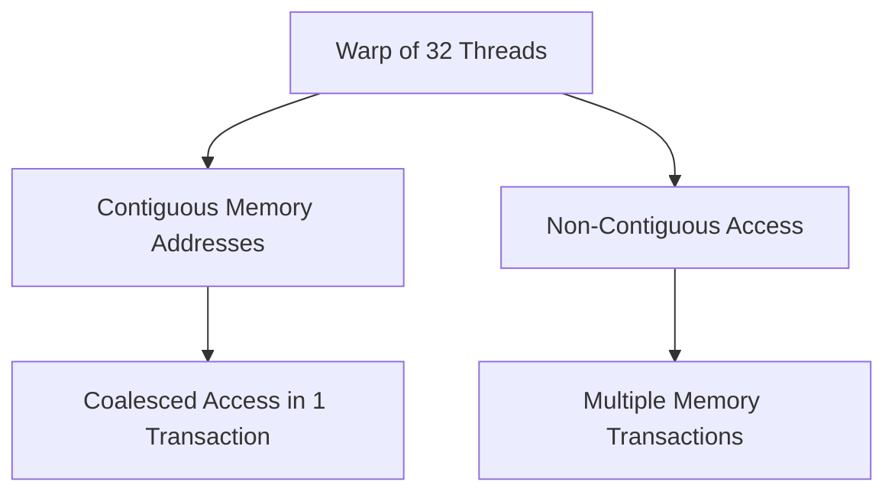
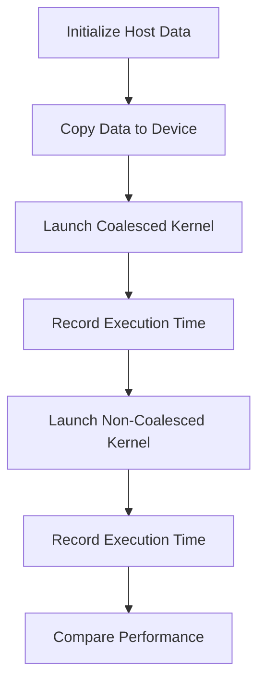

# Day 09: Memory Alignment & Coalescing

Optimizing memory accesses is crucial for high-performance CUDA applications. On Day 09, we explore **Memory Alignment & Coalescing**—techniques to ensure that global memory accesses are efficient. In this lesson, you will learn how coalesced memory accesses improve performance compared to non-coalesced (non-contiguous) patterns. We will benchmark both approaches in a kernel, discuss common pitfalls, and provide practical exercises and diagrams to help you grasp the concepts.

---

## Table of Contents
1. [Overview](#1-overview)  
2. [Memory Alignment & Coalescing: Concepts](#2-memory-alignment--coalescing-concepts)  
3. [Benchmarking Coalesced vs. Non-Coalesced Access](#3-benchmarking-coalesced-vs-non-coalesced-access)  
4. [Practical Exercise: Kernel Benchmarking](#4-practical-exercise-kernel-benchmarking)  
5. [Debugging Pitfalls and Best Practices](#5-debugging-pitfalls-and-best-practices)  
6. [Conceptual Diagrams](#6-conceptual-diagrams)  
7. [References & Further Reading](#7-references--further-reading)  
8. [Conclusion](#8-conclusion)  
9. [Next Steps](#9-next-steps)  

---

## 1. Overview
Global memory accesses in CUDA are most efficient when threads in a warp access contiguous memory addresses—a process known as **memory coalescing**. When threads access memory non-contiguously, memory transactions become inefficient, leading to a severe performance penalty. In this lesson, we will:
- Define memory alignment and coalescing.
- Explain how coalesced memory accesses improve throughput.
- Benchmark the performance difference between coalesced and non-coalesced memory accesses.
- Highlight common pitfalls and debugging strategies.

---

## 2. Memory Alignment & Coalescing: Concepts
### Memory Alignment
Memory alignment means that data is stored in memory at addresses that are multiples of the data size or cache line size. Proper alignment:
- **Ensures Efficient Access:** Aligned data is fetched in fewer memory transactions.
- **Reduces Overhead:** Misaligned accesses might require multiple memory transactions.

### Memory Coalescing
Memory coalescing occurs when threads in a warp (usually 32 threads) access contiguous memory addresses in a single transaction. Key points include:
- **Coalesced Access:** If the memory requests of a warp fall into one or a few contiguous blocks, the GPU can combine (coalesce) them into a single memory transaction.
- **Non-Coalesced Access:** When memory accesses are scattered, the GPU must perform multiple memory transactions, which degrades performance.

*Practical Impact:*  
Non-contiguous access patterns hurt performance significantly. Benchmarking these access patterns will demonstrate a stark difference in throughput.

---

## 3. Benchmarking Coalesced vs. Non-Coalesced Access
To illustrate the performance impact, we will compare two kernels:
- **Coalesced Kernel:** Threads access elements in contiguous order.
- **Non-Coalesced Kernel:** Threads access elements with a stride, causing scattered (non-contiguous) accesses.

### Coalesced Access Example
In a coalesced memory access scenario, thread `i` reads the element at index `i` of an array.  
**Access Pattern:**  
```
Thread 0 -> A[0]
Thread 1 -> A[1]
...
Thread 31 -> A[31]
```

### Non-Coalesced Access Example
In a non-coalesced access scenario, threads might access data with a stride larger than one, e.g., thread `i` accesses the element at index `i * stride`.  
**Access Pattern (stride = 2):**  
```
Thread 0 -> A[0]
Thread 1 -> A[2]
...
Thread 31 -> A[62]
```

---

## 4. Practical Exercise: Kernel Benchmarking
In this exercise, you will implement two kernels—one that exhibits coalesced memory access and one that does not. You will then measure and compare their performance.

### Code Example
```cpp
#include <cuda_runtime.h>
#include <stdio.h>

// Kernel with coalesced memory access
__global__ void coalescedKernel(const float *input, float *output, int N) {
    int idx = threadIdx.x + blockIdx.x * blockDim.x;
    if (idx < N) {
        // Simple operation: copy data
        output[idx] = input[idx] * 2.0f;
    }
}

// Kernel with non-coalesced memory access
__global__ void nonCoalescedKernel(const float *input, float *output, int N, int stride) {
    int idx = threadIdx.x + blockIdx.x * blockDim.x;
    int index = idx * stride;
    if (index < N) {
        // Simple operation: copy data
        output[index] = input[index] * 2.0f;
    }
}

int main() {
    int N = 1 << 20; // 1M elements
    size_t size = N * sizeof(float);
    cudaError_t err;

    // Allocate host memory
    float *h_input = (float*)malloc(size);
    float *h_output = (float*)malloc(size);

    // Initialize host array
    for (int i = 0; i < N; i++) {
        h_input[i] = 1.0f;
    }

    // Allocate device memory
    float *d_input, *d_output;
    err = cudaMalloc((void**)&d_input, size);
    if (err != cudaSuccess) { fprintf(stderr, "Error: %s\n", cudaGetErrorString(err)); exit(EXIT_FAILURE); }
    err = cudaMalloc((void**)&d_output, size);
    if (err != cudaSuccess) { fprintf(stderr, "Error: %s\n", cudaGetErrorString(err)); exit(EXIT_FAILURE); }

    // Copy input data to device
    cudaMemcpy(d_input, h_input, size, cudaMemcpyHostToDevice);

    // Configure kernel execution
    int threadsPerBlock = 256;
    int blocksPerGrid = (N + threadsPerBlock - 1) / threadsPerBlock;

    // Benchmark coalesced kernel
    cudaEvent_t start, stop;
    cudaEventCreate(&start);
    cudaEventCreate(&stop);
    cudaEventRecord(start);
    coalescedKernel<<<blocksPerGrid, threadsPerBlock>>>(d_input, d_output, N);
    cudaEventRecord(stop);
    cudaEventSynchronize(stop);
    float millisecondsCoalesced = 0;
    cudaEventElapsedTime(&millisecondsCoalesced, start, stop);

    // Benchmark non-coalesced kernel (stride = 2)
    cudaEventRecord(start);
    nonCoalescedKernel<<<blocksPerGrid, threadsPerBlock>>>(d_input, d_output, N, 2);
    cudaEventRecord(stop);
    cudaEventSynchronize(stop);
    float millisecondsNonCoalesced = 0;
    cudaEventElapsedTime(&millisecondsNonCoalesced, start, stop);

    // Print benchmark results
    printf("Coalesced Kernel Time:    %f ms\n", millisecondsCoalesced);
    printf("Non-Coalesced Kernel Time: %f ms\n", millisecondsNonCoalesced);

    // Cleanup
    cudaFree(d_input);
    cudaFree(d_output);
    free(h_input);
    free(h_output);
    cudaEventDestroy(start);
    cudaEventDestroy(stop);

    return 0;
}
```

*Explanation:*
- Two kernels are implemented: one with coalesced accesses and one with non-coalesced accesses (using a stride).
- CUDA events are used to measure the execution time of each kernel.
- The performance difference will highlight the importance of memory coalescing.

---

## 5. Debugging Pitfalls and Best Practices
When optimizing memory accesses, be aware of these pitfalls:
1. **Non-Contiguous Access Patterns:**  
   - **Problem:** Non-coalesced memory accesses lead to multiple memory transactions.
   - **Solution:** Arrange data so that threads in a warp access contiguous memory.

2. **Improper Memory Alignment:**  
   - **Problem:** Misaligned data can cause inefficient memory transactions.
   - **Solution:** Ensure data structures are aligned to boundaries that match the GPU’s memory architecture (e.g., 128-byte alignment).

3. **Ignoring Error Checking:**  
   - **Problem:** Failing to check the return values of CUDA API calls can mask errors.
   - **Solution:** Use robust error checking after memory allocation, kernel launches, and memory copies.

4. **Overlooking Kernel Launch Configurations:**  
   - **Problem:** Incorrect block or grid dimensions can lead to poor performance.
   - **Solution:** Optimize kernel launch parameters (threads per block and blocks per grid) for your specific application.

---

## 6. Conceptual Diagrams

### Diagram 1: Memory Coalescing Overview

*Explanation:*  
- When threads access contiguous addresses (B), they achieve coalesced access (C).  
- When access is non-contiguous (D), multiple memory transactions are required (E), degrading performance.

### Diagram 2: Benchmarking Flow for Coalesced vs. Non-Coalesced Kernels

*Explanation:*  
- The process involves initializing data, copying it to the device, running both kernels, and comparing their execution times to illustrate the performance impact of memory coalescing.

---

## 7. References & Further Reading
1. **[CUDA C Best Practices Guide](https://docs.nvidia.com/cuda/cuda-c-best-practices-guide/index.html)**  
   Refer to the “Memory Coalescing” section for in-depth details on efficient memory access.
2. **"Programming Massively Parallel Processors: A Hands-on Approach" by David B. Kirk and Wen-mei W. Hwu**  
   Provides comprehensive insights into CUDA optimization techniques.
3. **NVIDIA Developer Blog**  
   Offers articles and case studies on memory optimization in CUDA.

---

## 8. Conclusion
In this lesson, you explored the critical role of memory alignment and coalescing in CUDA. You learned that:
- **Coalesced memory accesses** allow threads to read and write contiguous data in a single transaction, significantly improving performance.
- **Non-coalesced accesses** require multiple transactions, leading to slower execution.
- Benchmarking kernels with both coalesced and non-coalesced memory access patterns clearly demonstrates the performance difference.
- Robust error checking and proper memory alignment are essential for optimizing CUDA applications.

By mastering these techniques, you can optimize your CUDA applications to achieve higher throughput and better overall performance.

---

## 9. Next Steps
In upcoming lessons, we will focus on:
- **Kernel Optimization:** Advanced strategies for reducing branch divergence and maximizing occupancy.
- **Asynchronous Data Transfers:** Techniques for overlapping data transfers with computation.
- **Profiling Tools:** Using NVIDIA NSight and other profiling tools to further refine and optimize your CUDA code.

Stay tuned as we continue to build on these optimization strategies to push the limits of GPU performance!
```
